# AI Development Patterns

A comprehensive collection of proven patterns for building software with AI assistance, organized by implementation maturity and development lifecycle phases.

## Pattern Organization

This repository provides a structured approach to AI-assisted development through three pattern categories:

- **[Foundation Patterns](#foundation-patterns)** - Essential patterns for team readiness and basic AI integration
- **[Development Patterns](#development-patterns)** - Daily practice patterns for AI-assisted coding workflows  
- **[Operations Patterns](#operations-patterns)** - CI/CD, security, and production management with AI

## Pattern Dependencies & Implementation Order

**Important**: These phases represent a **learning progression** for teams new to AI development, not a waterfall approach. Teams with existing DevOps/security expertise should implement patterns continuously across all phases from day one, following a "continuous everything" model.

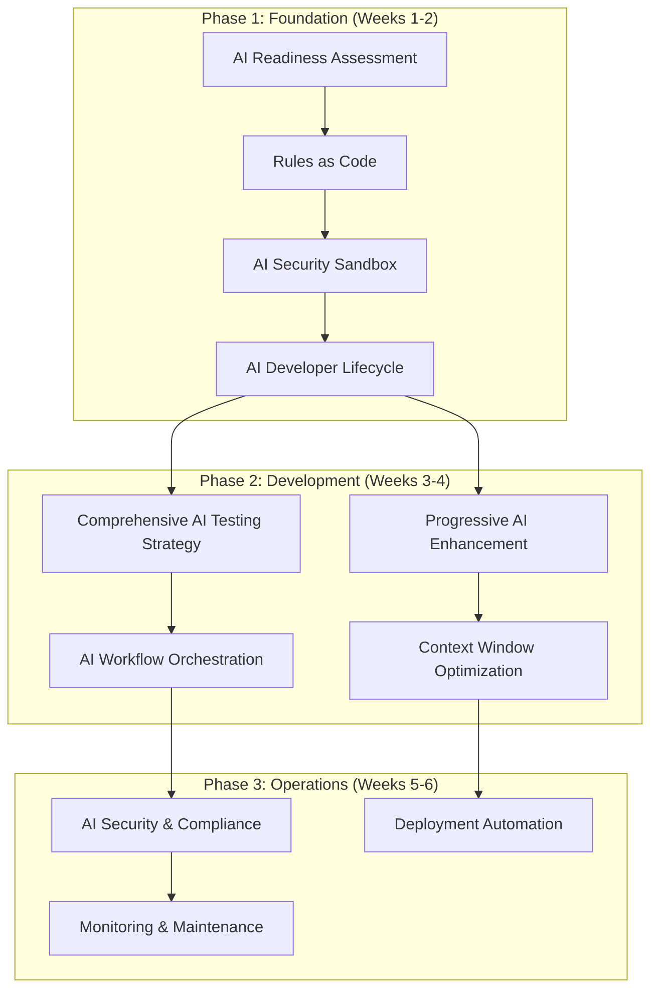

**Continuous Implementation Note**: Security patterns (AI Security Sandbox, AI Security & Compliance) and deployment patterns should be implemented continuously throughout development, not delayed until specific phases. The dependencies shown represent learning prerequisites, not deployment gates.

## Complete Pattern Reference

| Pattern | Maturity | Type | Description | Dependencies |
|---------|----------|------|-------------|--------------|
| **[AI Readiness Assessment](#ai-readiness-assessment)** | Beginner | Foundation | Systematic evaluation of codebase and team readiness for AI integration | None |
| **[Rules as Code](#rules-as-code)** | Beginner | Foundation | Version and maintain AI coding standards as explicit configuration files | AI Readiness Assessment |
| **[AI Security Sandbox](#ai-security-sandbox)** | Beginner | Foundation | Run AI tools in isolated environments without access to secrets or sensitive data | Rules as Code |
| **[AI Developer Lifecycle](#ai-developer-lifecycle)** | Intermediate | Foundation | Structured 9-stage process from problem definition through deployment with AI assistance | Rules as Code, AI Security Sandbox |
| **[AI Failure Recovery Protocol](#ai-failure-recovery-protocol)** | Intermediate | Foundation | Systematic approach to detecting and recovering from AI-generated issues | AI Developer Lifecycle |
| **[Human-AI Handoff Protocol](#human-ai-handoff-protocol)** | Intermediate | Foundation | Clear boundaries and procedures for transitioning work between human developers and AI | AI Developer Lifecycle |
| **[AI Issue Generation](#ai-issue-generation)** | Beginner | Foundation | Generate structured work items and tickets from requirements using AI to break down features into actionable tasks | AI Readiness Assessment |
| **[ATDD-Driven AI Development](#atdd-driven-ai-development)** | Intermediate | Development | Use Acceptance Test-Driven Development to guide AI code generation with executable specifications | AI Developer Lifecycle |
| **[Comprehensive AI Testing Strategy](#comprehensive-ai-testing-strategy)** | Intermediate | Development | Unified approach to test-first development, automated generation, and quality assurance | ATDD-Driven AI Development |
| **[Progressive AI Enhancement](#progressive-ai-enhancement)** | Beginner | Development | Build complex features through small, deployable iterations rather than big-bang generation | AI Developer Lifecycle |
| **[AI Workflow Orchestration](#ai-workflow-orchestration)** | Advanced | Development | Coordinate sequential pipelines, parallel workflows, and hybrid human-AI processes | Comprehensive AI Testing Strategy |
| **[Context Window Optimization](#context-window-optimization)** | Intermediate | Development | Match AI tool selection to task complexity and optimize cost/performance trade-offs | Progressive AI Enhancement |
| **[AI Knowledge Persistence](#ai-knowledge-persistence)** | Intermediate | Development | Capture successful patterns and failed attempts as versioned knowledge for future sessions | Rules as Code |
| **[Constraint-Based AI Development](#constraint-based-ai-development)** | Beginner | Development | Give AI specific constraints to prevent over-engineering and ensure focused solutions | Progressive AI Enhancement |
| **[Observable AI Development](#observable-ai-development)** | Intermediate | Development | Strategic logging and debugging that makes system behavior visible to AI | AI Developer Lifecycle |
| **[AI-Driven Refactoring](#ai-driven-refactoring)** | Intermediate | Development | Systematic code improvement using AI to detect and resolve code smells with measurable quality metrics | Rules as Code |
| **[AI Security & Compliance](#ai-security--compliance)** | Advanced | Operations | Unified framework for policy generation, vulnerability scanning, and compliance automation | AI Security Sandbox |
| **[Deployment Automation](#deployment-automation)** | Advanced | Operations | AI-powered pipeline generation, blue-green deployments, and intelligent rollback strategies | AI Workflow Orchestration |
| **[Monitoring & Maintenance](#monitoring--maintenance)** | Advanced | Operations | Performance baselines, incident response, and technical debt management with AI assistance | Observable AI Development |

---

# Foundation Patterns

Foundation patterns establish the essential infrastructure and team readiness required for successful AI-assisted development. These patterns must be implemented first as they enable all subsequent patterns.

## AI Readiness Assessment

**Maturity**: Beginner  
**Description**: Systematic evaluation of codebase and team readiness for AI-assisted development before implementing AI patterns.

**Assessment Framework**

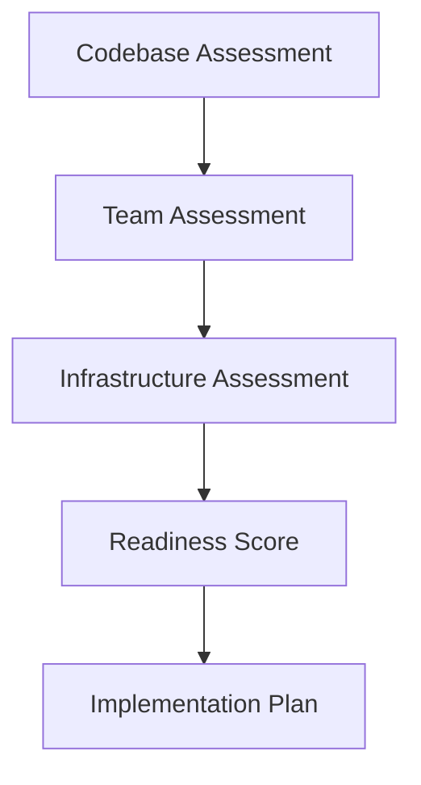

**Codebase Readiness Checklist**
```markdown
## Code Quality Prerequisites
□ Consistent code formatting and style guide
□ Comprehensive test coverage (>80% for critical paths)
□ Clear separation of concerns and modular architecture
□ Documented APIs and interfaces
□ Version-controlled configuration and secrets management

## Documentation Standards
□ README with setup and development instructions
□ API documentation (OpenAPI/Swagger)
□ Architecture decision records (ADRs)
□ Coding standards and conventions documented
□ Deployment and operational procedures
```

**Anti-pattern: Rushing Into AI**
Starting AI adoption without proper assessment leads to inconsistent practices, security vulnerabilities, and team frustration.

---

## Rules as Code

**Maturity**: Beginner  
**Description**: Treat AI coding standards like infrastructure - version them, evolve them, and make them explicit. Every AI session starts fresh, so without persistent rules, you're teaching AI your preferences from scratch each time.

**Related Patterns**: [AI Developer Lifecycle](#ai-developer-lifecycle), [AI Knowledge Persistence](#ai-knowledge-persistence)

**Standardized Project Structure**
```bash
project/
├── .ai/                          # AI configuration directory
│   ├── rules/                    # Modular rule sets
│   │   ├── security.md          # Security standards
│   │   ├── testing.md           # Testing requirements
│   │   ├── style.md             # Code style guide
│   │   └── architecture.md      # Architectural patterns
│   ├── prompts/                 # Reusable prompt templates
│   │   ├── implementation.md    # Implementation prompts
│   │   ├── review.md            # Code review prompts
│   │   └── testing.md           # Test generation prompts
│   └── knowledge/               # Captured patterns and gotchas
│       ├── successful.md        # Proven successful patterns
│       └── failures.md          # Known failure patterns
├── .cursorrules                 # Cursor IDE configuration
├── CLAUDE.md                    # Claude Code session context
└── .windsurf/                   # Windsurf configuration
    └── rules.md
```

**Anti-pattern: Context Drift**
Each developer maintains their own prompts and preferences, leading to inconsistent code across the team.

---

## AI Security Sandbox

**Maturity**: Beginner  
**Description**: Run AI tools in isolated environments that can't access secrets, credentials, or sensitive data. Essential for preventing credential leaks and maintaining security compliance.

**Related Patterns**: [AI Security & Compliance](#ai-security--compliance), [Rules as Code](#rules-as-code)

**Docker-Based Isolation**
```yaml
# docker-compose.ai-sandbox.yml
version: '3.8'

services:
  ai-development:
    build:
      context: .
      dockerfile: Dockerfile.ai-sandbox
    security_opt:
      - no-new-privileges:true
    cap_drop:
      - ALL
    volumes:
      # Read-only source code access
      - ./src:/workspace/src:ro
      - ./tests:/workspace/tests:rw
      # NO access to sensitive directories:
      # - .env files, .aws credentials, .ssh keys, secrets/ directory
    environment:
      - NODE_ENV=development
      - AI_SANDBOX=true
    networks:
      - ai-isolated
    restart: no

networks:
  ai-isolated:
    driver: bridge
    internal: true  # No external network access
```

**Anti-pattern: Unrestricted Access**
Allowing AI tools full system access risks credential leaks, data breaches, and security compliance violations.

---

## AI Developer Lifecycle

**Maturity**: Intermediate  
**Description**: AI development follows a structured lifecycle from problem definition through deployment, integrating all tactical patterns for systematic, testable, and maintainable AI-assisted development.

**Related Patterns**: [Rules as Code](#rules-as-code), [ATDD-Driven AI Development](#atdd-driven-ai-development), [Observable AI Development](#observable-ai-development)

**The Complete Lifecycle**

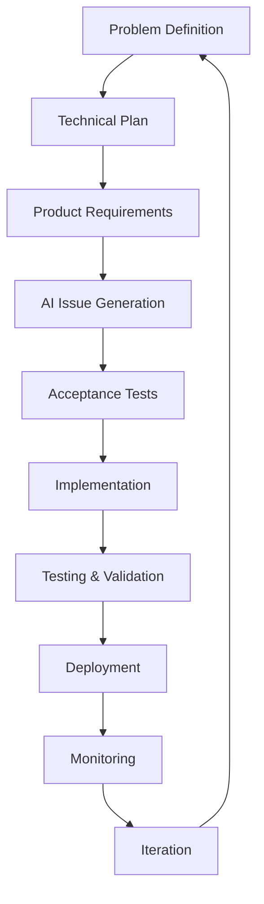

**Stage 1: AI-Assisted Problem Definition**
*Patterns: Constraint-Based AI Development, Test-Driven Prompt Engineering*

Define clear problem statements and success criteria before any implementation work begins.

```bash
ai "Analyze this problem statement for technical feasibility:
- Suggest alternative approaches
- Identify potential risks
- Estimate complexity and effort"
```

**Stage 2: AI-Generated Technical Plan**
*Patterns: Context Window Optimization, AI Pair Rotation, Rules as Code*

Transform problem definitions into concrete technical architectures with clear implementation paths.

```bash
ai "Create a technical plan for [problem] using [technology stack]:
- Include architecture diagrams
- Detail security considerations
- Break into 3-week development phases
- Identify technical risks and mitigation strategies"
```

**Stage 3: Product Requirements Document (PRD)**
*Patterns: AI Knowledge Persistence, Progressive AI Enhancement*

Translate technical plans into detailed product specifications with measurable acceptance criteria.

```bash
ai "Convert this technical plan into detailed product requirements:
- Include API specifications with OpenAPI format
- Define user interaction flows
- Specify error handling patterns
- Add acceptance criteria for each feature"
```

**Stage 4: AI Issue Generation**
*Patterns: AI Issue Generation, Progressive AI Enhancement*

Transform product requirements into structured, actionable work items using AI to break down features into properly sized tasks with clear acceptance criteria and dependencies.

```bash
# Generate development tasks from PRD
ai "Break down these product requirements into GitHub issues:
- Clear titles and acceptance criteria  
- Size estimates (Small, Medium, Large)
- Frontend/backend/testing labels
- Dependency mapping between tasks
- Kanban-ready task breakdown

Format as JSON for automated issue creation."
```

Apply **AI Issue Generation** to create comprehensive task breakdown. Use **Progressive AI Enhancement** to ensure tasks are properly sized for iterative delivery.

**Stage 5: Acceptance Test-Driven Development (ATDD)**
*Patterns: Test-Driven AI Development, Observable AI Development*

Write executable acceptance tests before implementation to guide AI code generation.

```bash
ai "Generate acceptance tests for user story:
- Use Gherkin format for clarity
- Cover happy path and edge cases
- Include performance criteria
- Make tests executable with minimal setup"
```

**Stage 6: AI-Driven Implementation**
*Patterns: AI Commit Protocol, AI Security Sandbox, Rules as Code, Progressive AI Enhancement*

Use AI to implement features that satisfy the acceptance tests while maintaining code quality.

```bash
# Implementation workflow
ai-checkpoint "Before implementing user authentication"
ai-implement "Create JWT-based authentication following our security patterns"
ai-test "Run tests and fix any failures"
ai-review "Review code for security vulnerabilities"
ai-commit "Add authentication with security review"
```

**Stage 7: Comprehensive Testing Strategy**
*Patterns: AI Prompt Pipeline, Parallel AI Workflows, Context Window Optimization*

Execute multi-layered testing approach with AI assistance for thorough quality assurance.

```bash
ai "Generate comprehensive test suite:
- Unit tests with edge cases
- Integration tests for API endpoints
- End-to-end user journey tests
- Security vulnerability scans
- Performance benchmarks"
```

**Stage 8: Deployment Pipeline**
*Patterns: Everything as a Tool, AI Prompt Pipeline, AI Security Sandbox*

Automate deployment with AI validation at each stage to ensure production readiness.

```bash
ai "Review deployment checklist:
- Validate all tests passing
- Check security compliance
- Verify performance metrics
- Generate deployment notes
- Create rollback plan"
```

**Stage 9: AI-Monitored Production**
*Patterns: Observable AI Development, AI Knowledge Persistence, Everything as a Tool*

Continuous monitoring with AI-powered analysis for proactive issue detection and resolution.

```bash
ai "Analyze production metrics:
- Identify performance anomalies
- Detect error rate increases
- Suggest optimization opportunities
- Generate incident reports"
```

**Anti-pattern: Ad-Hoc AI Development**
Jumping straight to coding with AI without proper planning, requirements, or testing strategy.

---

## AI Failure Recovery Protocol

**Maturity**: Intermediate  
**Description**: Systematic approach to detecting and recovering from AI-generated issues with automated rollback triggers and learning capture mechanisms.

**Detection & Recovery Framework**

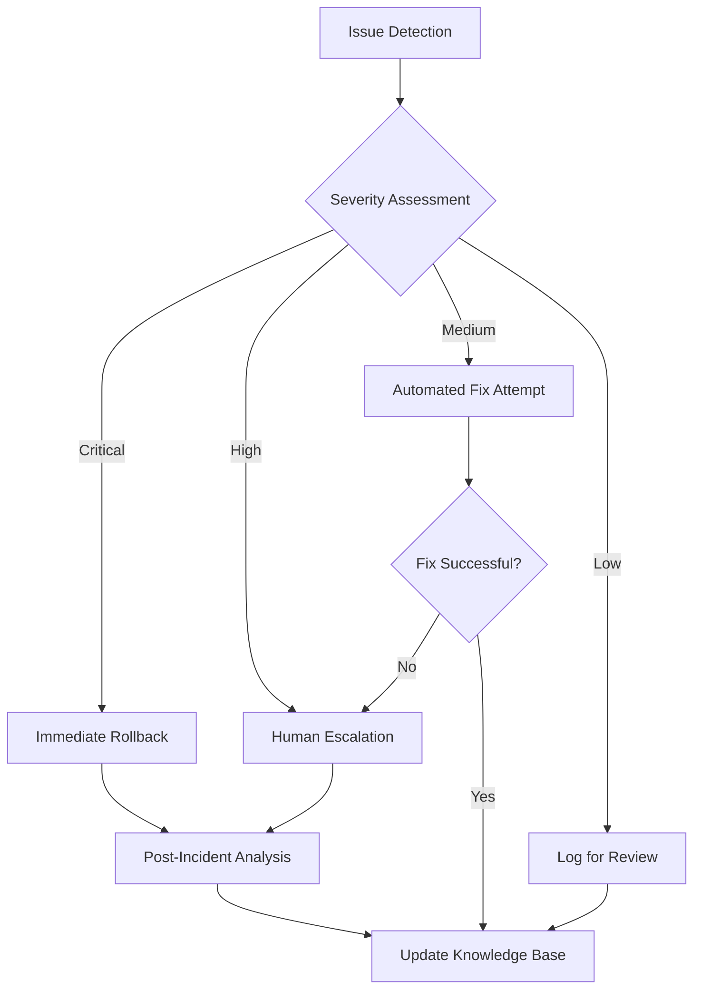

**Anti-pattern: Ignore and Hope**
Ignoring AI-generated issues or assuming they'll resolve themselves leads to accumulated technical debt and system instability.

---

## Human-AI Handoff Protocol

**Maturity**: Intermediate  
**Description**: Clear boundaries and procedures for transitioning work between human developers and AI tools based on complexity, security requirements, and creative problem-solving needs.

**Handoff Decision Framework**

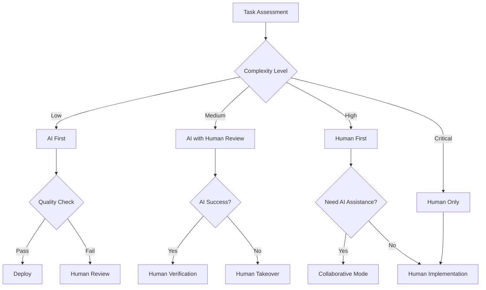

**Anti-pattern: Unclear Boundaries**
Allowing AI and humans to work on the same task simultaneously without clear handoff points leads to conflicts, duplicated effort, and inconsistent quality.

---

## AI Issue Generation

**Maturity**: Beginner  
**Description**: Generate structured work items and tickets from requirements using AI to break down features into actionable tasks with proper estimation, acceptance criteria, and dependencies.

**Related Patterns**: [AI Readiness Assessment](#ai-readiness-assessment), [ATDD-Driven AI Development](#atdd-driven-ai-development)

**Issue Generation Framework**

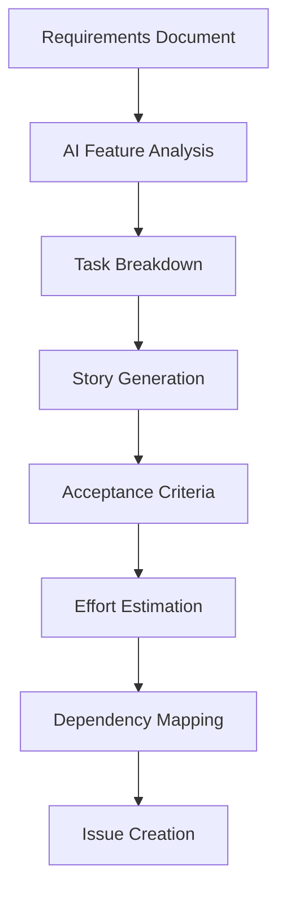

**Examples**

**Input: High-level requirement**
```markdown
## Feature Request
"Users need to be able to reset their passwords via email"
```

**AI Prompt for Issue Generation**
```bash
ai "Break down this feature into development tasks:

Feature: Password reset via email

Create GitHub issues with:
- Clear titles and descriptions
- Acceptance criteria
- Size estimates (Small, Medium, Large)
- Labels (frontend, backend, testing)
- Dependencies between tasks

Format as JSON for GitHub API import."
```

**Generated Issues Output**
```json
[
  {
    "title": "Backend: Implement password reset token generation",
    "body": "## Description\nCreate secure token generation for password reset requests\n\n## Acceptance Criteria\n- [ ] Generate cryptographically secure reset tokens\n- [ ] Set token expiration (15 minutes)\n- [ ] Store token-user mapping in Redis\n- [ ] Validate email exists before token creation\n\n## Technical Notes\n- Use crypto.randomBytes(32)\n- TTL of 900 seconds in Redis\n- Rate limit: 3 requests per hour per email\n\n## Estimated Time\n1-2 days, deployable independently",
    "labels": ["backend", "security", "size-medium"],
    "milestone": "Password Reset MVP"
  },
  {
    "title": "Backend: Email service integration for reset links", 
    "body": "## Description\nSend password reset emails with secure links\n\n## Acceptance Criteria\n- [ ] Template-based email generation\n- [ ] Secure reset link with token\n- [ ] Email delivery confirmation\n- [ ] Handle email service failures gracefully\n\n## Dependencies\n- Requires: Password reset token generation\n\n## Estimated Time\n1 day, can deploy once token generation is complete",
    "labels": ["backend", "email", "size-small"],
    "milestone": "Password Reset MVP"
  },
  {
    "title": "Frontend: Password reset request form",
    "body": "## Description\nUI for users to request password reset\n\n## Acceptance Criteria\n- [ ] Email input field with validation\n- [ ] Submit button with loading state\n- [ ] Success/error message display\n- [ ] Rate limiting feedback\n\n## Design\n- Use existing form components\n- Match current auth page styling\n\n## Estimated Time\n4-6 hours, can work in parallel with backend tasks",
    "labels": ["frontend", "ui", "size-small"],
    "milestone": "Password Reset MVP"
  }
]
```

**Advanced: Epic Breakdown**
```bash
ai "Break down this epic into small, independent tasks for Kanban flow:

Epic: User Dashboard with Analytics

Include:
- Database schema changes (Small tasks, 1-2 days each)
- Backend API endpoints (Medium tasks, deployable independently)
- Frontend components (Small UI tasks, immediate feedback)
- Testing requirements (Small validation tasks)
- Security considerations (Small security checks)
- Performance requirements (Small optimization tasks)

Each task should be completable in 1-3 days and immediately deployable."
```

**Integration with Project Management**
```bash
# GitHub Issues
gh issue create --title "$(echo "$issue" | jq -r '.title')" \
                --body "$(echo "$issue" | jq -r '.body')" \
                --label "$(echo "$issue" | jq -r '.labels[]')"

# JIRA Integration
curl -X POST "$JIRA_API/issue" \
  -H "Content-Type: application/json" \
  -d "$jira_issue_json"

# Azure DevOps
az boards work-item create --title "$title" \
                          --type "User Story" \
                          --description "$description"
```

**Task Sizing for Kanban Flow**
```bash
ai "Size these tasks for continuous delivery and Kanban flow:

Guidelines:
- Small: 1 day or less, single developer, immediately deployable
- Medium: 2-3 days max, may involve multiple files but single feature
- Large: Break down further - no task should take more than 3 days

Previous task completion times:
- Authentication token generation: 1 day (Small)
- Email service integration: 2 days (Medium) 
- Password reset form: 4 hours (Small)
- User dashboard API: 3 days (Medium)
- Database migration: 1 day (Small)

New tasks: [task list]

Recommend breaking any Large tasks into smaller chunks."
```

**Anti-pattern: Vague Issue Generation**
Creating generic tasks without specific acceptance criteria, proper sizing, or clear dependencies leads to scope creep and estimation errors.

**Anti-pattern Examples:**
```markdown
❌ "Fix the login page"
❌ "Make the dashboard better" 
❌ "Add some tests"

✅ "Replace deprecated auth library with OAuth 2.0 (Size: Large)"
✅ "Add real-time data refresh to dashboard metrics (Size: Medium)"
✅ "Achieve 90% test coverage for user service (Size: Small)"
```

---

# Development Patterns

Development patterns provide tactical approaches for day-to-day AI-assisted coding workflows, focusing on quality, maintainability, and team collaboration.

## ATDD-Driven AI Development

**Maturity**: Intermediate  
**Description**: Use Acceptance Test-Driven Development (ATDD) to guide AI code generation by writing executable specifications first, then prompting AI to create minimal implementations that satisfy the acceptance criteria.

**Related Patterns**: [AI Developer Lifecycle](#ai-developer-lifecycle), [Comprehensive AI Testing Strategy](#comprehensive-ai-testing-strategy), [Observable AI Development](#observable-ai-development)

**The ATDD-AI Workflow**

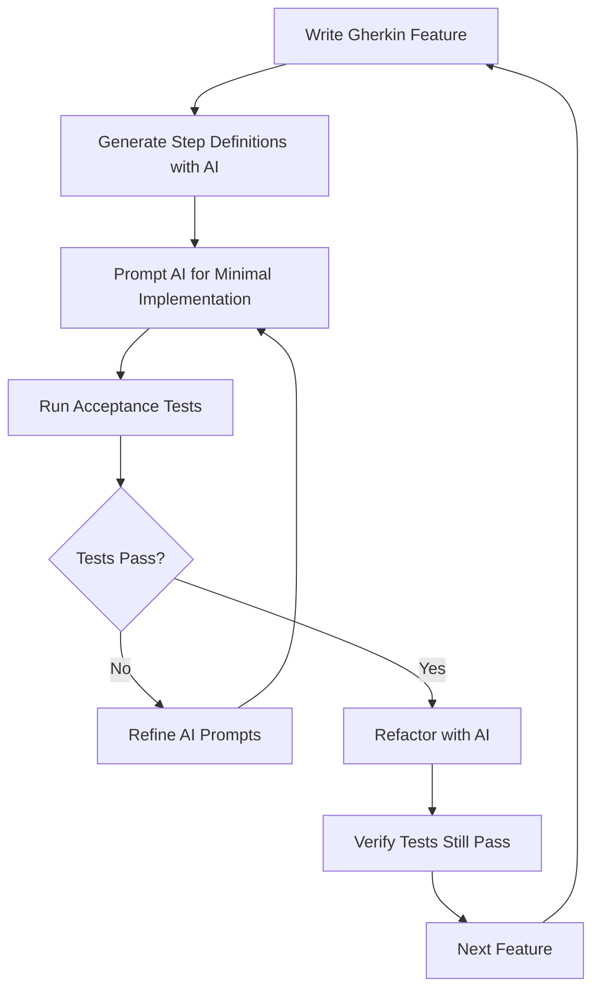

**Examples**

**Step 1: Write Executable Specifications First**
```gherkin
# features/user_authentication.feature
Feature: User Authentication
  As a user
  I want to log into the system
  So that I can access my personal dashboard

  Scenario: Successful login with valid credentials
    Given a user exists with email "user@example.com" and password "securepass123"
    When I submit login credentials "user@example.com" and "securepass123"
    Then I should be redirected to the dashboard
    And I should see a welcome message "Welcome back!"

  Scenario: Failed login with invalid credentials
    Given a user exists with email "user@example.com" and password "securepass123"
    When I submit login credentials "user@example.com" and "wrongpassword"
    Then I should see an error message "Invalid credentials"
    And I should remain on the login page
```

**Step 2: AI-Generated Step Definitions**
```python
# features/steps/auth_steps.py
# Prompt: "Generate pytest-bdd step definitions for the user authentication feature"

from pytest_bdd import given, when, then, scenarios
from selenium import webdriver
import pytest

scenarios('../user_authentication.feature')

@given('a user exists with email "<email>" and password "<password>"')
def user_exists(email, password):
    # AI generates user creation logic
    user_service.create_user(email=email, password=password)

@when('I submit login credentials "<email>" and "<password>"')
def submit_login(browser, email, password):
    # AI generates form interaction
    browser.find_element_by_id("email").send_keys(email)
    browser.find_element_by_id("password").send_keys(password)
    browser.find_element_by_id("login-button").click()

@then('I should be redirected to the dashboard')
def verify_dashboard_redirect(browser):
    # AI generates assertion logic
    assert "/dashboard" in browser.current_url
```

**Anti-pattern: Implementation-First AI**
Writing code with AI first, then trying to retrofit tests, resulting in tests that mirror implementation rather than specify behavior.

---

## Comprehensive AI Testing Strategy

**Maturity**: Intermediate  
**Description**: Unified approach combining test-first development, automated test generation, and quality assurance patterns to ensure AI-generated code meets quality and behavioral specifications.

**Related Patterns**: [ATDD-Driven AI Development](#atdd-driven-ai-development), [Observable AI Development](#observable-ai-development)

**Integrated Testing Framework**

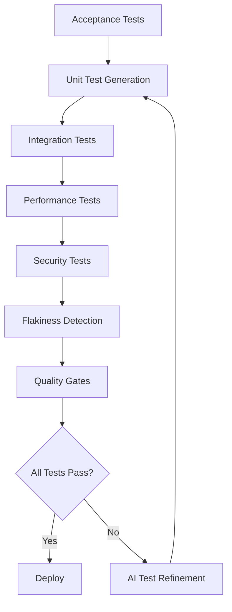

**Anti-pattern: Test Generation Without Strategy**
Generating tests with AI without a coherent strategy leads to poor coverage, flaky tests, and false confidence in code quality.

---

## Progressive AI Enhancement

**Maturity**: Beginner  
**Description**: Build complex features through small, deployable iterations. Each AI interaction adds one specific enhancement rather than trying to build everything at once.

**Related Patterns**: [AI Developer Lifecycle](#ai-developer-lifecycle), [Constraint-Based AI Development](#constraint-based-ai-development)

**Examples**
Building authentication progressively:
```bash
# Day 1: Minimal login
"Create POST /login that returns 200 for admin/admin, 401 otherwise"
→ Deploy

# Day 2: Real password check
"Modify login to check passwords against users table. Keep existing API."
→ Deploy

# Day 3: Add security
"Add bcrypt hashing to login. Support both hashed and plain passwords temporarily."
→ Deploy

# Day 4: Modern tokens
"Replace session with JWT. Keep session endpoint for backward compatibility."
→ Deploy
```

**Anti-pattern: Big Bang Generation**
Asking AI to "create a complete user management system" results in 5000 lines of coupled, untested code that takes days to review and debug.

---

## AI Workflow Orchestration

**Maturity**: Advanced  
**Description**: Coordinate sequential pipelines, parallel workflows, and hybrid human-AI processes for complex development tasks requiring multiple AI tools and human oversight.

**Related Patterns**: [Human-AI Handoff Protocol](#human-ai-handoff-protocol), [Comprehensive AI Testing Strategy](#comprehensive-ai-testing-strategy)

**Workflow Types & Selection**

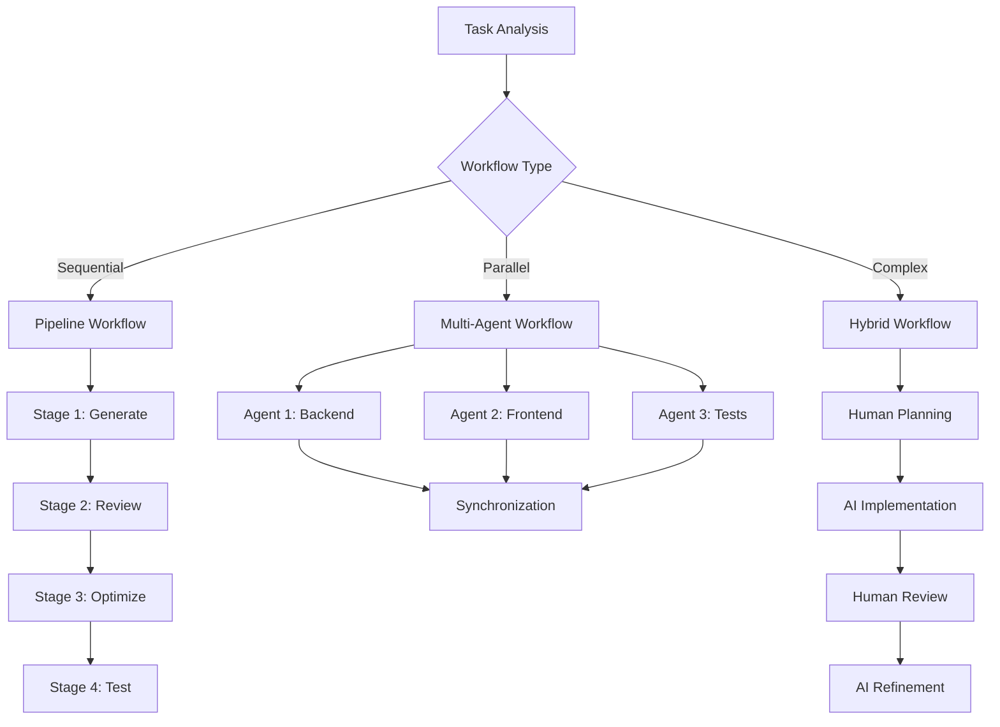

**Anti-pattern: Uncoordinated Multi-Tool Usage**
Using multiple AI tools without proper orchestration leads to inconsistent code, integration conflicts, and wasted effort from competing implementations.

---

## Context Window Optimization

**Maturity**: Intermediate  
**Description**: Match AI tool selection to task complexity and optimize cost/performance trade-offs. Using Claude for every task is like using a sledgehammer to hang a picture.

**Related Patterns**: [Progressive AI Enhancement](#progressive-ai-enhancement), [AI Workflow Orchestration](#ai-workflow-orchestration)

**Decision Matrix**
```
Task: Add null check
Tool: GitHub Copilot (instant, cheap)
Context: <100 tokens

Task: Extract method
Tool: Cursor Cmd+K (fast, focused)  
Context: <1000 tokens

Task: Refactor module
Tool: Windsurf Cascade (handles dependencies)
Context: <10000 tokens

Task: Design architecture
Tool: Claude Code (best reasoning)
Context: Full codebase
```

---

## AI Knowledge Persistence

**Maturity**: Intermediate  
**Description**: Capture successful patterns and failed attempts as versioned knowledge for future sessions.

**Related Patterns**: [Rules as Code](#rules-as-code), [AI Failure Recovery Protocol](#ai-failure-recovery-protocol)

**Examples**
`.ai/knowledge/authentication.md`:
```markdown
## Successful Patterns

### JWT Implementation
Prompt that works 95% of the time:
"Implement JWT auth:
- RS256 algorithm (never HS256)
- 15 min access token
- 7 day refresh token in httpOnly cookie
- Include user.id and role in payload"

## Failed Patterns

### ❌ "Make authentication secure"
Too vague - AI adds unnecessary complexity

## Gotchas
- AI defaults to HS256 (insecure)
- Often uses deprecated bcrypt methods
```

---

## Constraint-Based AI Development

**Maturity**: Beginner  
**Description**: Give AI specific constraints to prevent over-engineering and ensure focused solutions.

**Related Patterns**: [Progressive AI Enhancement](#progressive-ai-enhancement), [Human-AI Handoff Protocol](#human-ai-handoff-protocol)

**Examples**
```
Bad: "Create user service"
Good: "Create user service: <100 lines, 3 methods max, only bcrypt dependency"

Bad: "Add caching"
Good: "Add caching using Map, max 1000 entries, LRU eviction"

Bad: "Improve performance"
Good: "Reduce p99 latency to <50ms without new dependencies"
```

---

## Observable AI Development

**Maturity**: Intermediate  
**Description**: Make your system's behavior visible to AI through strategic logging and debugging. AI can't fix what it can't see.

**Related Patterns**: [AI Developer Lifecycle](#ai-developer-lifecycle), [Comprehensive AI Testing Strategy](#comprehensive-ai-testing-strategy)

**Examples**
```python
# Good: Observable operations
import logging
logger = logging.getLogger(__name__)

def process_order(order):
    logger.info(f"[ORDER] Processing {order.id} for {order.customer_email}")
    
    try:
        logger.info("[ORDER] Validating...")
        validate_order(order)
        logger.info("[ORDER] ✓ Validation passed")
        
        logger.info(f"[PAYMENT] Charging ${order.total} via {order.payment_method}")
        result = charge_payment(order)
        logger.info(f"[PAYMENT] ✓ Transaction: {result.transaction_id}")
        
    except ValidationError as e:
        logger.error(f"[ORDER] ✗ Validation failed: {e.field} - {e.message}")
        raise
```

**Anti-pattern: Black Box Systems**
Minimal or cryptic logging that leaves AI guessing about system state and failure causes.

---

## AI-Driven Refactoring

**Maturity**: Intermediate  
**Description**: Systematic code improvement using AI to detect and resolve code smells with measurable quality metrics, following established refactoring rules and maintaining test coverage throughout the process.

**Related Patterns**: [Rules as Code](#rules-as-code), [Comprehensive AI Testing Strategy](#comprehensive-ai-testing-strategy)

**Code Smell Detection Framework**

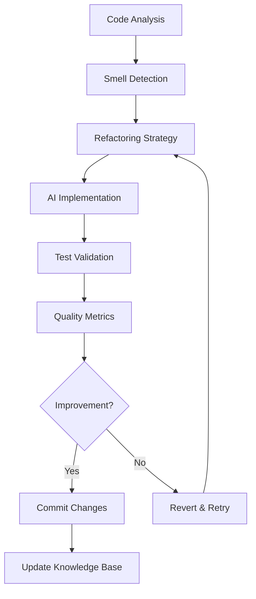

**Automated Code Smell Detection**

```bash
# .refactoringrules.md - Define measurable thresholds
cat > .refactoringrules.md << 'EOF'
# Refactoring Rules

## Long Method Smell
- Max lines: 20 (excluding docstrings)
- Max cyclomatic complexity: 10
- Detection: flake8 C901, pylint R0915

## Large Class Smell  
- Max class lines: 250
- Max methods: 20
- Max instance variables: 10
- Detection: pylint R0902, R0904

## Primitive Obsession Smell
- String validation patterns in multiple places
- Dictionaries as pseudo-objects
- Lists of primitives that always travel together

## Refactoring Strategies
- Extract Method for long methods
- Extract Class for large classes
- Replace Primitive with Object for primitive obsession
EOF

# AI smell detection
ai "Analyze this codebase using .refactoringrules.md:
1. Run static analysis tools (flake8, pylint, radon)
2. Identify code smells per defined thresholds
3. Prioritize by impact and complexity
4. Suggest specific refactoring strategy for each smell"
```

**Long Method Refactoring Example**

```python
# Before: Long method with complexity > 10
def process_user_data(user_data):
    # 35 lines of mixed responsibilities
    if not user_data.get('email'):
        raise ValueError("Email required")
    if '@' not in user_data['email']:
        raise ValueError("Invalid email")
    
    # Database operations
    user = User.objects.filter(email=user_data['email']).first()
    if user:
        user.name = user_data.get('name', user.name)
        user.phone = user_data.get('phone', user.phone)
    else:
        user = User.objects.create(**user_data)
    
    # Send notifications
    if user_data.get('send_welcome'):
        email_service.send_welcome(user.email)
    
    # Analytics tracking
    analytics.track('user_processed', user.id)
    
    return user
```

**AI Refactoring Prompt**

```bash
ai "Refactor this method using Extract Method pattern:

Analyze process_user_data() in user_service.py:
1. Method has 35 lines (exceeds 20 line threshold)
2. Cyclomatic complexity: 12 (exceeds 10)
3. Multiple responsibilities: validation, database, notifications, analytics

Apply Extract Method refactoring:
- Extract email validation
- Extract user creation/update logic  
- Extract notification logic
- Extract analytics logic
- Keep main method as coordinator

Maintain existing test coverage and API contract."
```

**After: Refactored with extracted methods**

```python
def process_user_data(user_data):
    """Coordinate user data processing with clear separation of concerns."""
    validated_data = self._validate_user_data(user_data)
    user = self._create_or_update_user(validated_data)
    self._send_notifications(user, user_data)
    self._track_analytics(user)
    return user

def _validate_user_data(self, user_data):
    """Validate user data and return cleaned data."""
    if not user_data.get('email'):
        raise ValueError("Email required")
    if '@' not in user_data['email']:
        raise ValueError("Invalid email")
    return user_data

def _create_or_update_user(self, user_data):
    """Create new user or update existing user."""
    user = User.objects.filter(email=user_data['email']).first()
    if user:
        user.name = user_data.get('name', user.name)
        user.phone = user_data.get('phone', user.phone)
        user.save()
    else:
        user = User.objects.create(**user_data)
    return user

def _send_notifications(self, user, user_data):
    """Handle user notification logic."""
    if user_data.get('send_welcome'):
        email_service.send_welcome(user.email)

def _track_analytics(self, user):
    """Track user processing analytics."""
    analytics.track('user_processed', user.id)
```

**Large Class Refactoring Example**

```bash
# Detect large class smell
ai "Analyze UserManager class using .refactoringrules.md:

Class metrics:
- 320 lines (exceeds 250 threshold)
- 25 methods (exceeds 20 threshold)  
- 12 instance variables (exceeds 10 threshold)

Apply Extract Class refactoring:
1. Group related methods and data
2. Identify cohesive responsibilities
3. Extract separate classes with single responsibilities
4. Update all references and maintain API compatibility"
```

**Primitive Obsession Refactoring**

```python
# Before: Primitive obsession
def validate_user_input(email_str, phone_str, address_dict):
    # String validation scattered everywhere
    if not re.match(r'^[^@]+@[^@]+\.[^@]+$', email_str):
        raise ValueError("Invalid email")
    if not re.match(r'^\+?1?\d{9,15}$', phone_str):
        raise ValueError("Invalid phone")
    # Dictionary used as pseudo-object
    if not all(k in address_dict for k in ['street', 'city', 'zip']):
        raise ValueError("Invalid address")

# After: AI-assisted value object extraction
ai "Replace primitive obsession with value objects:

Create Email, Phone, and Address classes:
- Encapsulate validation logic
- Provide meaningful methods
- Replace primitive parameters with objects
- Maintain backward compatibility during transition"

class Email:
    def __init__(self, value: str):
        if not re.match(r'^[^@]+@[^@]+\.[^@]+$', value):
            raise ValueError("Invalid email")
        self.value = value
    
    def __str__(self):
        return self.value

class Phone:
    def __init__(self, value: str):
        if not re.match(r'^\+?1?\d{9,15}$', value):
            raise ValueError("Invalid phone")
        self.value = value

class Address:
    def __init__(self, street: str, city: str, zip_code: str):
        if not all([street, city, zip_code]):
            raise ValueError("All address fields required")
        self.street = street
        self.city = city
        self.zip_code = zip_code

def validate_user_input(email: Email, phone: Phone, address: Address):
    # Validation now encapsulated in value objects
    pass
```

**Refactoring Workflow Integration**

```bash
# Automated refactoring pipeline
#!/bin/bash
# refactor-pipeline.sh

echo "Running code smell detection..."
flake8 --select=C901 src/  # Complexity
pylint src/ --disable=all --enable=R0915,R0902,R0904  # Method/class size
radon cc src/ --min=C  # Cyclomatic complexity

echo "AI refactoring analysis..."
ai "Analyze static analysis output and .refactoringrules.md:
1. List code smells by priority (impact × frequency)
2. Suggest refactoring strategy for top 3 smells  
3. Estimate effort and risk for each refactoring
4. Generate implementation plan"

echo "Running tests before refactoring..."
pytest --cov=src tests/

echo "AI refactoring implementation..."
ai "Implement highest priority refactoring:
- Maintain test coverage >90%
- Preserve existing API contracts  
- Create atomic commits for each smell
- Document refactoring decisions"

echo "Validate refactoring..."
pytest --cov=src tests/
flake8 src/
pylint src/

echo "Update knowledge base..."
ai "Document refactoring outcome in .ai/knowledge/refactoring.md:
- What was refactored and why
- Metrics before/after
- Lessons learned
- Patterns to reuse"
```

**Quality Metrics Tracking**

```bash
# Before/after metrics comparison
ai "Generate refactoring impact report:

Before refactoring:
- Cyclomatic complexity: 12
- Method length: 35 lines
- Test coverage: 85%
- Code duplication: 15%

After refactoring:
- Cyclomatic complexity: 4 (main) + 2 (extracted methods)
- Method length: 8 lines (main) + 4 extracted methods <10 lines each
- Test coverage: 92% 
- Code duplication: 8%

Calculate:
- Maintainability improvement score
- Technical debt reduction
- Risk assessment for future changes"
```

**When to Apply Refactoring**

**During Initial Development** (Ideal Time)
```bash
# Red-Green-Refactor cycle with AI
1. Write failing test
2. Make test pass (minimum code)
3. AI refactoring for code quality

ai "Review this just-written method for immediate refactoring opportunities:
- Check against .refactoringrules.md thresholds
- Suggest improvements while context is fresh
- Maintain green tests throughout
- Focus on single responsibility and readability"
```

**During Feature Development** (Continuous)
```bash
# Before adding new functionality
ai "Analyze existing code before adding feature:
1. Check if target class/method already violates thresholds
2. Refactor to good state first if needed
3. Then add new feature cleanly
4. Apply boy scout rule: leave code better than found"

# Example workflow
git checkout -b feature/user-notifications
ai "Check UserService class health before adding notifications"
# If smells detected: refactor first, commit, then add feature
ai "Add notification feature to now-clean UserService"
```

**During Bug Fixes** (Opportunistic)
```bash
# When fixing bugs in smelly code
ai "Fix bug in process_user_data() method:
1. First refactor the method to be testable/understandable
2. Then apply the actual bug fix to clean code
3. Much easier to verify fix in simple, focused methods

Benefits: Bug fixes in complex code often miss edge cases"
```

**During Code Reviews** (Preventive)
```bash
# Automated PR checks
name: Code Quality Check
on: [pull_request]
jobs:
  refactoring-check:
    runs-on: ubuntu-latest
    steps:
      - name: Run smell detection
        run: |
          flake8 --select=C901 src/
          pylint src/ --enable=R0915,R0902,R0904
      
      - name: AI refactoring suggestions
        run: |
          ai "Review PR changes for refactoring opportunities:
          - Focus on changed files only
          - Suggest immediate improvements
          - Check if changes make existing smells worse
          - Provide specific refactoring steps"
```

**Scheduled Refactoring** (Proactive)
```bash
# Weekly code health check
#!/bin/bash
# weekly-refactor.sh

echo "=== Weekly Code Health Report ==="
echo "Running comprehensive smell detection..."

# Generate metrics
radon cc src/ --json > complexity.json
radon mi src/ --json > maintainability.json
coverage run -m pytest && coverage json

ai "Generate weekly refactoring report:
1. Compare metrics vs last week
2. Identify top 3 refactoring priorities
3. Estimate effort for each (Small: <2h, Medium: 2-8h, Large: >8h)
4. Create GitHub issues for approved refactorings

Focus on:
- High-impact, low-risk improvements
- Classes/methods touched frequently (git log analysis)
- Areas with recent bugs (correlate with issue tracker)"
```

**Integration with Development Workflow**

**Pre-Commit Hook Integration**
```bash
# .git/hooks/pre-commit
#!/bin/bash
echo "Checking for immediate refactoring opportunities..."

# Check only staged files
STAGED_FILES=$(git diff --cached --name-only --diff-filter=AM | grep "\.py$")

if [ -n "$STAGED_FILES" ]; then
    ai "Quick refactoring check for staged files:
    Files: $STAGED_FILES
    
    Check for obvious smells:
    - Methods >20 lines
    - Cyclomatic complexity >10
    - Duplicate code blocks
    
    If smells found: suggest quick fixes before commit"
fi
```

**IDE Integration**
```bash
# VS Code settings.json
{
  "python.linting.enabled": true,
  "python.linting.flake8Enabled": true,
  "python.linting.pylintEnabled": true,
  "python.linting.flake8Args": ["--select=C901", "--max-complexity=10"],
  "ai.refactoring.autoSuggest": true,
  "ai.refactoring.rulesFile": ".refactoringrules.md"
}

# AI-powered refactoring assistant
ai "Monitor code as I type:
- Real-time smell detection
- Suggest refactorings during development  
- Auto-apply safe refactorings (rename, extract constant)
- Warn before code crosses quality thresholds"
```

**Continuous Integration Pipeline**
```yaml
# .github/workflows/code-quality.yml
name: Code Quality Gate
on: [push, pull_request]

jobs:
  quality-check:
    runs-on: ubuntu-latest
    steps:
      - name: Code smell detection
        run: |
          # Fail build if critical thresholds exceeded
          flake8 --select=C901 --max-complexity=15 src/
          
      - name: AI refactoring report
        run: |
          ai "Generate refactoring report for CI:
          1. List methods/classes exceeding thresholds
          2. Calculate technical debt score
          3. Recommend if changes should be blocked
          4. Create refactoring tasks for backlog"
          
      - name: Update technical debt dashboard
        run: |
          # Track metrics over time
          python scripts/update-debt-metrics.py
```

**Risk Assessment for Refactoring Timing**

**Low Risk - Anytime**
- Extract Method (pure functions)
- Rename variables/methods
- Extract constants
- Add type hints

**Medium Risk - During feature work**
- Extract Class
- Replace conditional with polymorphism
- Introduce parameter objects

**High Risk - Scheduled maintenance windows**
- Large class decomposition
- Inheritance hierarchy changes
- Database schema refactoring

**AI-Guided Risk Assessment**
```bash
ai "Assess refactoring risk for UserManager class:

Factors to consider:
1. Number of callers (grep analysis)
2. Test coverage percentage
3. Recent change frequency (git log)
4. Complexity of dependencies
5. Team familiarity with codebase area

Recommend timing:
- Low risk: Do during regular development
- Medium risk: Schedule for next sprint
- High risk: Plan dedicated refactoring sprint"
```

**Anti-pattern: Shotgun Surgery**
Making widespread changes without systematic analysis leads to introduced bugs and degraded code quality.

**Anti-pattern: Speculative Refactoring**
Refactoring code "just in case" without measurable quality issues or clear improvement goals wastes time and introduces risk.

**Anti-pattern: Refactoring Without Tests**
Attempting refactoring without comprehensive automated tests makes it impossible to verify behavior preservation.

---

# Operations Patterns

Operations patterns focus on CI/CD, security, compliance, and production management with AI assistance, building on the foundation and development patterns.

## AI Security & Compliance

**Maturity**: Advanced  
**Description**: Unified framework for policy generation, vulnerability scanning, and compliance automation using AI to transform regulatory requirements into executable code.

**Related Patterns**: [AI Security Sandbox](#ai-security-sandbox), [Rules as Code](#rules-as-code)

**Unified Security Framework**

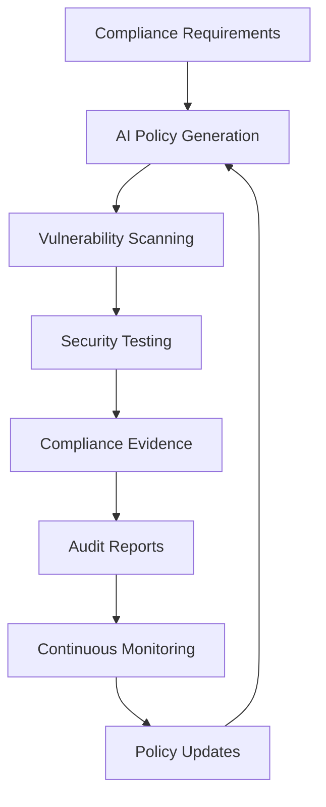

**Policy-as-Code Generation**
```bash
# policies/req.md
"Data at rest must be AES-256 encrypted in transit and at rest per SOC 2."

# Generate policy
ai "Convert policies/req.md into Cedar policy code" > policies/code/encryption.cedar
opa test policies/code/encryption.cedar
```

**Security Scanning Orchestration**
```bash
#!/bin/bash
snyk test --json > snyk.json
bandit -r src -f json > bandit.json
trivy fs --format json . > trivy.json
ai "Summarize snyk.json, bandit.json, trivy.json; list CRITICAL issues" > pr-comment.txt
gh pr comment --body-file pr-comment.txt
if grep -q '"severity":"CRITICAL"' pr-comment.txt; then exit 1; fi
```

**Anti-pattern: Fragmented Security**
Implementing security tools and compliance checks in isolation without a unified AI-driven framework leads to gaps and inconsistencies.

---

## Deployment Automation

**Maturity**: Advanced  
**Description**: AI-powered pipeline generation, blue-green deployments, and intelligent rollback strategies that adapt to system behavior and historical patterns.

**Related Patterns**: [AI Workflow Orchestration](#ai-workflow-orchestration), [Observable AI Development](#observable-ai-development)

**Pipeline Synthesis**
```bash
# ci.spec
install dependencies -> pip install -r requirements.txt
run tests -> pytest
build image -> docker build -t myapp .
push image -> aws ecr get-login-password | docker push myapp:latest

# Generate CI
ai "Read ci.spec and output GitHub Actions YAML" > .github/workflows/ci.yml
git add ci.spec .github/workflows/ci.yml
git commit -m "chore: generate CI from spec"
```

**Intelligent Rollback Strategies**
```bash
aws cloudwatch get-metric-statistics --output text > metrics.csv
ai "From metrics.csv, suggest a 5% canary rollout and rollback criteria" > canary.json
deploy-tool update-release --config canary.json
```

**Anti-pattern: Static Deployment**
Using fixed deployment scripts without AI adaptation leads to suboptimal rollout strategies and missed opportunities for intelligent automation.

---

## Monitoring & Maintenance

**Maturity**: Advanced  
**Description**: Performance baselines, incident response, and technical debt management with AI assistance for proactive system health and automated maintenance workflows.

**Related Patterns**: [Observable AI Development](#observable-ai-development), [AI Knowledge Persistence](#ai-knowledge-persistence)

**Performance Baseline Management**
```bash
aws cloudwatch get-metric-statistics --period 86400 > perf.csv
ai "From perf.csv, recommend latency alert thresholds and autoscale policies" > perf-policy.json
deploy-tool apply perf-policy.json
```

**Technical Debt Forecasting**
```bash
cloc src > loc.txt
coverage run -m pytest; coverage report > cov.txt
ai "From loc.txt and cov.txt, list top-3 files needing refactor and tests" > debt.txt
```

**Incident Response Automation**
```bash
pd incidents:list --limit 10 > incidents.json
ai "Create a step-by-step RDS failover runbook from incidents.json" > runbooks/rds-failover.md
git add runbooks/rds-failover.md
```

**Anti-pattern: Reactive Maintenance**
Waiting for incidents to spike forces firefighting rather than proactive system health management with AI assistance.

---

# Anti-Patterns Reference

## Common AI Development Anti-Patterns

### Foundation Anti-Patterns
- **Rushing Into AI**: Starting AI adoption without proper assessment
- **Context Drift**: Inconsistent AI rules across team members
- **Unrestricted Access**: Allowing AI tools access to sensitive data
- **Ad-Hoc Development**: Skipping structured development lifecycle

### Development Anti-Patterns
- **Implementation-First AI**: Writing code before defining acceptance criteria
- **Test Generation Without Strategy**: Creating tests without coherent quality goals
- **Big Bang Generation**: Attempting complex features in single AI interaction
- **Uncoordinated Multi-Tool Usage**: Using multiple AI tools without orchestration
- **Black Box Systems**: Insufficient logging for AI debugging
- **Unclear Boundaries**: Ambiguous human-AI handoff points

### Operations Anti-Patterns
- **Fragmented Security**: Isolated security tools without unified framework
- **Static Deployment**: Fixed scripts without AI adaptation
- **Reactive Maintenance**: Firefighting instead of proactive AI-assisted management
- **Alert Fatigue**: Overwhelming developers with low-priority findings

---

# Implementation Guide

## Getting Started

### Phase 1: Foundation (Weeks 1-2)
1. **[AI Readiness Assessment](#ai-readiness-assessment)** - Evaluate team and codebase readiness
2. **[Rules as Code](#rules-as-code)** - Establish consistent AI coding standards
3. **[AI Security Sandbox](#ai-security-sandbox)** - Implement secure AI tool isolation
4. **[AI Developer Lifecycle](#ai-developer-lifecycle)** - Define structured development process
5. **[AI Issue Generation](#ai-issue-generation)** - Generate structured work items from requirements

### Phase 2: Development (Weeks 3-4)
1. **[ATDD-Driven AI Development](#atdd-driven-ai-development)** - Implement acceptance test-first approach
2. **[Comprehensive AI Testing Strategy](#comprehensive-ai-testing-strategy)** - Establish unified testing framework
3. **[Progressive AI Enhancement](#progressive-ai-enhancement)** - Practice iterative development
4. **[Context Window Optimization](#context-window-optimization)** - Optimize AI tool selection

### Phase 3: Operations (Weeks 5-6)
1. **[AI Security & Compliance](#ai-security--compliance)** - Implement unified security framework
2. **[Deployment Automation](#deployment-automation)** - Establish AI-powered CI/CD
3. **[Monitoring & Maintenance](#monitoring--maintenance)** - Deploy proactive system management

**Note**: For teams practicing continuous delivery, implement security (AI Security Sandbox, AI Security & Compliance) and deployment patterns (Deployment Automation) from week 1 alongside foundation patterns. The phases represent learning dependencies, not deployment sequences.

## Success Metrics

### Foundation Metrics
- Team readiness score improvement
- Consistent AI rule adherence across projects
- Zero credential leaks in AI-generated code
- Reduced onboarding time for new developers

### Development Metrics
- Test coverage maintenance (>90% for AI-generated code)
- Reduced code review cycles
- Faster feature delivery with maintained quality
- Decreased debugging time for AI-generated issues

### Operations Metrics
- Automated policy compliance verification
- Reduced deployment failures
- Faster incident response with AI-generated runbooks
- Proactive technical debt management

## Contributing

Have a pattern that's working well for your team? Open an issue or PR to share your experience. The AI development landscape is evolving rapidly, and we're all learning together.

### Pattern Contribution Guidelines
1. Follow the established pattern template (Maturity, Description, Related Patterns, Examples, Anti-patterns)
2. Include practical, runnable examples
3. Specify clear success criteria and anti-patterns
4. Reference related patterns appropriately
5. Test patterns with multiple AI tools when applicable

## License

MIT License - See LICENSE file for details.

---

*The patterns in this collection represent collective wisdom from teams pioneering AI-assisted development. They're designed to be adapted and evolved as the AI development landscape continues to mature.*