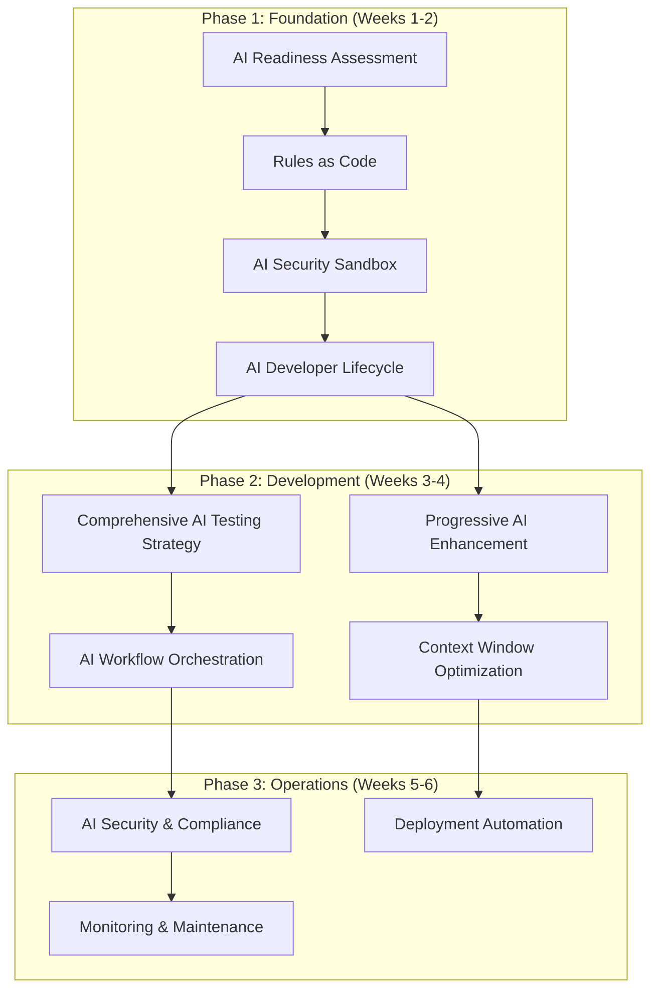
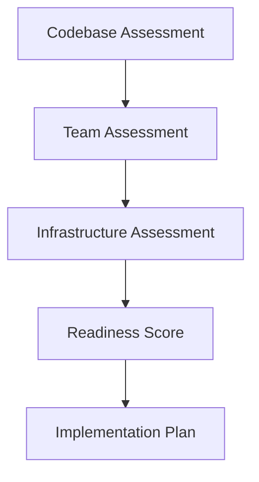
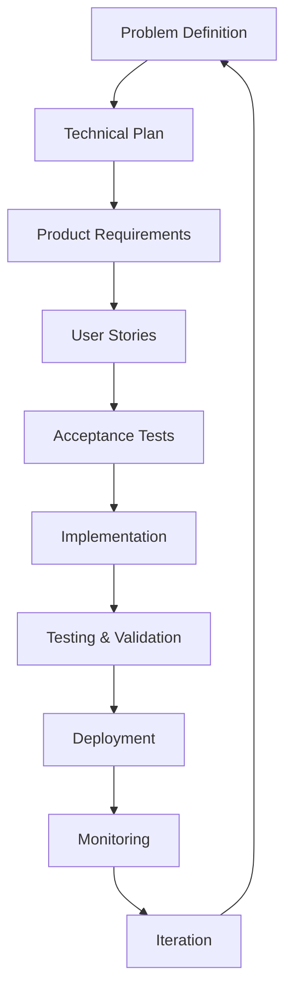
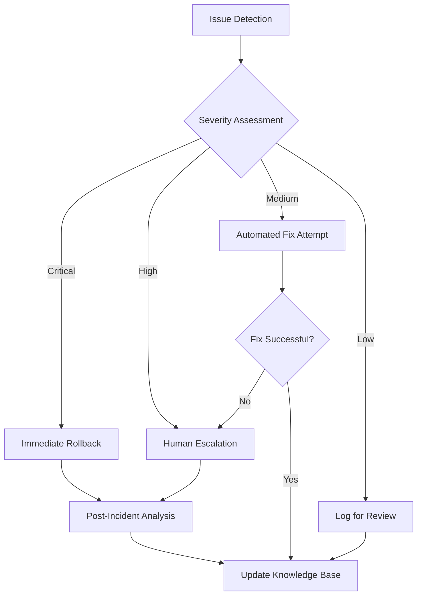
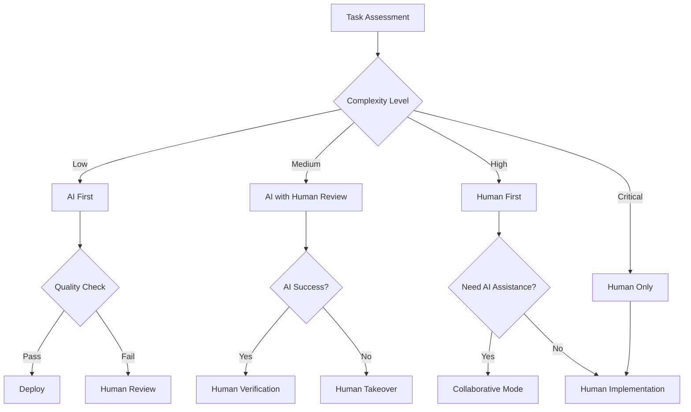
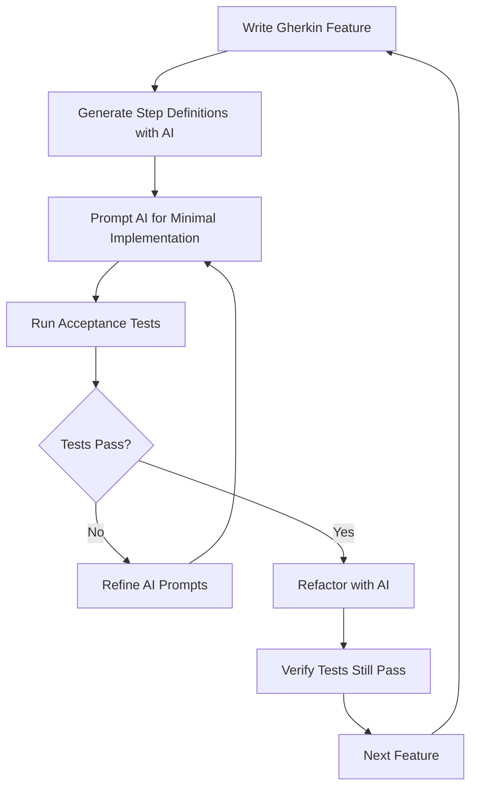
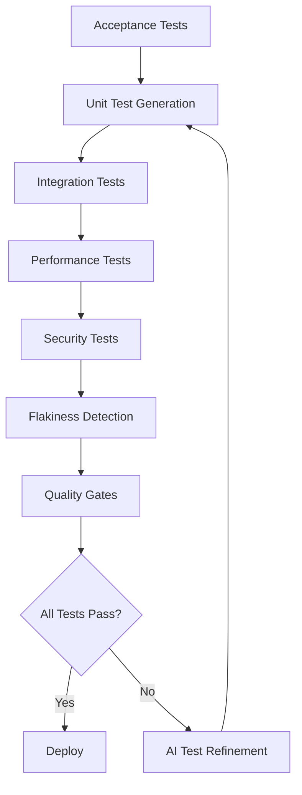
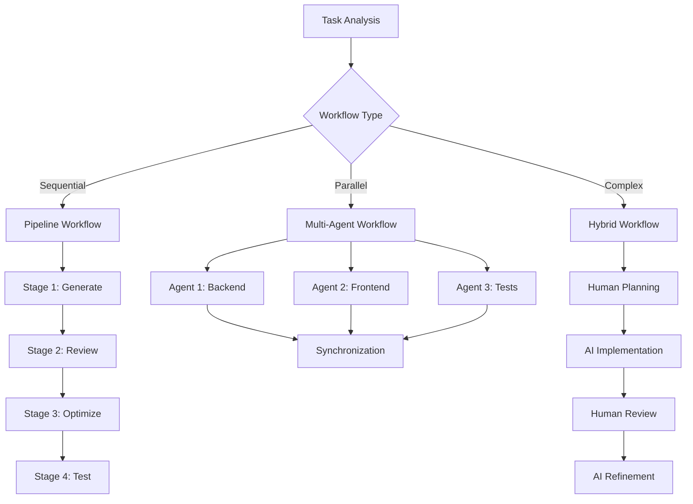
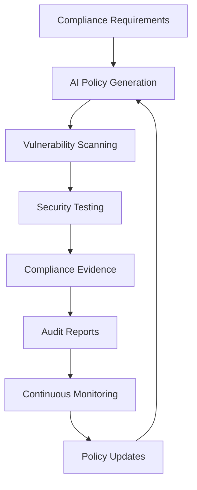

# AI Development Patterns

A comprehensive collection of proven patterns for building software with AI assistance, organized by implementation maturity and development lifecycle phases.

## Pattern Organization

This repository provides a structured approach to AI-assisted development through three pattern categories:

- **[Foundation Patterns](#foundation-patterns)** - Essential patterns for team readiness and basic AI integration
- **[Development Patterns](#development-patterns)** - Daily practice patterns for AI-assisted coding workflows  
- **[Operations Patterns](#operations-patterns)** - CI/CD, security, and production management with AI

## Pattern Dependencies & Implementation Order



## Complete Pattern Reference

| Pattern | Maturity | Type | Description | Dependencies |
|---------|----------|------|-------------|--------------|
| **[AI Readiness Assessment](#ai-readiness-assessment)** | Beginner | Foundation | Systematic evaluation of codebase and team readiness for AI integration | None |
| **[Rules as Code](#rules-as-code)** | Beginner | Foundation | Version and maintain AI coding standards as explicit configuration files | AI Readiness Assessment |
| **[AI Security Sandbox](#ai-security-sandbox)** | Beginner | Foundation | Run AI tools in isolated environments without access to secrets or sensitive data | Rules as Code |
| **[AI Developer Lifecycle](#ai-developer-lifecycle)** | Intermediate | Foundation | Structured 9-stage process from problem definition through deployment with AI assistance | Rules as Code, AI Security Sandbox |
| **[AI Failure Recovery Protocol](#ai-failure-recovery-protocol)** | Intermediate | Foundation | Systematic approach to detecting and recovering from AI-generated issues | AI Developer Lifecycle |
| **[Human-AI Handoff Protocol](#human-ai-handoff-protocol)** | Intermediate | Foundation | Clear boundaries and procedures for transitioning work between human developers and AI | AI Developer Lifecycle |
| **[ATDD-Driven AI Development](#atdd-driven-ai-development)** | Intermediate | Development | Use Acceptance Test-Driven Development to guide AI code generation with executable specifications | AI Developer Lifecycle |
| **[Comprehensive AI Testing Strategy](#comprehensive-ai-testing-strategy)** | Intermediate | Development | Unified approach to test-first development, automated generation, and quality assurance | ATDD-Driven AI Development |
| **[Progressive AI Enhancement](#progressive-ai-enhancement)** | Beginner | Development | Build complex features through small, deployable iterations rather than big-bang generation | AI Developer Lifecycle |
| **[AI Workflow Orchestration](#ai-workflow-orchestration)** | Advanced | Development | Coordinate sequential pipelines, parallel workflows, and hybrid human-AI processes | Comprehensive AI Testing Strategy |
| **[Context Window Optimization](#context-window-optimization)** | Intermediate | Development | Match AI tool selection to task complexity and optimize cost/performance trade-offs | Progressive AI Enhancement |
| **[AI Knowledge Persistence](#ai-knowledge-persistence)** | Intermediate | Development | Capture successful patterns and failed attempts as versioned knowledge for future sessions | Rules as Code |
| **[Constraint-Based AI Development](#constraint-based-ai-development)** | Beginner | Development | Give AI specific constraints to prevent over-engineering and ensure focused solutions | Progressive AI Enhancement |
| **[Observable AI Development](#observable-ai-development)** | Intermediate | Development | Strategic logging and debugging that makes system behavior visible to AI | AI Developer Lifecycle |
| **[AI Security & Compliance](#ai-security--compliance)** | Advanced | Operations | Unified framework for policy generation, vulnerability scanning, and compliance automation | AI Security Sandbox |
| **[Deployment Automation](#deployment-automation)** | Advanced | Operations | AI-powered pipeline generation, blue-green deployments, and intelligent rollback strategies | AI Workflow Orchestration |
| **[Monitoring & Maintenance](#monitoring--maintenance)** | Advanced | Operations | Performance baselines, incident response, and technical debt management with AI assistance | Observable AI Development |

---

# Foundation Patterns

Foundation patterns establish the essential infrastructure and team readiness required for successful AI-assisted development. These patterns must be implemented first as they enable all subsequent patterns.

## AI Readiness Assessment

**Maturity**: Beginner  
**Description**: Systematic evaluation of codebase and team readiness for AI-assisted development before implementing AI patterns.

**Assessment Framework**



**Codebase Readiness Checklist**
```markdown
## Code Quality Prerequisites
□ Consistent code formatting and style guide
□ Comprehensive test coverage (>80% for critical paths)
□ Clear separation of concerns and modular architecture
□ Documented APIs and interfaces
□ Version-controlled configuration and secrets management

## Documentation Standards
□ README with setup and development instructions
□ API documentation (OpenAPI/Swagger)
□ Architecture decision records (ADRs)
□ Coding standards and conventions documented
□ Deployment and operational procedures
```

**Anti-pattern: Rushing Into AI**
Starting AI adoption without proper assessment leads to inconsistent practices, security vulnerabilities, and team frustration.

---

## Rules as Code

**Maturity**: Beginner  
**Description**: Treat AI coding standards like infrastructure - version them, evolve them, and make them explicit. Every AI session starts fresh, so without persistent rules, you're teaching AI your preferences from scratch each time.

**Related Patterns**: [AI Developer Lifecycle](#ai-developer-lifecycle), [AI Knowledge Persistence](#ai-knowledge-persistence)

**Standardized Project Structure**
```bash
project/
├── .ai/                          # AI configuration directory
│   ├── rules/                    # Modular rule sets
│   │   ├── security.md          # Security standards
│   │   ├── testing.md           # Testing requirements
│   │   ├── style.md             # Code style guide
│   │   └── architecture.md      # Architectural patterns
│   ├── prompts/                 # Reusable prompt templates
│   │   ├── implementation.md    # Implementation prompts
│   │   ├── review.md            # Code review prompts
│   │   └── testing.md           # Test generation prompts
│   └── knowledge/               # Captured patterns and gotchas
│       ├── successful.md        # Proven successful patterns
│       └── failures.md          # Known failure patterns
├── .cursorrules                 # Cursor IDE configuration
├── CLAUDE.md                    # Claude Code session context
└── .windsurf/                   # Windsurf configuration
    └── rules.md
```

**Anti-pattern: Context Drift**
Each developer maintains their own prompts and preferences, leading to inconsistent code across the team.

---

## AI Security Sandbox

**Maturity**: Beginner  
**Description**: Run AI tools in isolated environments that can't access secrets, credentials, or sensitive data. Essential for preventing credential leaks and maintaining security compliance.

**Related Patterns**: [AI Security & Compliance](#ai-security--compliance), [Rules as Code](#rules-as-code)

**Docker-Based Isolation**
```yaml
# docker-compose.ai-sandbox.yml
version: '3.8'

services:
  ai-development:
    build:
      context: .
      dockerfile: Dockerfile.ai-sandbox
    security_opt:
      - no-new-privileges:true
    cap_drop:
      - ALL
    volumes:
      # Read-only source code access
      - ./src:/workspace/src:ro
      - ./tests:/workspace/tests:rw
      # NO access to sensitive directories:
      # - .env files, .aws credentials, .ssh keys, secrets/ directory
    environment:
      - NODE_ENV=development
      - AI_SANDBOX=true
    networks:
      - ai-isolated
    restart: no

networks:
  ai-isolated:
    driver: bridge
    internal: true  # No external network access
```

**Anti-pattern: Unrestricted Access**
Allowing AI tools full system access risks credential leaks, data breaches, and security compliance violations.

---

## AI Developer Lifecycle

**Maturity**: Intermediate  
**Description**: AI development follows a structured lifecycle from problem definition through deployment, integrating all tactical patterns for systematic, testable, and maintainable AI-assisted development.

**Related Patterns**: [Rules as Code](#rules-as-code), [ATDD-Driven AI Development](#atdd-driven-ai-development), [Observable AI Development](#observable-ai-development)

**The Complete Lifecycle**



**Anti-pattern: Ad-Hoc AI Development**
Jumping straight to coding with AI without proper planning, requirements, or testing strategy.

---

## AI Failure Recovery Protocol

**Maturity**: Intermediate  
**Description**: Systematic approach to detecting and recovering from AI-generated issues with automated rollback triggers and learning capture mechanisms.

**Detection & Recovery Framework**



**Anti-pattern: Ignore and Hope**
Ignoring AI-generated issues or assuming they'll resolve themselves leads to accumulated technical debt and system instability.

---

## Human-AI Handoff Protocol

**Maturity**: Intermediate  
**Description**: Clear boundaries and procedures for transitioning work between human developers and AI tools based on complexity, security requirements, and creative problem-solving needs.

**Handoff Decision Framework**



**Anti-pattern: Unclear Boundaries**
Allowing AI and humans to work on the same task simultaneously without clear handoff points leads to conflicts, duplicated effort, and inconsistent quality.

---

# Development Patterns

Development patterns provide tactical approaches for day-to-day AI-assisted coding workflows, focusing on quality, maintainability, and team collaboration.

## ATDD-Driven AI Development

**Maturity**: Intermediate  
**Description**: Use Acceptance Test-Driven Development (ATDD) to guide AI code generation by writing executable specifications first, then prompting AI to create minimal implementations that satisfy the acceptance criteria.

**Related Patterns**: [AI Developer Lifecycle](#ai-developer-lifecycle), [Comprehensive AI Testing Strategy](#comprehensive-ai-testing-strategy), [Observable AI Development](#observable-ai-development)

**The ATDD-AI Workflow**



**Examples**

**Step 1: Write Executable Specifications First**
```gherkin
# features/user_authentication.feature
Feature: User Authentication
  As a user
  I want to log into the system
  So that I can access my personal dashboard

  Scenario: Successful login with valid credentials
    Given a user exists with email "user@example.com" and password "securepass123"
    When I submit login credentials "user@example.com" and "securepass123"
    Then I should be redirected to the dashboard
    And I should see a welcome message "Welcome back!"

  Scenario: Failed login with invalid credentials
    Given a user exists with email "user@example.com" and password "securepass123"
    When I submit login credentials "user@example.com" and "wrongpassword"
    Then I should see an error message "Invalid credentials"
    And I should remain on the login page
```

**Step 2: AI-Generated Step Definitions**
```python
# features/steps/auth_steps.py
# Prompt: "Generate pytest-bdd step definitions for the user authentication feature"

from pytest_bdd import given, when, then, scenarios
from selenium import webdriver
import pytest

scenarios('../user_authentication.feature')

@given('a user exists with email "<email>" and password "<password>"')
def user_exists(email, password):
    # AI generates user creation logic
    user_service.create_user(email=email, password=password)

@when('I submit login credentials "<email>" and "<password>"')
def submit_login(browser, email, password):
    # AI generates form interaction
    browser.find_element_by_id("email").send_keys(email)
    browser.find_element_by_id("password").send_keys(password)
    browser.find_element_by_id("login-button").click()

@then('I should be redirected to the dashboard')
def verify_dashboard_redirect(browser):
    # AI generates assertion logic
    assert "/dashboard" in browser.current_url
```

**Anti-pattern: Implementation-First AI**
Writing code with AI first, then trying to retrofit tests, resulting in tests that mirror implementation rather than specify behavior.

---

## Comprehensive AI Testing Strategy

**Maturity**: Intermediate  
**Description**: Unified approach combining test-first development, automated test generation, and quality assurance patterns to ensure AI-generated code meets quality and behavioral specifications.

**Related Patterns**: [ATDD-Driven AI Development](#atdd-driven-ai-development), [Observable AI Development](#observable-ai-development)

**Integrated Testing Framework**



**Anti-pattern: Test Generation Without Strategy**
Generating tests with AI without a coherent strategy leads to poor coverage, flaky tests, and false confidence in code quality.

---

## Progressive AI Enhancement

**Maturity**: Beginner  
**Description**: Build complex features through small, deployable iterations. Each AI interaction adds one specific enhancement rather than trying to build everything at once.

**Related Patterns**: [AI Developer Lifecycle](#ai-developer-lifecycle), [Constraint-Based AI Development](#constraint-based-ai-development)

**Examples**
Building authentication progressively:
```bash
# Day 1: Minimal login
"Create POST /login that returns 200 for admin/admin, 401 otherwise"
→ Deploy

# Day 2: Real password check
"Modify login to check passwords against users table. Keep existing API."
→ Deploy

# Day 3: Add security
"Add bcrypt hashing to login. Support both hashed and plain passwords temporarily."
→ Deploy

# Day 4: Modern tokens
"Replace session with JWT. Keep session endpoint for backward compatibility."
→ Deploy
```

**Anti-pattern: Big Bang Generation**
Asking AI to "create a complete user management system" results in 5000 lines of coupled, untested code that takes days to review and debug.

---

## AI Workflow Orchestration

**Maturity**: Advanced  
**Description**: Coordinate sequential pipelines, parallel workflows, and hybrid human-AI processes for complex development tasks requiring multiple AI tools and human oversight.

**Related Patterns**: [Human-AI Handoff Protocol](#human-ai-handoff-protocol), [Comprehensive AI Testing Strategy](#comprehensive-ai-testing-strategy)

**Workflow Types & Selection**



**Anti-pattern: Uncoordinated Multi-Tool Usage**
Using multiple AI tools without proper orchestration leads to inconsistent code, integration conflicts, and wasted effort from competing implementations.

---

## Context Window Optimization

**Maturity**: Intermediate  
**Description**: Match AI tool selection to task complexity and optimize cost/performance trade-offs. Using Claude for every task is like using a sledgehammer to hang a picture.

**Related Patterns**: [Progressive AI Enhancement](#progressive-ai-enhancement), [AI Workflow Orchestration](#ai-workflow-orchestration)

**Decision Matrix**
```
Task: Add null check
Tool: GitHub Copilot (instant, cheap)
Context: <100 tokens

Task: Extract method
Tool: Cursor Cmd+K (fast, focused)  
Context: <1000 tokens

Task: Refactor module
Tool: Windsurf Cascade (handles dependencies)
Context: <10000 tokens

Task: Design architecture
Tool: Claude Code (best reasoning)
Context: Full codebase
```

---

## AI Knowledge Persistence

**Maturity**: Intermediate  
**Description**: Capture successful patterns and failed attempts as versioned knowledge for future sessions.

**Related Patterns**: [Rules as Code](#rules-as-code), [AI Failure Recovery Protocol](#ai-failure-recovery-protocol)

**Examples**
`.ai/knowledge/authentication.md`:
```markdown
## Successful Patterns

### JWT Implementation
Prompt that works 95% of the time:
"Implement JWT auth:
- RS256 algorithm (never HS256)
- 15 min access token
- 7 day refresh token in httpOnly cookie
- Include user.id and role in payload"

## Failed Patterns

### ❌ "Make authentication secure"
Too vague - AI adds unnecessary complexity

## Gotchas
- AI defaults to HS256 (insecure)
- Often uses deprecated bcrypt methods
```

---

## Constraint-Based AI Development

**Maturity**: Beginner  
**Description**: Give AI specific constraints to prevent over-engineering and ensure focused solutions.

**Related Patterns**: [Progressive AI Enhancement](#progressive-ai-enhancement), [Human-AI Handoff Protocol](#human-ai-handoff-protocol)

**Examples**
```
Bad: "Create user service"
Good: "Create user service: <100 lines, 3 methods max, only bcrypt dependency"

Bad: "Add caching"
Good: "Add caching using Map, max 1000 entries, LRU eviction"

Bad: "Improve performance"
Good: "Reduce p99 latency to <50ms without new dependencies"
```

---

## Observable AI Development

**Maturity**: Intermediate  
**Description**: Make your system's behavior visible to AI through strategic logging and debugging. AI can't fix what it can't see.

**Related Patterns**: [AI Developer Lifecycle](#ai-developer-lifecycle), [Comprehensive AI Testing Strategy](#comprehensive-ai-testing-strategy)

**Examples**
```python
# Good: Observable operations
import logging
logger = logging.getLogger(__name__)

def process_order(order):
    logger.info(f"[ORDER] Processing {order.id} for {order.customer_email}")
    
    try:
        logger.info("[ORDER] Validating...")
        validate_order(order)
        logger.info("[ORDER] ✓ Validation passed")
        
        logger.info(f"[PAYMENT] Charging ${order.total} via {order.payment_method}")
        result = charge_payment(order)
        logger.info(f"[PAYMENT] ✓ Transaction: {result.transaction_id}")
        
    except ValidationError as e:
        logger.error(f"[ORDER] ✗ Validation failed: {e.field} - {e.message}")
        raise
```

**Anti-pattern: Black Box Systems**
Minimal or cryptic logging that leaves AI guessing about system state and failure causes.

---

# Operations Patterns

Operations patterns focus on CI/CD, security, compliance, and production management with AI assistance, building on the foundation and development patterns.

## AI Security & Compliance

**Maturity**: Advanced  
**Description**: Unified framework for policy generation, vulnerability scanning, and compliance automation using AI to transform regulatory requirements into executable code.

**Related Patterns**: [AI Security Sandbox](#ai-security-sandbox), [Rules as Code](#rules-as-code)

**Unified Security Framework**



**Policy-as-Code Generation**
```bash
# policies/req.md
"Data at rest must be AES-256 encrypted in transit and at rest per SOC 2."

# Generate policy
ai "Convert policies/req.md into Cedar policy code" > policies/code/encryption.cedar
opa test policies/code/encryption.cedar
```

**Security Scanning Orchestration**
```bash
#!/bin/bash
snyk test --json > snyk.json
bandit -r src -f json > bandit.json
trivy fs --format json . > trivy.json
ai "Summarize snyk.json, bandit.json, trivy.json; list CRITICAL issues" > pr-comment.txt
gh pr comment --body-file pr-comment.txt
if grep -q '"severity":"CRITICAL"' pr-comment.txt; then exit 1; fi
```

**Anti-pattern: Fragmented Security**
Implementing security tools and compliance checks in isolation without a unified AI-driven framework leads to gaps and inconsistencies.

---

## Deployment Automation

**Maturity**: Advanced  
**Description**: AI-powered pipeline generation, blue-green deployments, and intelligent rollback strategies that adapt to system behavior and historical patterns.

**Related Patterns**: [AI Workflow Orchestration](#ai-workflow-orchestration), [Observable AI Development](#observable-ai-development)

**Pipeline Synthesis**
```bash
# ci.spec
install dependencies -> pip install -r requirements.txt
run tests -> pytest
build image -> docker build -t myapp .
push image -> aws ecr get-login-password | docker push myapp:latest

# Generate CI
ai "Read ci.spec and output GitHub Actions YAML" > .github/workflows/ci.yml
git add ci.spec .github/workflows/ci.yml
git commit -m "chore: generate CI from spec"
```

**Intelligent Rollback Strategies**
```bash
aws cloudwatch get-metric-statistics --output text > metrics.csv
ai "From metrics.csv, suggest a 5% canary rollout and rollback criteria" > canary.json
deploy-tool update-release --config canary.json
```

**Anti-pattern: Static Deployment**
Using fixed deployment scripts without AI adaptation leads to suboptimal rollout strategies and missed opportunities for intelligent automation.

---

## Monitoring & Maintenance

**Maturity**: Advanced  
**Description**: Performance baselines, incident response, and technical debt management with AI assistance for proactive system health and automated maintenance workflows.

**Related Patterns**: [Observable AI Development](#observable-ai-development), [AI Knowledge Persistence](#ai-knowledge-persistence)

**Performance Baseline Management**
```bash
aws cloudwatch get-metric-statistics --period 86400 > perf.csv
ai "From perf.csv, recommend latency alert thresholds and autoscale policies" > perf-policy.json
deploy-tool apply perf-policy.json
```

**Technical Debt Forecasting**
```bash
cloc src > loc.txt
coverage run -m pytest; coverage report > cov.txt
ai "From loc.txt and cov.txt, list top-3 files needing refactor and tests" > debt.txt
```

**Incident Response Automation**
```bash
pd incidents:list --limit 10 > incidents.json
ai "Create a step-by-step RDS failover runbook from incidents.json" > runbooks/rds-failover.md
git add runbooks/rds-failover.md
```

**Anti-pattern: Reactive Maintenance**
Waiting for incidents to spike forces firefighting rather than proactive system health management with AI assistance.

---

# Anti-Patterns Reference

## Common AI Development Anti-Patterns

### Foundation Anti-Patterns
- **Rushing Into AI**: Starting AI adoption without proper assessment
- **Context Drift**: Inconsistent AI rules across team members
- **Unrestricted Access**: Allowing AI tools access to sensitive data
- **Ad-Hoc Development**: Skipping structured development lifecycle

### Development Anti-Patterns
- **Implementation-First AI**: Writing code before defining acceptance criteria
- **Test Generation Without Strategy**: Creating tests without coherent quality goals
- **Big Bang Generation**: Attempting complex features in single AI interaction
- **Uncoordinated Multi-Tool Usage**: Using multiple AI tools without orchestration
- **Black Box Systems**: Insufficient logging for AI debugging
- **Unclear Boundaries**: Ambiguous human-AI handoff points

### Operations Anti-Patterns
- **Fragmented Security**: Isolated security tools without unified framework
- **Static Deployment**: Fixed scripts without AI adaptation
- **Reactive Maintenance**: Firefighting instead of proactive AI-assisted management
- **Alert Fatigue**: Overwhelming developers with low-priority findings

---

# Implementation Guide

## Getting Started

### Phase 1: Foundation (Weeks 1-2)
1. **[AI Readiness Assessment](#ai-readiness-assessment)** - Evaluate team and codebase readiness
2. **[Rules as Code](#rules-as-code)** - Establish consistent AI coding standards
3. **[AI Security Sandbox](#ai-security-sandbox)** - Implement secure AI tool isolation
4. **[AI Developer Lifecycle](#ai-developer-lifecycle)** - Define structured development process

### Phase 2: Development (Weeks 3-4)
1. **[ATDD-Driven AI Development](#atdd-driven-ai-development)** - Implement acceptance test-first approach
2. **[Comprehensive AI Testing Strategy](#comprehensive-ai-testing-strategy)** - Establish unified testing framework
3. **[Progressive AI Enhancement](#progressive-ai-enhancement)** - Practice iterative development
4. **[Context Window Optimization](#context-window-optimization)** - Optimize AI tool selection

### Phase 3: Operations (Weeks 5-6)
1. **[AI Security & Compliance](#ai-security--compliance)** - Implement unified security framework
2. **[Deployment Automation](#deployment-automation)** - Establish AI-powered CI/CD
3. **[Monitoring & Maintenance](#monitoring--maintenance)** - Deploy proactive system management

## Success Metrics

### Foundation Metrics
- Team readiness score improvement
- Consistent AI rule adherence across projects
- Zero credential leaks in AI-generated code
- Reduced onboarding time for new developers

### Development Metrics
- Test coverage maintenance (>90% for AI-generated code)
- Reduced code review cycles
- Faster feature delivery with maintained quality
- Decreased debugging time for AI-generated issues

### Operations Metrics
- Automated policy compliance verification
- Reduced deployment failures
- Faster incident response with AI-generated runbooks
- Proactive technical debt management

## Contributing

Have a pattern that's working well for your team? Open an issue or PR to share your experience. The AI development landscape is evolving rapidly, and we're all learning together.

### Pattern Contribution Guidelines
1. Follow the established pattern template (Maturity, Description, Related Patterns, Examples, Anti-patterns)
2. Include practical, runnable examples
3. Specify clear success criteria and anti-patterns
4. Reference related patterns appropriately
5. Test patterns with multiple AI tools when applicable

## License

MIT License - See LICENSE file for details.

---

*The patterns in this collection represent collective wisdom from teams pioneering AI-assisted development. They're designed to be adapted and evolved as the AI development landscape continues to mature.*