# AI Development Patterns

A comprehensive collection of patterns based on my experience for building software with AI assistance, organized by implementation maturity and development lifecycle phases. These patterns are subject to change as the field evolves.

## Pattern Organization

This repository provides a structured approach to AI-assisted development through three pattern categories:

- **[Foundation Patterns](#foundation-patterns)** - Essential patterns for team readiness and basic AI integration
- **[Development Patterns](#development-patterns)** - Daily practice patterns for AI-assisted coding workflows  
- **[Operations Patterns](#operations-patterns)** - CI/CD, security, and production management with AI

## Pattern Dependencies & Implementation Order

**Important**: These phases represent a **learning progression** for teams new to AI development, not a waterfall approach. Teams with existing DevOps/security expertise should implement patterns continuously across all phases from day one, following a "continuous everything" model.

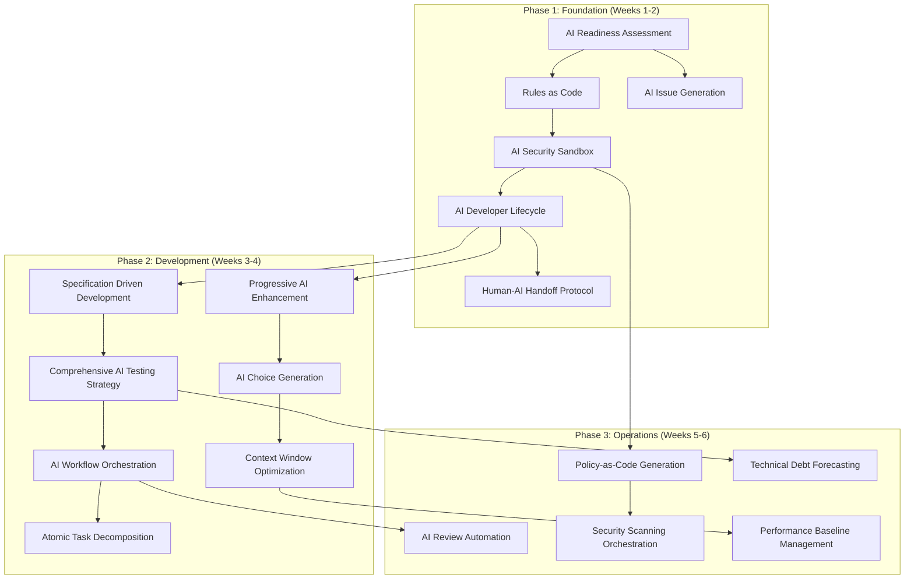

**Continuous Implementation Note**: Security patterns (AI Security Sandbox, AI Security & Compliance) and deployment patterns should be implemented continuously throughout development, not delayed until specific phases. The dependencies shown represent learning prerequisites, not deployment gates.

## Complete Pattern Reference

| Pattern | Maturity | Type | Description | Dependencies |
|---------|----------|------|-------------|--------------|
| **[AI Readiness Assessment](#ai-readiness-assessment)** | Beginner | Foundation | Systematic evaluation of codebase and team readiness for AI integration | None |
| **[Rules as Code](#rules-as-code)** | Beginner | Foundation | Version and maintain AI coding standards as explicit configuration files | AI Readiness Assessment |
| **[AI Security Sandbox](#ai-security-sandbox)** | Beginner | Foundation | Run AI tools in isolated environments without access to secrets or sensitive data | Rules as Code |
| **[AI Developer Lifecycle](#ai-developer-lifecycle)** | Intermediate | Foundation | Structured 9-stage process from problem definition through deployment with AI assistance | Rules as Code, AI Security Sandbox |
| **[Human-AI Handoff Protocol](#human-ai-handoff-protocol)** | Intermediate | Foundation | Clear boundaries and procedures for transitioning work between human developers and AI | AI Developer Lifecycle |
| **[AI Issue Generation](#ai-issue-generation)** | Intermediate | Foundation | Generate Kanban-optimized work items (4-8 hours max) from requirements using AI to ensure continuous flow with clear acceptance criteria and dependencies | AI Readiness Assessment |
| **[Specification Driven Development](#specification-driven-development)** | Intermediate | Development | Use executable specifications to guide AI code generation with clear acceptance criteria before implementation | AI Developer Lifecycle |
| **[Comprehensive AI Testing Strategy](#comprehensive-ai-testing-strategy)** | Intermediate | Development | Unified approach to test-first development, automated generation, and quality assurance | Specification Driven Development |
| **[Progressive AI Enhancement](#progressive-ai-enhancement)** | Beginner | Development | Build complex features through small, deployable iterations rather than big-bang generation | AI Developer Lifecycle |
| **[AI Choice Generation](#ai-choice-generation)** | Intermediate | Development | Generate multiple implementation options for exploration and comparison rather than accepting first AI solution | Progressive AI Enhancement, Context Window Optimization |
| **[Atomic Task Decomposition](#atomic-task-decomposition)** | Intermediate | Development | Break complex features into atomic, independently implementable tasks for parallel AI agent execution | AI Workflow Orchestration, Progressive AI Enhancement |
| **[AI Workflow Orchestration](#ai-workflow-orchestration)** | Advanced | Development | Coordinate sequential pipelines, parallel workflows, and hybrid human-AI processes | Comprehensive AI Testing Strategy |
| **[Context Window Optimization](#context-window-optimization)** | Advanced | Development | Match AI tool selection to task complexity and optimize cost/performance trade-offs | Progressive AI Enhancement |
| **[AI Knowledge Persistence](#ai-knowledge-persistence)** | Intermediate | Development | Capture successful patterns and failed attempts as versioned knowledge for future sessions | Rules as Code |
| **[Constraint-Based AI Development](#constraint-based-ai-development)** | Beginner | Development | Give AI specific constraints to prevent over-engineering and ensure focused solutions | Progressive AI Enhancement |
| **[Observable AI Development](#observable-ai-development)** | Intermediate | Development | Strategic logging and debugging that makes system behavior visible to AI | AI Developer Lifecycle |
| **[AI-Driven Refactoring](#ai-driven-refactoring)** | Intermediate | Development | Systematic code improvement using AI to detect and resolve code smells with measurable quality metrics | Rules as Code |
| **[AI-Driven Traceability](#ai-driven-traceability)** | Intermediate | Development | Maintain automated links between requirements, specifications, tests, implementation, and documentation using AI | AI Developer Lifecycle |
| **Security & Compliance** | | Operations | *Category containing security and compliance patterns* | |
| **[Policy-as-Code Generation](#policy-as-code-generation)** | Advanced | Operations | Transform compliance requirements into executable Cedar/OPA policy files with AI assistance | AI Security Sandbox |
| **[Security Scanning Orchestration](#security-scanning-orchestration)** | Intermediate | Operations | Aggregate multiple security tools and use AI to summarize findings for actionable insights | Policy-as-Code Generation |
| **[AI Review Automation](#ai-review-automation)** | Intermediate | Operations | Automate review process for parallel agent outputs using AI to detect conflicts and coordinate integration | AI Workflow Orchestration, Atomic Task Decomposition |
| **[Compliance Evidence Automation](#compliance-evidence-automation)** | Advanced | Operations | Generate audit evidence matrices from logs and configuration changes automatically | Security Scanning Orchestration |
| **[ChatOps Security Integration](#chatops-security-integration)** | Beginner | Operations | Deploy security scanning capabilities through chat commands for immediate feedback | Security Scanning Orchestration |
| **Deployment Automation** | | Operations | *Category containing deployment and pipeline patterns* | |
| **[Pipeline Synthesis](#pipeline-synthesis)** | Intermediate | Operations | Convert plain-English build specifications into CI/CD pipeline configurations | AI Workflow Orchestration |
| **[AI-Guided Blue-Green Deployment](#ai-guided-blue-green-deployment)** | Advanced | Operations | Generate blue-green deployment scripts with validation to prevent AI misconceptions | Pipeline Synthesis |
| **[Drift Detection & Remediation](#drift-detection--remediation)** | Advanced | Operations | Detect infrastructure configuration drift and generate corrective patches automatically | Pipeline Synthesis |
| **[Release Note Synthesis](#release-note-synthesis)** | Beginner | Operations | Automatically generate structured release notes by analyzing git commit history | Pipeline Synthesis |
| **Monitoring & Maintenance** | | Operations | *Category containing monitoring and maintenance patterns* | |
| **[Performance Baseline Management](#performance-baseline-management)** | Advanced | Operations | Establish intelligent performance baselines and configure monitoring thresholds automatically | Observable AI Development |
| **[Technical Debt Forecasting](#technical-debt-forecasting)** | Intermediate | Operations | Proactively identify and prioritize technical debt using AI-powered code analysis | AI-Driven Refactoring |
| **[Incident Response Automation](#incident-response-automation)** | Advanced | Operations | Generate actionable incident response playbooks from historical incident data | Performance Baseline Management |
| **[Test Suite Health Management](#test-suite-health-management)** | Intermediate | Operations | Analyze build history to identify and remediate flaky tests automatically | Comprehensive AI Testing Strategy |
| **[Dependency Upgrade Advisor](#dependency-upgrade-advisor)** | Intermediate | Operations | Intelligently manage dependency upgrades with compatibility analysis and risk assessment | Technical Debt Forecasting |
| **[On-Call Handoff Automation](#on-call-handoff-automation)** | Intermediate | Operations | Generate comprehensive handoff briefs that summarize system state and active issues | Incident Response Automation |
| **[Chaos Engineering Scenarios](#chaos-engineering-scenarios)** | Advanced | Operations | Generate targeted chaos experiments based on system architecture and dependencies | Performance Baseline Management |

---

## Pattern Maturity Levels

Patterns are classified by implementation complexity and prerequisite knowledge:

**Beginner**: Basic AI tool usage with minimal setup required
- Prerequisites: Basic programming skills, access to AI tools
- Complexity: Single tool usage, straightforward prompts
- Examples: Simple code generation, basic constraint setting

**Intermediate**: Multi-tool coordination and process integration  
- Prerequisites: Development workflow experience, team coordination
- Complexity: Multiple tools, orchestration patterns, quality gates
- Examples: Testing strategies, parallel workflows, choice generation

**Advanced**: Complex systems with enterprise concerns
- Prerequisites: Architecture experience, security/compliance knowledge  
- Complexity: Multi-agent systems, advanced safety, compliance automation
- Examples: Enterprise security, compliance automation, chaos engineering

## Task Sizing Framework

The patterns use different task sizing approaches based on their purpose and context:

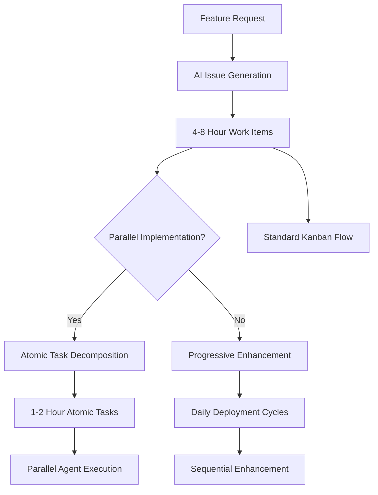

**Task Sizing Hierarchy**:

- **AI Issue Generation** (4-8 hours): Standard Kanban work items for continuous flow and rapid feedback
- **Atomic Task Decomposition** (1-2 hours): Ultra-small tasks for parallel agent execution without conflicts
- **Progressive AI Enhancement** (Daily cycles): Deployment-focused iterations that may contain multiple work items

**When to Use Each Approach**:
- Use **AI Issue Generation** for standard team development with human developers
- Use **Atomic Task Decomposition** when implementing with parallel AI agents
- Use **Progressive Enhancement** when prioritizing rapid market feedback over task granularity

**Pattern Differentiation**:
- **AI Issue Generation**: Creates Kanban work items (4-8 hours) for human team workflows
- **Atomic Task Decomposition**: Creates ultra-small tasks (1-2 hours) for parallel AI agents
- **Progressive AI Enhancement**: Creates deployment cycles (daily) focused on user feedback

## Pattern Selection Decision Framework

Choose the right patterns based on your team's context, project requirements, and AI development maturity:

### Decision Tree

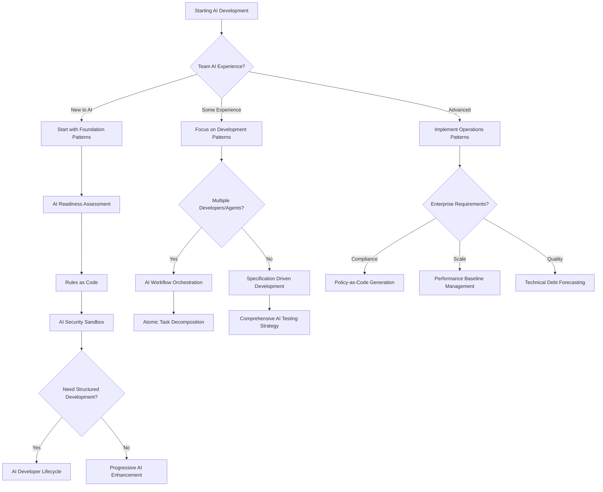

### Context-Based Pattern Selection

**For New Teams (First 2 weeks)**:
1. **[AI Readiness Assessment](#ai-readiness-assessment)** - Evaluate current state
2. **[Rules as Code](#rules-as-code)** - Establish consistent standards
3. **[AI Security Sandbox](#ai-security-sandbox)** - Ensure safe experimentation
4. **[Progressive AI Enhancement](#progressive-ai-enhancement)** - Start with simple iterations

**For Development Teams (Weeks 3-8)**:
1. **[AI Developer Lifecycle](#ai-developer-lifecycle)** - Structured development process
2. **[Specification Driven Development](#specification-driven-development)** - Quality-focused development
3. **[AI Issue Generation](#ai-issue-generation)** - Organized work breakdown
4. **[Comprehensive AI Testing Strategy](#comprehensive-ai-testing-strategy)** - Quality assurance

**For Parallel Implementation**:
1. **[Atomic Task Decomposition](#atomic-task-decomposition)** - Ultra-small independent tasks
2. **[AI Workflow Orchestration](#ai-workflow-orchestration)** - Agent coordination
3. **[AI Review Automation](#ai-review-automation)** - Automated integration
4. **[AI Security Sandbox](#ai-security-sandbox)** - Enhanced with parallel safety

**For Enterprise/Production (Month 2+)**:
1. **[Policy-as-Code Generation](#policy-as-code-generation)** - Compliance automation
2. **[Security Scanning Orchestration](#security-scanning-orchestration)** - Integrated security
3. **[Performance Baseline Management](#performance-baseline-management)** - Production monitoring
4. **[Technical Debt Forecasting](#technical-debt-forecasting)** - Proactive maintenance

### Project Type Recommendations

**MVP/Startup Projects**:
- **Primary**: Progressive AI Enhancement, AI Choice Generation
- **Secondary**: AI Security Sandbox, Constraint-Based AI Development  
- **Avoid**: Complex orchestration patterns until scale demands

**Enterprise Applications**:
- **Primary**: AI Developer Lifecycle, Policy-as-Code Generation
- **Secondary**: AI-Driven Traceability, Security Scanning Orchestration
- **Essential**: All foundation patterns before development patterns

**Research/Experimental Projects**:
- **Primary**: AI Choice Generation, Observable AI Development
- **Secondary**: AI Knowledge Persistence, Context Window Optimization
- **Focus**: Learning and exploration over production readiness

**High-Scale Production**:
- **Primary**: AI Workflow Orchestration, Performance Baseline Management
- **Secondary**: Chaos Engineering Scenarios, Incident Response Automation
- **Critical**: All security and monitoring patterns

### Team Size Considerations

**Solo Developer (1 person)**:
- Focus on **Progressive AI Enhancement** and **AI Choice Generation**
- Add **Observable AI Development** for debugging
- Skip parallel orchestration patterns

**Small Team (2-5 people)**:
- Implement **AI Issue Generation** for coordination
- Use **Specification Driven Development** for quality
- Consider **Human-AI Handoff Protocol** for role clarity

**Medium Team (6-15 people)**:
- Full **AI Developer Lifecycle** implementation
- **AI Workflow Orchestration** for complex features
- **Comprehensive AI Testing Strategy** for quality gates

**Large Team (15+ people)**:
- **Atomic Task Decomposition** for parallel work
- **AI-Driven Traceability** for coordination
- All **Operations Patterns** for scale management

### Technology Stack Considerations

**Cloud-Native Applications**:
- Emphasize **Policy-as-Code Generation** and **Compliance Evidence Automation**
- Implement **Drift Detection & Remediation** for infrastructure
- Use **AI-Guided Blue-Green Deployment** for safe releases

**On-Premise Systems**:
- Focus on **AI Security Sandbox** with network isolation
- Implement **AI Knowledge Persistence** for institutional knowledge
- Use **Technical Debt Forecasting** for maintenance planning

**Microservices Architecture**:
- **AI Workflow Orchestration** for service coordination
- **Observable AI Development** across service boundaries
- **Performance Baseline Management** for distributed monitoring

**Monolithic Applications**:
- **Progressive AI Enhancement** for gradual modernization
- **AI-Driven Refactoring** for code quality improvement
- **Constraint-Based AI Development** to prevent over-engineering

---

# Foundation Patterns

Foundation patterns establish the essential infrastructure and team readiness required for successful AI-assisted development. These patterns must be implemented first as they enable all subsequent patterns.

## AI Readiness Assessment

**Maturity**: Beginner  
**Description**: Systematic evaluation of codebase and team readiness for AI-assisted development before implementing AI patterns.

**Related Patterns**: [Rules as Code](#rules-as-code), [AI Issue Generation](#ai-issue-generation)

**Assessment Framework**

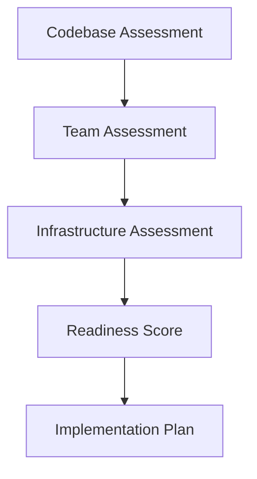

**Codebase Readiness Checklist**
```markdown
## Code Quality Prerequisites
□ Consistent code formatting and style guide
□ Comprehensive test coverage (>80% for critical paths)
□ Clear separation of concerns and modular architecture
□ Documented APIs and interfaces
□ Version-controlled configuration and secrets management

## Documentation Standards
□ README with setup and development instructions
□ API documentation (OpenAPI/Swagger)
□ Architecture decision records (ADRs)
□ Coding standards and conventions documented
□ Deployment and operational procedures
```

**Anti-pattern: Rushing Into AI**
Starting AI adoption without proper assessment leads to inconsistent practices, security vulnerabilities, and team frustration.

---

## Rules as Code

**Maturity**: Beginner  
**Description**: Treat AI coding standards like infrastructure - version them, evolve them, and make them explicit. Every AI session starts fresh, so without persistent rules, you're teaching AI your preferences from scratch each time.

**Related Patterns**: [AI Developer Lifecycle](#ai-developer-lifecycle), [AI Knowledge Persistence](#ai-knowledge-persistence)

**Standardized Project Structure**
```bash
project/
├── .ai/                          # AI configuration directory
│   ├── rules/                    # Modular rule sets
│   │   ├── security.md          # Security standards
│   │   ├── testing.md           # Testing requirements
│   │   ├── style.md             # Code style guide
│   │   └── architecture.md      # Architectural patterns
│   ├── prompts/                 # Reusable prompt templates
│   │   ├── implementation.md    # Implementation prompts
│   │   ├── review.md            # Code review prompts
│   │   └── testing.md           # Test generation prompts
│   └── knowledge/               # Captured patterns and gotchas
│       ├── successful.md        # Proven successful patterns
│       └── failures.md          # Known failure patterns
├── .cursorrules                 # Cursor IDE configuration
├── CLAUDE.md                    # Claude Code session context
└── .windsurf/                   # Windsurf configuration
    └── rules.md
```

**Anti-pattern: Context Drift**
Each developer maintains their own prompts and preferences, leading to inconsistent code across the team.

---

## AI Security Sandbox

**Maturity**: Beginner  
**Description**: Run AI tools in isolated environments that can't access secrets, credentials, or sensitive data. Essential for preventing credential leaks and maintaining security compliance. When running multiple parallel agents, isolation becomes critical to prevent cross-contamination and coordinate access to shared resources safely.

**Related Patterns**: [AI Security & Compliance](#ai-security--compliance), [Rules as Code](#rules-as-code)

**Default-Deny Network Isolation**
```yaml
# See actual implementation: sandbox/docker-compose.ai-sandbox.yml
# docker-compose.ai-sandbox.yml
version: '3.8'

services:
  ai-development:
    build:
      context: .
      dockerfile: Dockerfile.ai-sandbox
    # Complete network isolation - no egress or ingress
    network_mode: none
    security_opt:
      - no-new-privileges:true
    cap_drop:
      - ALL
    volumes:
      # Read-only source code, read/write tests
      - ./src:/workspace/src:ro
      - ./tests:/workspace/tests:rw
      # DO NOT mount ~/.aws, .env, secrets/, etc.
    environment:
      - NODE_ENV=development
      - AI_SANDBOX=true
    restart: no

# If you need intra-container communication, define an explicit internal network:
# networks:
#   ai-isolated:
#     driver: bridge
#     internal: true
```

**What Default-Deny Accomplishes**

- **`network_mode: none`** cuts off ALL network access - no DNS, no HTTP, no callbacks
- AI gets a fully functional environment for code generation and testing with zero risk of credential exfiltration
- No "phone home" capabilities, no data leaks, no accidental API calls with embedded secrets
- If inter-container communication is needed (e.g., mock services), use an explicit internal-only bridge network
- Pair with Rules-as-Code to enforce these isolation settings in CI/CD pipelines

**Result**: AI assistance lives in a complete network vault. Secrets stay put. Compliance stays intact.

**Parallel Agent Isolation**

When running multiple AI agents simultaneously, additional isolation considerations become critical:

```yaml
# docker-compose.parallel-ai-sandbox.yml
version: '3.8'

services:
  ai-agent-backend:
    build: 
      context: .
      dockerfile: Dockerfile.ai-sandbox
    network_mode: none
    volumes:
      - ./src/backend:/workspace/backend:ro
      - ./workspace/agent-1:/workspace/output:rw
      - type: tmpfs
        target: /tmp
        tmpfs:
          size: 100M
    environment:
      - AGENT_ID=backend-specialist
      - WORKSPACE_PATH=/workspace/output
      - MAX_EXECUTION_TIME=7200  # 2 hours
    security_opt:
      - no-new-privileges:true
    cap_drop:
      - ALL
    ulimits:
      nproc: 256
      nofile: 1024
    
  ai-agent-frontend:
    build: 
      context: .
      dockerfile: Dockerfile.ai-sandbox
    network_mode: none
    volumes:
      - ./src/frontend:/workspace/frontend:ro
      - ./workspace/agent-2:/workspace/output:rw
      - type: tmpfs
        target: /tmp
        tmpfs:
          size: 100M
    environment:
      - AGENT_ID=frontend-specialist
      - WORKSPACE_PATH=/workspace/output
      - MAX_EXECUTION_TIME=7200
    security_opt:
      - no-new-privileges:true
    cap_drop:
      - ALL
    ulimits:
      nproc: 256
      nofile: 1024

  coordination-service:
    build:
      context: .
      dockerfile: Dockerfile.coordinator
    networks:
      - ai-coordination
    volumes:
      - ./workspace:/workspace:rw
      - coordination-logs:/logs:rw
    environment:
      - COORDINATOR_MODE=parallel
      - MAX_CONCURRENT_AGENTS=3
      - CONFLICT_DETECTION=enabled
    depends_on:
      - ai-agent-backend
      - ai-agent-frontend

networks:
  ai-coordination:
    driver: bridge
    internal: true

volumes:
  coordination-logs:
```

**Cross-Agent Resource Protection**

```bash
# .ai/parallel-safety/resource-locks.sh
#!/bin/bash
# Prevent parallel agents from modifying shared resources simultaneously

acquire_lock() {
    local resource_path="$1"
    local agent_id="$2"
    local lock_file="/workspace/locks/$(echo "$resource_path" | sed 's/\//_/g').lock"
    
    # Atomic lock acquisition with timeout
    if (set -C; echo "$agent_id" > "$lock_file") 2>/dev/null; then
        echo "Lock acquired for $resource_path by $agent_id"
        return 0
    else
        echo "Resource $resource_path locked by $(cat "$lock_file" 2>/dev/null || echo 'unknown')"
        return 1
    fi
}

release_lock() {
    local resource_path="$1"
    local agent_id="$2"
    local lock_file="/workspace/locks/$(echo "$resource_path" | sed 's/\//_/g').lock"
    
    if [[ -f "$lock_file" ]] && [[ "$(cat "$lock_file")" == "$agent_id" ]]; then
        rm "$lock_file"
        echo "Lock released for $resource_path by $agent_id"
    fi
}

# Usage in agent scripts
if acquire_lock "package.json" "$AGENT_ID"; then
    # Modify package.json safely
    modify_package_json
    release_lock "package.json" "$AGENT_ID"
else
    echo "Cannot modify package.json - locked by another agent"
    exit 1
fi
```

**Agent Communication Security**

```yaml
# .ai/parallel-safety/agent-communication.yml
communication_rules:
  allowed_channels:
    - "file_system_workspace"  # Agents can write to separate workspace dirs
    - "coordination_api"       # Structured API for status updates
  
  forbidden_channels:
    - "direct_network"         # No agent-to-agent network communication
    - "shared_memory"          # No shared memory segments
    - "process_signals"        # No inter-process signaling
    
  message_format:
    type: "structured_json"
    schema: "/schemas/agent-message.json"
    encryption: "not_required"  # Internal coordination only
    
  coordination_api:
    endpoint: "http://coordinator:8080/api/v1"
    authentication: "agent_token"
    rate_limit: "10_requests_per_minute"
    timeout: "30_seconds"
```

**Parallel Safety Monitoring**

```python
# parallel-safety-monitor.py
import time
import psutil
import json
from pathlib import Path

class ParallelSafetyMonitor:
    def __init__(self):
        self.workspace_path = Path("/workspace")
        self.violations = []
        
    def monitor_resource_conflicts(self):
        """Detect when multiple agents try to modify same files"""
        file_access_map = {}
        
        for agent_dir in self.workspace_path.glob("agent-*"):
            agent_id = agent_dir.name
            
            # Check file access patterns
            for file_path in agent_dir.glob("**/*"):
                if file_path.is_file():
                    # Detect concurrent file modifications
                    stat = file_path.stat()
                    if file_path.suffix in ['.js', '.py', '.json']:
                        if file_path in file_access_map:
                            self.violations.append({
                                "type": "concurrent_access",
                                "file": str(file_path),
                                "agents": [file_access_map[file_path], agent_id],
                                "timestamp": time.time()
                            })
                        file_access_map[file_path] = agent_id
    
    def check_resource_limits(self):
        """Monitor resource usage per agent container"""
        for container_name in ["ai-agent-backend", "ai-agent-frontend"]:
            try:
                # In real implementation, use Docker API
                stats = self.get_container_stats(container_name)
                
                if stats["memory_usage"] > 512 * 1024 * 1024:  # 512MB
                    self.violations.append({
                        "type": "memory_limit_exceeded",
                        "container": container_name,
                        "usage": stats["memory_usage"],
                        "limit": 512 * 1024 * 1024
                    })
                    
                if stats["cpu_usage"] > 80:  # 80% CPU
                    self.violations.append({
                        "type": "cpu_limit_exceeded", 
                        "container": container_name,
                        "usage": stats["cpu_usage"]
                    })
            except Exception as e:
                self.violations.append({
                    "type": "monitoring_error",
                    "container": container_name,
                    "error": str(e)
                })
    
    def report_violations(self):
        """Report safety violations for review"""
        if self.violations:
            with open("/workspace/safety-violations.json", "w") as f:
                json.dump({
                    "timestamp": time.time(),
                    "violations": self.violations,
                    "severity": "high" if len(self.violations) > 5 else "medium"
                }, f, indent=2)
            
            # Alert coordination service
            print(f"SAFETY ALERT: {len(self.violations)} violations detected")
            return False
        return True

# Run monitoring
if __name__ == "__main__":
    monitor = ParallelSafetyMonitor()
    while True:
        monitor.monitor_resource_conflicts()
        monitor.check_resource_limits()
        if not monitor.report_violations():
            # Stop all agents on safety violation
            exit(1)
        time.sleep(30)
```

**Emergency Agent Shutdown**

```bash
# emergency-shutdown.sh
#!/bin/bash
# Emergency shutdown for parallel agents

shutdown_all_agents() {
    echo "EMERGENCY: Shutting down all AI agents"
    
    # Stop all agent containers
    docker-compose -f docker-compose.parallel-ai-sandbox.yml down --timeout 10
    
    # Kill any runaway processes
    pkill -f "ai-agent"
    
    # Clear shared workspaces
    rm -rf /workspace/agent-*/
    
    # Archive logs for investigation
    tar -czf "/logs/emergency-shutdown-$(date +%s).tar.gz" /workspace/logs/
    
    echo "All agents shut down. Workspace cleared."
}

# Monitor for safety violations
if [[ -f "/workspace/safety-violations.json" ]]; then
    violation_count=$(jq '.violations | length' /workspace/safety-violations.json)
    if [[ $violation_count -gt 5 ]]; then
        shutdown_all_agents
    fi
fi
```

**Anti-pattern: Unrestricted Access**
Allowing AI tools full system access risks credential leaks, data breaches, and security compliance violations.

**Anti-pattern: Shared Agent Workspaces**
Allowing multiple parallel agents to write to the same directories creates race conditions, file conflicts, and unpredictable behavior that can corrupt the development environment.

---

## AI Developer Lifecycle

**Maturity**: Intermediate  
**Description**: AI development follows a structured lifecycle from problem definition through deployment, integrating all tactical patterns for systematic, testable, and maintainable AI-assisted development.

**Related Patterns**: [Rules as Code](#rules-as-code), [Specification Driven Development](#specification-driven-development), [Observable AI Development](#observable-ai-development)

**The Complete Lifecycle**

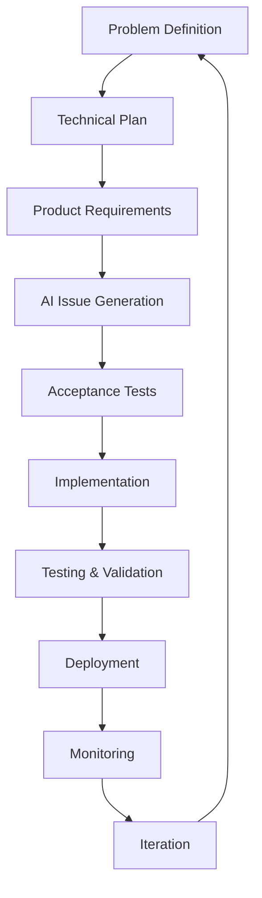

**Stage 1: AI-Assisted Problem Definition**
*Patterns: [Constraint-Based AI Development](#constraint-based-ai-development)*

Define clear problem statements and success criteria before any implementation work begins.

```bash
ai "Analyze this problem statement for technical feasibility:
- Suggest alternative approaches
- Identify potential risks
- Estimate complexity and effort"
```

**Stage 2: AI-Generated Technical Plan**
*Patterns: [Context Window Optimization](#context-window-optimization), [Rules as Code](#rules-as-code)*

Transform problem definitions into concrete technical architectures with clear implementation paths.

```bash
ai "Create a technical plan for [problem] using [technology stack]:
- Include architecture diagrams
- Detail security considerations
- Break into 3-week development phases
- Identify technical risks and mitigation strategies"
```

**Stage 3: Product Requirements Document (PRD)**
*Patterns: [AI Knowledge Persistence](#ai-knowledge-persistence), [Progressive AI Enhancement](#progressive-ai-enhancement)*

Translate technical plans into detailed product specifications with measurable acceptance criteria.

```bash
ai "Convert this technical plan into detailed product requirements:
- Include API specifications with OpenAPI format
- Define user interaction flows
- Specify error handling patterns
- Add acceptance criteria for each feature"
```

**Stage 4: AI Issue Generation**
*Patterns: [AI Issue Generation](#ai-issue-generation), [Progressive AI Enhancement](#progressive-ai-enhancement)*

Transform product requirements into structured, actionable work items using AI to break down features into properly sized tasks with clear acceptance criteria and dependencies.

```bash
# Generate development tasks from PRD
ai "Break down these product requirements into Kanban-ready GitHub issues:
- Clear titles and acceptance criteria  
- Cycle time targets (4-8 hours max per task)
- If any task would take >8 hours, split it further
- Frontend/backend/testing labels
- Dependency mapping between tasks
- Each task independently deployable

Format as JSON for automated issue creation."
```

Apply [**AI Issue Generation**](#ai-issue-generation) to create comprehensive task breakdown. Use [**Progressive AI Enhancement**](#progressive-ai-enhancement) to ensure tasks are properly sized for iterative delivery.

**Stage 5: Specification Driven Development**
*Patterns: [Specification Driven Development](#specification-driven-development), [Observable AI Development](#observable-ai-development)*

Write executable acceptance tests before implementation to guide AI code generation.

```bash
ai "Generate acceptance tests for user story:
- Use Gherkin format for clarity
- Cover happy path and edge cases
- Include performance criteria
- Make tests executable with minimal setup"
```

**Stage 6: AI-Driven Implementation**
*Patterns: [AI Security Sandbox](#ai-security-sandbox), [Rules as Code](#rules-as-code), [Progressive AI Enhancement](#progressive-ai-enhancement)*

Use AI to implement features that satisfy the acceptance tests while maintaining code quality.

```bash
# Implementation workflow
ai-checkpoint "Before implementing user authentication"
ai-implement "Create JWT-based authentication following our security patterns"
ai-test "Run tests and fix any failures"
ai-review "Review code for security vulnerabilities"
ai-commit "Add authentication with security review"
```

**Stage 7: Comprehensive Testing Strategy**
*Patterns: [Comprehensive AI Testing Strategy](#comprehensive-ai-testing-strategy), [AI Workflow Orchestration](#ai-workflow-orchestration), [Context Window Optimization](#context-window-optimization)*

Execute multi-layered testing approach with AI assistance for thorough quality assurance.

```bash
ai "Generate comprehensive test suite:
- Unit tests with edge cases
- Integration tests for API endpoints
- End-to-end user journey tests
- Security vulnerability scans
- Performance benchmarks"
```

**Stage 8: Deployment Pipeline**
*Patterns: [Deployment Automation](#deployment-automation), [AI Security Sandbox](#ai-security-sandbox)*

Automate deployment with AI validation at each stage to ensure production readiness.

```bash
ai "Review deployment checklist:
- Validate all tests passing
- Check security compliance
- Verify performance metrics
- Generate deployment notes
- Create rollback plan"
```

**Stage 9: AI-Monitored Production**
*Patterns: [Observable AI Development](#observable-ai-development), [AI Knowledge Persistence](#ai-knowledge-persistence), [Monitoring & Maintenance](#monitoring--maintenance)*

Continuous monitoring with AI-powered analysis for proactive issue detection and resolution.

```bash
ai "Analyze production metrics:
- Identify performance anomalies
- Detect error rate increases
- Suggest optimization opportunities
- Generate incident reports"
```

**Anti-pattern: Ad-Hoc AI Development**
Jumping straight to coding with AI without proper planning, requirements, or testing strategy.

**Note**: Some patterns referenced in the lifecycle stages are advanced patterns documented in separate resources. The patterns linked above provide the foundation for the AI Developer Lifecycle.

---


## Human-AI Handoff Protocol

**Maturity**: Intermediate  
**Description**: Clear boundaries and procedures for transitioning work between human developers and AI tools based on complexity, security requirements, and creative problem-solving needs.

**Related Patterns**: [AI Developer Lifecycle](#ai-developer-lifecycle), [Observable AI Development](#observable-ai-development), [AI Workflow Orchestration](#ai-workflow-orchestration)

**Handoff Decision Framework**

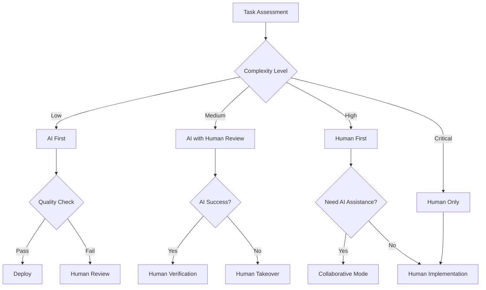

**Anti-pattern: Unclear Boundaries**
Allowing AI and humans to work on the same task simultaneously without clear handoff points leads to conflicts, duplicated effort, and inconsistent quality.

---

## AI Issue Generation

**Maturity**: Intermediate  
**Description**: Generate structured work items optimized for Kanban flow using AI to break down features into small, rapidly completable tasks (4-8 hours max) with clear acceptance criteria and dependencies. Focus on continuous flow rather than batch estimation.

**Related Patterns**: [AI Readiness Assessment](#ai-readiness-assessment), [Specification Driven Development](#specification-driven-development)

**Issue Generation Framework**

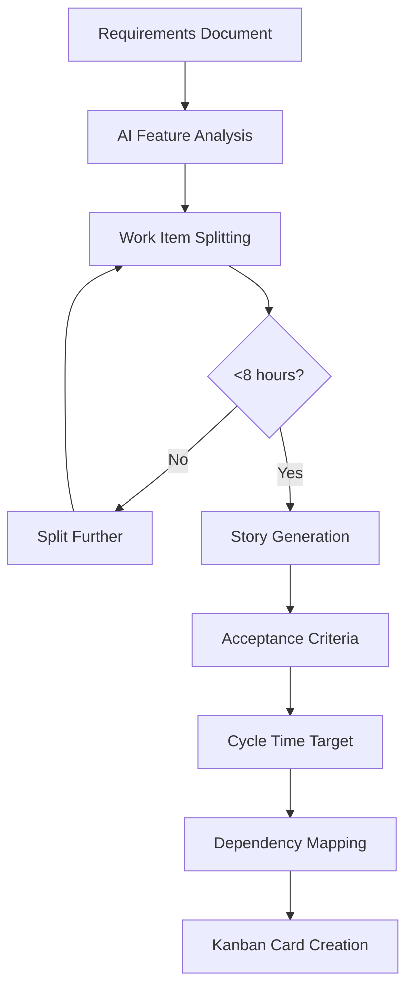

**Examples**

**Input: High-level requirement**
```markdown
## Feature Request
"Users need to be able to reset their passwords via email"
```

**AI Prompt for Kanban-Ready Task Generation**
```bash
ai "Break down this feature into small Kanban tasks:

Feature: Password reset via email

Create GitHub issues following Kanban principles:
- Ensure each task can be completed in less than a day
- Clear titles and descriptions
- Specific acceptance criteria
- Labels (frontend, backend, testing)
- Dependencies between tasks
- If any task takes >2 days, split it further

Format as JSON for GitHub API import."
```

**Generated Kanban-Ready Issues**
```json
[
  {
    "title": "Backend: Implement password reset token generation",
    "body": "## Description\nCreate secure token generation for password reset requests\n\n## Acceptance Criteria\n- [ ] Generate cryptographically secure reset tokens\n- [ ] Set token expiration (15 minutes)\n- [ ] Store token-user mapping in Redis\n- [ ] Validate email exists before token creation\n\n## Technical Notes\n- Use crypto.randomBytes(32)\n- TTL of 900 seconds in Redis\n- Rate limit: 3 requests per hour per email\n\n## Cycle Time Target\n8-12 hours (deployable independently)",
    "labels": ["backend", "security", "kanban-ready"],
    "milestone": "Password Reset MVP"
  },
  {
    "title": "Backend: Email service integration for reset links", 
    "body": "## Description\nSend password reset emails with secure links\n\n## Acceptance Criteria\n- [ ] Template-based email generation\n- [ ] Secure reset link with token\n- [ ] Email delivery confirmation\n- [ ] Handle email service failures gracefully\n\n## Dependencies\n- Requires: Password reset token generation\n\n## Cycle Time Target\n6-8 hours (deploy once token generation is complete)",
    "labels": ["backend", "email", "kanban-ready"],
    "milestone": "Password Reset MVP"
  },
  {
    "title": "Frontend: Password reset request form",
    "body": "## Description\nUI for users to request password reset\n\n## Acceptance Criteria\n- [ ] Email input field with validation\n- [ ] Submit button with loading state\n- [ ] Success/error message display\n- [ ] Rate limiting feedback\n\n## Design\n- Use existing form components\n- Match current auth page styling\n\n## Cycle Time Target\n4-6 hours (can work in parallel with backend tasks)",
    "labels": ["frontend", "ui", "kanban-ready"],
    "milestone": "Password Reset MVP"
  }
]
```

**Kanban Epic Breakdown**
```bash
ai "Break down this epic for optimal Kanban flow:

Epic: User Dashboard with Analytics

Kanban task requirements:
- Maximum 4-8 hours per task (1 day)
- If a task would take longer, split it
- Each task independently deployable
- Focus on flow over estimates

Break down into:
- Database migrations (each table/index separately)
- Individual API endpoints (one endpoint per task)
- UI components (one component per task)
- Test suites (by feature area)
- Security checks (per component)
- Performance optimizations (targeted improvements)

Goal: Continuous flow with rapid feedback cycles."
```

**Integration with Project Management**
```bash
# GitHub Issues
gh issue create --title "$(echo "$issue" | jq -r '.title')" \
                --body "$(echo "$issue" | jq -r '.body')" \
                --label "$(echo "$issue" | jq -r '.labels[]')"

# JIRA Integration
curl -X POST "$JIRA_API/issue" \
  -H "Content-Type: application/json" \
  -d "$jira_issue_json"

# Azure DevOps
az boards work-item create --title "$title" \
                          --type "User Story" \
                          --description "$description"
```

**Kanban Work Item Splitting**
```bash
ai "Apply Kanban principles to split these work items:

Kanban splitting rules:
- Maximum cycle time: 4-8 hours (1 day)
- If >8 hours, must split into smaller items
- Each item independently deployable
- Measure actual cycle time, not estimates

Historical cycle times for reference:
- Authentication token generation: 8 hours
- Email template setup: 4 hours
- Password reset form: 4 hours  
- API endpoint creation: 6 hours
- Database migration: 3 hours per table

For each task:
1. Can it be completed in <8 hours?
2. If no, how to split it?
3. What's the smallest valuable increment?

Remember: Flow over estimates, rapid feedback over perfect planning."
```

> "If a task takes more than one day, split it."  
> – Kanban Guide, Lean Kanban University

> "Small, frequent deliveries expose issues early and keep teams aligned."  
> – Agile Alliance, Kanban Glossary

**Anti-pattern: Vague Issue Generation**
Creating generic tasks without specific acceptance criteria, proper sizing, or clear dependencies leads to scope creep and estimation errors.

**Anti-pattern Examples:**
```markdown
❌ "Fix the login page"
❌ "Make the dashboard better" 
❌ "Add some tests"

✅ "Add OAuth 2.0 token validation endpoint (8 hours)"
✅ "Implement dashboard metric WebSocket connection (6 hours)"
✅ "Write unit tests for user service login method (4 hours)"
```

---

# Development Patterns

Development patterns provide tactical approaches for day-to-day AI-assisted coding workflows, focusing on quality, maintainability, and team collaboration.

## Specification Driven Development

**Maturity**: Intermediate  
**Description**: Use executable specifications to guide AI code generation by writing clear acceptance criteria first, then prompting AI to create minimal implementations that satisfy those specifications. This approach ensures AI-generated code meets exact requirements before implementation begins.

**Key Principle: Specifications Persist, Prompts are Ephemeral**

Unlike prompts that vanish after each AI session, executable specifications become permanent project artifacts that:
- Define system behavior independently of any AI tool
- Serve as living documentation that evolves with the codebase
- Provide regression testing throughout the project lifecycle
- Act as the source of truth for what the system should do

While you may refine prompts repeatedly to get the right implementation, the specifications remain constant, ensuring consistency across different AI tools and sessions.

**Related Patterns**: [AI Developer Lifecycle](#ai-developer-lifecycle), [Comprehensive AI Testing Strategy](#comprehensive-ai-testing-strategy), [Observable AI Development](#observable-ai-development)

**The Specification-Driven AI Workflow**

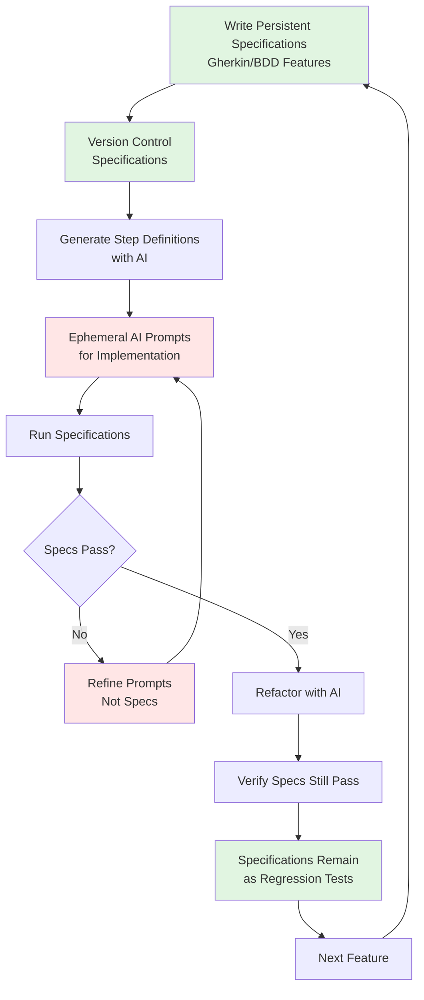

**Examples**

**Step 1: Write Persistent Specifications (These Live Forever)**
```gherkin
# See actual implementations: 
# specs/user_authentication.feature (Gherkin format)
# specs/user_authentication_structured.md (OpenAI Model Spec format)
# features/user_authentication.feature
# This specification will persist throughout the project lifecycle
# It defines WHAT the system does, not HOW it's implemented

Feature: User Authentication
  As a user
  I want to log into the system
  So that I can access my personal dashboard

  Scenario: Successful login with valid credentials
    Given a user exists with email "user@example.com" and password "securepass123"
    When I submit login credentials "user@example.com" and "securepass123"
    Then I should be redirected to the dashboard
    And I should see a welcome message "Welcome back!"

  Scenario: Failed login with invalid credentials
    Given a user exists with email "user@example.com" and password "securepass123"
    When I submit login credentials "user@example.com" and "wrongpassword"
    Then I should see an error message "Invalid credentials"
    And I should remain on the login page
```

**Step 2: Generate Implementation with Ephemeral Prompts**
```python
# features/steps/auth_steps.py
# These prompts are temporary - used once and discarded
# The specifications above remain the source of truth

# Ephemeral Prompt 1: "Generate pytest-bdd step definitions for the user authentication feature"
# Ephemeral Prompt 2: "Use bcrypt for password hashing"
# Ephemeral Prompt 3: "Add rate limiting to prevent brute force"

from pytest_bdd import given, when, then, scenarios
from selenium import webdriver
import pytest

scenarios('../user_authentication.feature')

@given('a user exists with email "<email>" and password "<password>"')
def user_exists(email, password):
    # AI generates user creation logic
    user_service.create_user(email=email, password=password)

@when('I submit login credentials "<email>" and "<password>"')
def submit_login(browser, email, password):
    # AI generates form interaction
    browser.find_element_by_id("email").send_keys(email)
    browser.find_element_by_id("password").send_keys(password)
    browser.find_element_by_id("login-button").click()

@then('I should be redirected to the dashboard')
def verify_dashboard_redirect(browser):
    # AI generates assertion logic
    assert "/dashboard" in browser.current_url
```

**Machine-Readable Specification Structure**

Following the OpenAI Model Spec pattern, specifications should be structured for both human comprehension and automated processing:

```markdown
# User Authentication Specification {#user_auth}

## Overview {#overview}
This specification defines the authentication system behavior, establishing the contract between user expectations and system implementation.

**Strategic Goals:**
- Secure user credential validation
- Seamless user experience
- Protection against brute force attacks
- Clear error messaging for failed attempts

## Definitions {#definitions}

**User**: An entity with valid account credentials in the system  
**Session**: A time-limited authenticated state after successful login  
**Credentials**: Email address and password combination  
**Dashboard**: The authenticated user's primary interface post-login  

## Authentication Requirements {#auth_requirements authority=system}

### Successful Authentication {#successful_auth authority=system}
The system MUST:
- Validate credentials against stored user data
- Create a secure session upon successful validation  
- Redirect authenticated users to dashboard
- Display personalized welcome message

### Failed Authentication {#failed_auth authority=system}
The system MUST:
- Reject invalid credentials without revealing user existence
- Display generic "Invalid credentials" message
- Remain on login page after failed attempt
- Implement rate limiting after 3 failed attempts [^rl2c]

### Security Controls {#security_controls authority=platform}
The system MUST:
- Hash passwords using bcrypt with minimum cost factor 12
- Implement CSRF protection on authentication endpoints
- Log authentication attempts for security monitoring
- Expire sessions after 30 minutes of inactivity

## Evaluation Cases {#evaluation}

[^rl2c]: tests/security/test_rate_limiting.py
[^cv9g]: tests/security/test_csrf_authentication.py
[^sl3f]: tests/auth/test_session_expiration.py
```

**Why Specifications Persist While Prompts Don't**

1. **Specifications are contracts**: They define what your system promises to do, regardless of implementation
2. **Prompts are conversations**: They're tactical instructions that change based on AI capabilities and context  
3. **Specifications enable refactoring**: You can completely rewrite implementations while specifications ensure behavior remains correct
4. **Prompts are tool-specific**: Different AI tools need different prompts, but they all must satisfy the same specifications
5. **Anchored sections enable traceability**: Each requirement has a unique identifier for automated testing and compliance linking

**Key Elements of Machine-Readable Specifications** (inspired by OpenAI Model Spec):

1. **Anchored Headings**: Every section has explicit `{#anchor}` identifiers for unambiguous cross-referencing
2. **Authority Levels**: Requirements annotated with `authority=platform|system|feature` to resolve conflicts
3. **Explicit Language**: Use MUST/SHOULD/MAY for clear requirement strength
4. **Linked Evaluation**: Footnotes `[^sy73]` connect requirements to automated test files
5. **Definitions Section**: Concrete definitions for all domain terms used in specifications
6. **Meta Commentary**: `!!! meta` blocks explain document structure without instructing implementation
7. **Hierarchical Conflict Resolution**: Clear precedence rules when requirements conflict

**Benefits of Specification Persistence**
- **AI Tool Independence**: Switch between Copilot, Cursor, Claude without losing your behavioral requirements
- **Team Alignment**: New developers understand system behavior from specs, not from scattered prompts
- **Automated Compliance**: Machine-readable structure enables automated requirement validation
- **Precise Traceability**: Anchored sections link directly to test cases and implementation code
- **Living Documentation**: Specifications evolve with the system while maintaining historical context
- **Regression Safety**: Specifications catch breaking changes regardless of how code was generated

**Anti-pattern: Implementation-First AI**
Writing code with AI first, then trying to retrofit tests, resulting in tests that mirror implementation rather than specify behavior.

**Anti-pattern: Prompt Hoarding**
Saving collections of prompts as if they were specifications. Prompts are implementation details; specifications are behavioral contracts.

---

## Comprehensive AI Testing Strategy

**Maturity**: Intermediate  
**Description**: Unified approach combining test-first development, automated test generation, and quality assurance patterns to ensure AI-generated code meets quality and behavioral specifications.

**Pattern Boundary Clarification**:
- **This pattern** focuses on overall testing strategy and test generation
- **Specification Driven Development** focuses on writing specs before implementation
- **Observable AI Development** focuses on logging and debugging for AI understanding
- **AI-Driven Traceability** focuses on linking requirements to tests and implementation

**Related Patterns**: [Specification Driven Development](#specification-driven-development), [Observable AI Development](#observable-ai-development)

**Integrated Testing Framework**

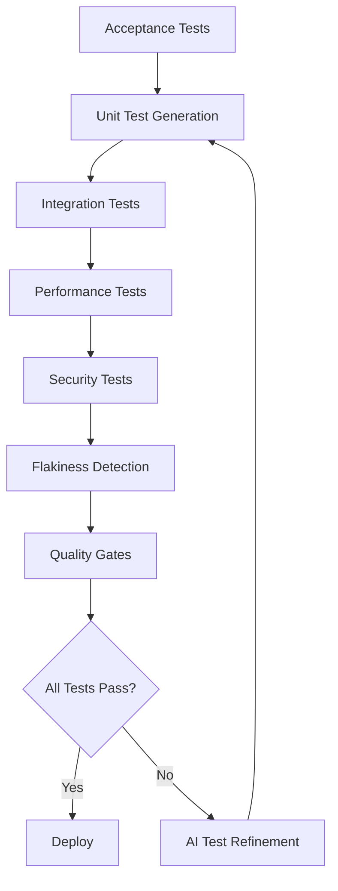

**Anti-pattern: Test Generation Without Strategy**
Generating tests with AI without a coherent strategy leads to poor coverage, flaky tests, and false confidence in code quality.

---

## Progressive AI Enhancement

**Maturity**: Beginner  
**Description**: Build complex features through small, deployable iterations with daily deployment cycles. Each AI interaction adds one specific enhancement rather than trying to build everything at once. Focus on rapid market feedback over granular task breakdown.

**Related Patterns**: [AI Developer Lifecycle](#ai-developer-lifecycle), [Constraint-Based AI Development](#constraint-based-ai-development), [AI Choice Generation](#ai-choice-generation)

**Examples**
Building authentication progressively:
```bash
# Day 1: Minimal login
"Create POST /login that returns 200 for admin/admin, 401 otherwise"
→ Deploy

# Day 2: Real password check
"Modify login to check passwords against users table. Keep existing API."
→ Deploy

# Day 3: Add security
"Add bcrypt hashing to login. Support both hashed and plain passwords temporarily."
→ Deploy

# Day 4: Modern tokens
"Replace session with JWT. Keep session endpoint for backward compatibility."
→ Deploy
```

**When to Use Progressive AI Enhancement**

- **MVP Development**: When you need to get to market quickly with minimal features
- **Uncertain Requirements**: When requirements are likely to change based on user feedback  
- **Risk Mitigation**: When you want to reduce the risk of large, complex implementations
- **Continuous Delivery**: When you have automated deployment and want rapid iterations
- **Learning Projects**: When the team is learning new technologies or domains

**Anti-pattern: Big Bang Generation**
Asking AI to "create a complete user management system" results in 5000 lines of coupled, untested code that takes days to review and debug.

---

## AI Choice Generation

**Maturity**: Intermediate  
**Description**: Generate multiple implementation options for exploration and comparison rather than accepting the first AI solution. Focus on discovery over delivery by creating alternatives that reveal different trade-offs and approaches.

**Related Patterns**: [Progressive AI Enhancement](#progressive-ai-enhancement), [Context Window Optimization](#context-window-optimization), [Constraint-Based AI Development](#constraint-based-ai-development)

**Choice Generation Framework**

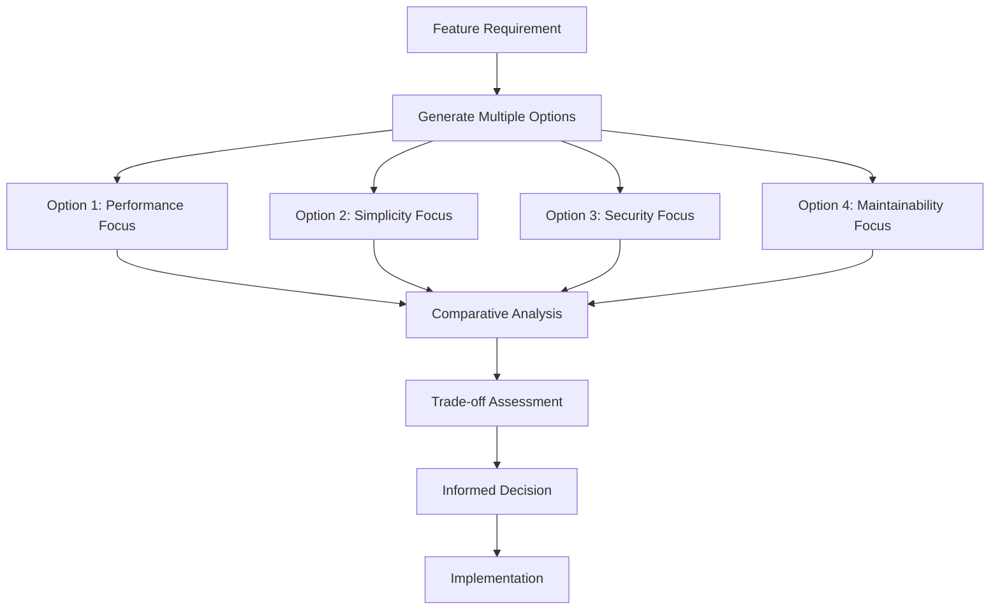

**Multi-Option Generation Examples**

```bash
# Generate authentication implementation choices
ai_choices "Generate 4 different approaches for user authentication:

Option 1: Performance-optimized
- Focus: Minimal latency and high throughput
- Trade-offs: May sacrifice some security features
- Target: High-traffic applications

Option 2: Security-first
- Focus: Maximum security and compliance
- Trade-offs: Additional complexity and latency
- Target: Financial or healthcare applications  

Option 3: Developer experience
- Focus: Simple integration and maintenance
- Trade-offs: May use more standard but less optimal patterns
- Target: Rapid prototyping and small teams

Option 4: Vendor-neutral
- Focus: No external dependencies or cloud services
- Trade-offs: More code to maintain
- Target: Air-gapped or compliance-restricted environments

For each option, provide:
- Architecture diagram
- Implementation approach
- Key trade-offs
- When to choose this option"
```

**Structured Choice Comparison**

```yaml
# .ai/choices/authentication-options.yml
authentication_choices:
  option_1_performance:
    approach: "In-memory JWT with Redis caching"
    pros:
      - "Sub-10ms token validation"
      - "Horizontal scaling ready"
      - "Minimal database hits"
    cons:
      - "Memory intensive"
      - "Complex cache invalidation"
      - "Redis dependency"
    best_for: "High-traffic APIs (>10k req/sec)"
    
  option_2_security:
    approach: "Database-backed sessions with MFA"
    pros:
      - "Audit trail for all sessions"
      - "Immediate revocation capability"
      - "Multi-factor authentication built-in"
    cons:
      - "Database load for every request"
      - "Complex session management"
      - "Higher latency"
    best_for: "Banking, healthcare, government"
    
  option_3_simple:
    approach: "Standard JWT with Passport.js"
    pros:
      - "Well-documented patterns"
      - "Large community support"
      - "Minimal custom code"
    cons:
      - "Less optimization opportunities"
      - "Framework lock-in"
      - "Standard security model only"
    best_for: "Startups, MVPs, small teams"
    
  option_4_standalone:
    approach: "Custom token system with local storage"
    pros:
      - "No external dependencies"
      - "Full control over implementation"
      - "Air-gap compatible"
    cons:
      - "More code to maintain"
      - "Custom security implementation risk"
      - "No ecosystem benefits"
    best_for: "Government, defense, offline systems"
```

**Rapid Prototyping for Choice Validation**

```bash
# Generate minimal prototypes for each option
ai_prototype "Create 30-minute prototypes for each authentication option:

For each option (1-4):
1. Create minimal working implementation
2. Include basic test cases
3. Document key architectural decisions
4. Measure and report:
   - Lines of code
   - External dependencies
   - Setup complexity
   - Performance characteristics

Goal: Quick validation of assumptions before full implementation"

# Example prototype validation
./validate_choices.sh
# Output:
# Option 1 (Performance): 125 LOC, 3 deps, 8ms avg response
# Option 2 (Security): 200 LOC, 5 deps, 25ms avg response  
# Option 3 (Simple): 75 LOC, 8 deps, 15ms avg response
# Option 4 (Standalone): 300 LOC, 0 deps, 12ms avg response
```

**Choice-Driven Development Workflow**

```bash
# 1. Generate multiple implementation approaches
ai_choices "Generate 3 different database schema designs for user management"

# 2. Create rapid prototypes
ai_prototype "Implement minimal versions of each schema design"

# 3. Evaluate trade-offs
ai_evaluate "Compare prototypes across dimensions:
- Query performance
- Storage efficiency  
- Migration complexity
- Developer experience"

# 4. Make informed decision
ai_decide "Based on evaluation, recommend which schema to implement and why"

# 5. Implement chosen approach with full features
ai_implement "Build production version of recommended schema design"
```

**UI/UX Choice Generation**

```bash
# Generate multiple UI approaches
ai_ui_choices "Design 4 different user onboarding flows:

Flow 1: Progressive disclosure
- Minimal initial form, expand as needed
- Best for: Complex products with many options

Flow 2: Single-page wizard
- All steps visible, scroll to progress
- Best for: Simple workflows with few steps

Flow 3: Multi-step modal
- Overlay approach with step indicators
- Best for: Adding features to existing interfaces

Flow 4: Embedded progressive
- Integrated into main application flow
- Best for: Converting existing users to new features

For each flow, provide:
- Wireframe or mockup
- Conversion rate expectations
- Implementation complexity
- A/B testing strategy"
```

**Benefits of Choice Generation**

1. **Better Decisions**: Compare multiple approaches before committing
2. **Risk Mitigation**: Identify problems early through rapid prototyping
3. **Learning Acceleration**: Explore different patterns and trade-offs
4. **Team Alignment**: Discuss options with concrete examples
5. **Innovation Discovery**: Find unexpected solutions through exploration
6. **Context Awareness**: Match solutions to specific requirements

**Integration with Existing Patterns**

```bash
# Choice generation works with other patterns
ai_choices + progressive_enhancement:
  "Generate 3 progressive enhancement paths for the chosen authentication option"

ai_choices + atomic_decomposition:
  "Break down each authentication option into atomic tasks for parallel implementation"

ai_choices + specification_driven:
  "Create acceptance tests that work with any of the 4 authentication options"
```

**When to Use Choice Generation**

- **Architecture decisions** with significant long-term impact
- **New technology adoption** where team lacks experience
- **Performance-critical** implementations with unclear optimal approach
- **User experience** designs that affect conversion or engagement
- **Security implementations** where multiple valid approaches exist
- **Vendor selection** decisions with lock-in implications

**Anti-pattern: Analysis Paralysis**
Generating so many choices that decision-making becomes delayed indefinitely, or spending more time evaluating options than implementing them.

**Anti-pattern: False Choices**
Creating options that appear different but are fundamentally the same approach with minor variations, providing no real decision value.

---

## AI Workflow Orchestration

**Maturity**: Advanced  
**Description**: Coordinate sequential pipelines, parallel agent workflows, and hybrid human-AI processes for complex development tasks. Transform synchronous single-agent workflows into asynchronous, event-driven multi-agent architectures while maintaining safety and consistency.

**Related Patterns**: [Human-AI Handoff Protocol](#human-ai-handoff-protocol), [Comprehensive AI Testing Strategy](#comprehensive-ai-testing-strategy), [Atomic Task Decomposition](#atomic-task-decomposition)

**Workflow Types & Selection**

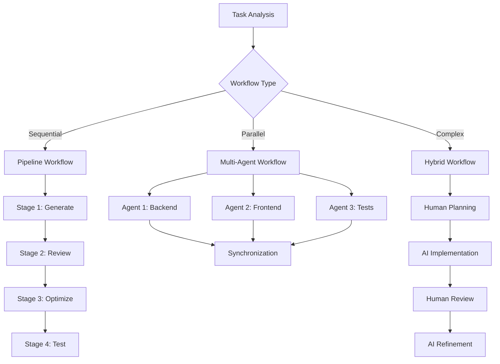

**Parallel Agent Coordination Examples**

```bash
# Atomic task breakdown for parallel execution
ai_task_manager "Break down user authentication feature into atomic tasks:
- Each task <2 hours completion time
- Independent implementation (no shared state)
- Clear input/output contracts
- Parallelizable across agents"

# Parallel agent execution with safety
ai_orchestrator --parallel --safe-mode \
  --task="backend-auth-api" --agent="backend-specialist" \
  --task="frontend-login-ui" --agent="frontend-specialist" \
  --task="integration-tests" --agent="testing-specialist" \
  --sync-point="integration-review"

# Safety-first parallel review
ai_reviewer --parallel-output \
  --check-conflicts \
  --verify-contracts \
  --merge-strategy="human-approval"
```

**Parallel Agent Safety Framework**

```yaml
# .ai/parallel-config.yml
parallel_safety:
  max_concurrent_agents: 3
  conflict_detection: enabled
  shared_resources:
    - "src/shared/"
    - "package.json"
    - "database/migrations/"
  isolation_boundaries:
    - backend: "src/api/"
    - frontend: "src/components/"
    - testing: "tests/"
  sync_points:
    - after_implementation
    - before_integration
    - before_deployment
```

**Anti-pattern: Uncoordinated Multi-Tool Usage**
Using multiple AI tools without proper orchestration leads to inconsistent code, integration conflicts, and wasted effort from competing implementations.

**Anti-pattern: Unsafe Parallel Execution**
Running parallel agents without proper isolation, conflict detection, or sync points risks data corruption, merge conflicts, and system instability.

---

## Context Window Optimization

**Maturity**: Advanced  
**Description**: Match AI tool selection to task complexity and optimize cost/performance trade-offs. Using Claude for every task is like using a sledgehammer to hang a picture.

**Related Patterns**: [Progressive AI Enhancement](#progressive-ai-enhancement), [AI Workflow Orchestration](#ai-workflow-orchestration)

**Decision Matrix**
```
Task: Add null check
Tool: GitHub Copilot (instant, cheap)
Context: <100 tokens

Task: Extract method
Tool: Cursor Cmd+K (fast, focused)  
Context: <1000 tokens

Task: Refactor module
Tool: Windsurf Cascade (handles dependencies)
Context: <10000 tokens

Task: Design architecture
Tool: Claude Code (best reasoning)
Context: Full codebase
```

---

## AI Knowledge Persistence

**Maturity**: Intermediate  
**Description**: Capture successful patterns and failed attempts as versioned knowledge for future sessions.

**Related Patterns**: [Rules as Code](#rules-as-code), [AI-Driven Traceability](#ai-driven-traceability)

**Examples**
`.ai/knowledge/authentication.md`:
```markdown
## Successful Patterns

### JWT Implementation
Prompt that works 95% of the time:
"Implement JWT auth:
- RS256 algorithm (never HS256)
- 15 min access token
- 7 day refresh token in httpOnly cookie
- Include user.id and role in payload"

## Failed Patterns

### ❌ "Make authentication secure"
Too vague - AI adds unnecessary complexity

## Gotchas
- AI defaults to HS256 (insecure)
- Often uses deprecated bcrypt methods
```

---

## Constraint-Based AI Development

**Maturity**: Beginner  
**Description**: Give AI specific constraints to prevent over-engineering and ensure focused solutions.

**Related Patterns**: [Progressive AI Enhancement](#progressive-ai-enhancement), [Human-AI Handoff Protocol](#human-ai-handoff-protocol), [AI Choice Generation](#ai-choice-generation)

**Examples**
```
Bad: "Create user service"
Good: "Create user service: <100 lines, 3 methods max, only bcrypt dependency"

Bad: "Add caching"
Good: "Add caching using Map, max 1000 entries, LRU eviction"

Bad: "Improve performance"
Good: "Reduce p99 latency to <50ms without new dependencies"
```

---

## Atomic Task Decomposition

**Maturity**: Intermediate  
**Description**: Break complex features into atomic, independently implementable tasks (1-2 hours) that can be parallelized across multiple AI agents. Each task should be completable in isolation without dependencies on concurrent work. Use this pattern when implementing with parallel agents; for standard team development, use AI Issue Generation (4-8 hour tasks).

**Related Patterns**: [AI Workflow Orchestration](#ai-workflow-orchestration), [Progressive AI Enhancement](#progressive-ai-enhancement), [AI Issue Generation](#ai-issue-generation)

**Atomic Task Criteria**

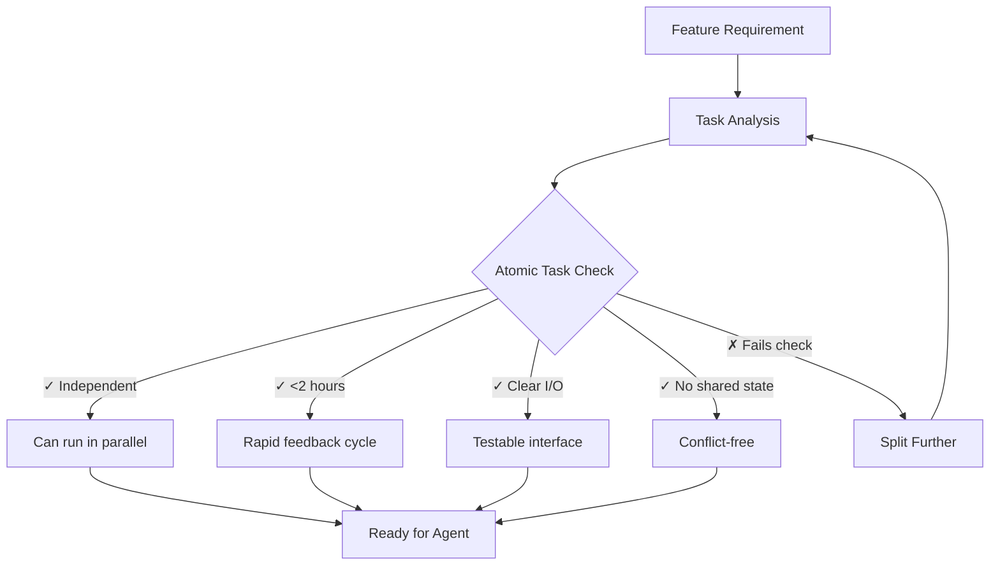

**Decomposition Examples**

```bash
# Feature: User Authentication System
# Bad: Single monolithic task
❌ "Implement complete user authentication with JWT, password hashing, rate limiting, and email verification"

# Good: Atomic task breakdown
✅ ai_decompose "Break down user authentication into atomic tasks:

Task 1: Password validation service
- Input: plain text password, validation rules
- Output: validation result object
- No dependencies on other authentication components
- Time estimate: 1.5 hours

Task 2: JWT token generation service  
- Input: user ID, role, expiration config
- Output: signed JWT token
- Independent crypto operations only
- Time estimate: 1 hour

Task 3: Rate limiting middleware
- Input: request metadata, rate limit config
- Output: allow/deny decision
- No user data dependencies
- Time estimate: 2 hours

Task 4: Login endpoint controller
- Input: credentials, dependencies from tasks 1-3
- Output: HTTP response with token or error
- Integration task (runs after 1-3 complete)
- Time estimate: 1 hour"
```

**Parallel Agent Assignment**

```yaml
# .ai/task-assignment.yml
authentication_feature:
  tasks:
    - id: "auth-001"
      name: "Password validation service"
      agent: "backend-specialist-1"
      dependencies: []
      estimated_hours: 1.5
      
    - id: "auth-002" 
      name: "JWT token generation"
      agent: "security-specialist"
      dependencies: []
      estimated_hours: 1
      
    - id: "auth-003"
      name: "Rate limiting middleware"
      agent: "backend-specialist-2" 
      dependencies: []
      estimated_hours: 2
      
    - id: "auth-004"
      name: "Login endpoint integration"
      agent: "integration-specialist"
      dependencies: ["auth-001", "auth-002", "auth-003"]
      estimated_hours: 1
      
  coordination:
    parallel_execution: ["auth-001", "auth-002", "auth-003"]
    sequential_after: ["auth-004"]
    sync_points:
      - after_parallel_completion
      - before_integration_testing
```

**Atomic Task Validation**

```bash
# Validate tasks meet atomic criteria
ai_task_validator "Review task breakdown for authentication feature:

Validation criteria:
1. Each task completable in <2 hours
2. No shared mutable state between parallel tasks  
3. Clear input/output contracts defined
4. Testable in isolation
5. No circular dependencies

For each task that fails validation:
- Explain why it's not atomic
- Suggest how to split it further
- Recommend dependency restructuring"

# Example validation output
✓ auth-001: Password validation - ATOMIC (isolated function, clear I/O)
✓ auth-002: JWT generation - ATOMIC (crypto operation, no external deps)  
✗ auth-003: Rate limiting - NOT ATOMIC (requires shared cache, >2hr estimate)
  → Split: 3a) Rate limit logic, 3b) Cache integration
✓ auth-004: Integration - ATOMIC (assembly task with clear dependencies)
```

**Task Interface Contracts**

```python
# Define clear contracts for atomic tasks
class TaskContract:
    """Interface contract for atomic tasks to ensure parallel compatibility"""
    
    def __init__(self, task_id: str):
        self.task_id = task_id
        self.inputs: Dict[str, Type] = {}
        self.outputs: Dict[str, Type] = {}
        self.side_effects: List[str] = []
        self.dependencies: List[str] = []
    
    def validate_atomic(self) -> bool:
        """Validate task meets atomic criteria"""
        checks = [
            len(self.side_effects) == 0,  # No side effects
            len(self.dependencies) <= 3,   # Minimal dependencies  
            self.estimated_hours <= 2,     # Rapid completion
            self.has_clear_io_contract()   # Testable interface
        ]
        return all(checks)

# Example atomic task contracts
password_validation_task = TaskContract("auth-001")
password_validation_task.inputs = {
    "password": str,
    "rules": PasswordRules
}
password_validation_task.outputs = {
    "is_valid": bool,
    "validation_errors": List[str]
}
password_validation_task.side_effects = []  # Pure function
password_validation_task.estimated_hours = 1.5
```

**When to Use Atomic Task Decomposition**

- **Parallel Agent Implementation**: When using multiple AI agents simultaneously
- **Complex Feature Development**: Large features that can benefit from parallel work
- **Time-Critical Projects**: When faster delivery through parallelization is essential
- **Team Scaling**: When you need to distribute work across multiple developers/agents
- **Risk Mitigation**: When you want to reduce the blast radius of individual task failures

**Benefits of Atomic Decomposition**

1. **Parallel Execution**: Independent tasks can run simultaneously across multiple agents
2. **Rapid Feedback**: 1-2 hour tasks provide quick validation cycles
3. **Conflict Prevention**: No shared state eliminates merge conflicts
4. **Clear Testing**: Each atomic task has testable inputs/outputs
5. **Easy Recovery**: Failed tasks can be retried without affecting others
6. **Progress Visibility**: Fine-grained progress tracking and estimation

**Anti-pattern: Pseudo-Atomic Tasks**
Creating tasks that appear independent but secretly share state, require specific execution order, or have hidden dependencies on other concurrent work.

**Anti-pattern: Over-Decomposition**  
Breaking tasks so small that coordination overhead exceeds the benefits of parallelization, leading to more complexity than value.

---

## Observable AI Development

**Maturity**: Intermediate  
**Description**: Make your system's behavior visible to AI through strategic logging and debugging. AI can't fix what it can't see.

**Related Patterns**: [AI Developer Lifecycle](#ai-developer-lifecycle), [Comprehensive AI Testing Strategy](#comprehensive-ai-testing-strategy), [AI-Driven Traceability](#ai-driven-traceability)

**Examples**
```python
# Good: Observable operations
import logging
logger = logging.getLogger(__name__)

def process_order(order):
    logger.info(f"[ORDER] Processing {order.id} for {order.customer_email}")
    
    try:
        logger.info("[ORDER] Validating...")
        validate_order(order)
        logger.info("[ORDER] ✓ Validation passed")
        
        logger.info(f"[PAYMENT] Charging ${order.total} via {order.payment_method}")
        result = charge_payment(order)
        logger.info(f"[PAYMENT] ✓ Transaction: {result.transaction_id}")
        
    except ValidationError as e:
        logger.error(f"[ORDER] ✗ Validation failed: {e.field} - {e.message}")
        raise
```

**When to Use Observable AI Development**

- **AI Debugging**: When AI-generated code has bugs that are difficult to understand
- **System Integration**: When AI needs to understand complex system interactions
- **Performance Optimization**: When AI needs to identify performance bottlenecks
- **Error Investigation**: When AI needs to diagnose and fix production issues
- **Legacy System Work**: When AI needs to understand existing system behavior

**Anti-pattern: Black Box Systems**
Minimal or cryptic logging that leaves AI guessing about system state and failure causes.

---

## AI-Driven Refactoring

**Maturity**: Intermediate  
**Description**: Systematic code improvement using AI to detect and resolve code smells with measurable quality metrics, following established refactoring rules and maintaining test coverage throughout the process.

**Related Patterns**: [Rules as Code](#rules-as-code), [Comprehensive AI Testing Strategy](#comprehensive-ai-testing-strategy), [Technical Debt Forecasting](#technical-debt-forecasting)

**Code Smell Detection Framework**

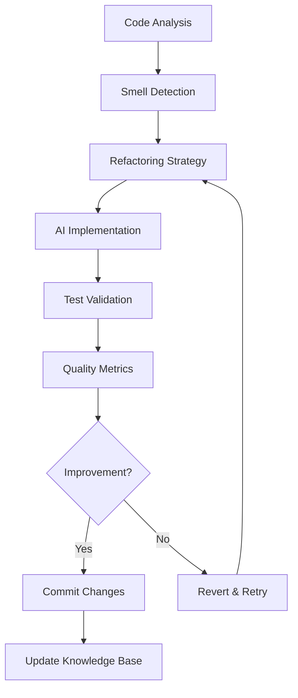

**Automated Code Smell Detection**

```bash
# .ai/rules/refactoring.md - Define measurable thresholds
cat > .ai/rules/refactoring.md << 'EOF'
# Refactoring Rules

## Long Method Smell
- Max lines: 20 (excluding docstrings)
- Max cyclomatic complexity: 10
- Detection: flake8 C901, pylint R0915

## Large Class Smell  
- Max class lines: 250
- Max methods: 20
- Max instance variables: 10
- Detection: pylint R0902, R0904

## Primitive Obsession Smell
- String validation patterns in multiple places
- Dictionaries as pseudo-objects
- Lists of primitives that always travel together

## Refactoring Strategies
- Extract Method for long methods
- Extract Class for large classes
- Replace Primitive with Object for primitive obsession
EOF

# AI smell detection
ai "Analyze this codebase using .ai/rules/refactoring.md:
1. Run static analysis tools (flake8, pylint, radon)
2. Identify code smells per defined thresholds
3. Prioritize by impact and complexity
4. Suggest specific refactoring strategy for each smell"
```

**Long Method Refactoring Example**

```bash
# AI refactoring prompt for long methods
ai "Refactor process_user_data() method:
- 35 lines (exceeds 20 line threshold)
- Multiple responsibilities: validation, database, notifications
- Apply Extract Method pattern
- Maintain test coverage and API contract"
```

**Large Class Refactoring Example**

```bash
# AI refactoring prompt for large classes
ai "Extract cohesive classes from UserManager:
- 320 lines, 25 methods, 12 variables (all exceed thresholds)
- Apply Extract Class pattern
- Maintain API compatibility"
```

**Primitive Obsession Refactoring**

```bash
# AI refactoring prompt for primitive obsession
ai "Replace primitive strings/dicts with value objects:
- Create Email, Phone, Address classes
- Encapsulate validation logic
- Replace primitive parameters with objects"
```

**Refactoring Workflow Integration**

```bash
# Automated refactoring pipeline
#!/bin/bash
# refactor-pipeline.sh

echo "Running code smell detection..."
flake8 --select=C901 src/  # Complexity
pylint src/ --disable=all --enable=R0915,R0902,R0904  # Method/class size
radon cc src/ --min=C  # Cyclomatic complexity

echo "AI refactoring analysis..."
ai "Analyze static analysis output and .ai/rules/refactoring.md:
1. List code smells by priority (impact × frequency)
2. Suggest refactoring strategy for top 3 smells  
3. Estimate effort and risk for each refactoring
4. Generate implementation plan"

echo "Running tests before refactoring..."
pytest --cov=src tests/

echo "AI refactoring implementation..."
ai "Implement highest priority refactoring:
- Maintain test coverage >90%
- Preserve existing API contracts  
- Create atomic commits for each smell
- Document refactoring decisions"

echo "Validate refactoring..."
pytest --cov=src tests/
flake8 src/
pylint src/

echo "Update knowledge base..."
ai "Document refactoring outcome in .ai/knowledge/refactoring.md:
- What was refactored and why
- Metrics before/after
- Lessons learned
- Patterns to reuse"
```

**Quality Metrics Tracking**

```bash
# Before/after metrics comparison
ai "Generate refactoring impact report:

Before refactoring:
- Cyclomatic complexity: 12
- Method length: 35 lines
- Test coverage: 85%
- Code duplication: 15%

After refactoring:
- Cyclomatic complexity: 4 (main) + 2 (extracted methods)
- Method length: 8 lines (main) + 4 extracted methods <10 lines each
- Test coverage: 92% 
- Code duplication: 8%

Calculate:
- Maintainability improvement score
- Technical debt reduction
- Risk assessment for future changes"
```

**When to Apply Refactoring**

- **During Development**: Red-Green-Refactor cycle with AI assistance
- **Feature Work**: Refactor smelly code before adding features
- **Bug Fixes**: Clean up code while fixing issues
- **Code Reviews**: Automated PR quality checks
- **Scheduled**: Weekly code health assessments

**Integration with Development Workflow**

- **Pre-commit hooks**: Check staged files for code smells
- **IDE integration**: Real-time refactoring suggestions
- **CI pipeline**: Automated quality gates and technical debt tracking

**Risk Assessment for Refactoring Timing**

- **Low Risk**: Extract Method, rename, constants, type hints
- **Medium Risk**: Extract Class, replace conditionals, parameter objects  
- **High Risk**: Large decomposition, inheritance changes, schema refactoring

**Anti-pattern: Shotgun Surgery**
Making widespread changes without systematic analysis leads to introduced bugs and degraded code quality.

**Anti-pattern: Speculative Refactoring**
Refactoring code for hypothetical future requirements rather than addressing current code smells and quality issues.

----

## AI-Driven Traceability

**Maturity**: Intermediate  
**Description**: Maintain automated bidirectional links between requirements, specifications, tests, implementation code, and documentation using AI to ensure complete visibility and change impact analysis throughout the development lifecycle.

**Related Patterns**: [AI Developer Lifecycle](#ai-developer-lifecycle), [Specification Driven Development](#specification-driven-development), [Comprehensive AI Testing Strategy](#comprehensive-ai-testing-strategy), [Observable AI Development](#observable-ai-development), [AI Knowledge Persistence](#ai-knowledge-persistence)

**Traceability Matrix Framework**

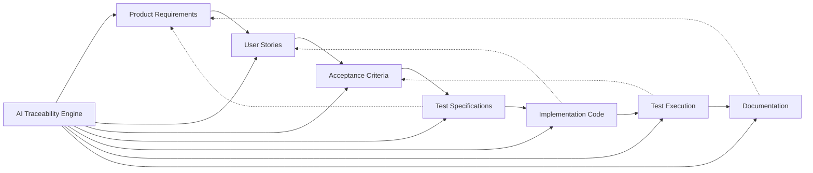

**Automated Link Generation**

```bash
# Generate traceability links during development
ai "Analyze this code change and create traceability links:

Code: src/auth/login.py
Commit: feat: add JWT token expiration handling

Map this change to:
1. Which user stories does this fulfill?
2. Which acceptance criteria are satisfied?
3. Which tests validate this functionality?
4. Which documentation needs updates?
5. Which requirements are now complete?

Output as structured JSON for automated tracking."
```

**Requirements-to-Code Mapping**

```yaml
# .ai/traceability/requirements_map.yml
traceability_rules:
  requirements:
    - pattern: "\\[\\^[a-zA-Z0-9]+\\]"
      link_to: ["user_stories", "acceptance_tests", "code_modules"]
    - pattern: "US-\\d+"  
      link_to: ["acceptance_criteria", "test_files", "implementation"]
    - pattern: "AC-\\d+"
      link_to: ["test_cases", "code_functions"]
      
  code_annotations:
    - comment_format: "# Implements: [^au3f], US-456"
    - docstring_format: "Satisfies [^pm7a]"
    - test_format: "@pytest.mark.requirement('[^sc7a]')"
    
  automated_checks:
    - verify_requirement_coverage: true
    - detect_orphaned_code: true
    - validate_test_mapping: true
```

**AI-Powered Impact Analysis**

```bash
# Analyze change impact across entire codebase
ai "Perform impact analysis for this requirement change:

CHANGED REQUIREMENT: [^au3f]
'User sessions must expire after 30 minutes (changed from 60 minutes)'

Trace through:
1. Which user stories are affected?
2. Which acceptance criteria need updates?  
3. Which test cases require modification?
4. Which code modules need changes?
5. Which documentation needs revision?
6. What is the risk level of this change?

Provide migration plan with estimated effort."
```

**Real-time Traceability Dashboard**

```python
# traceability_dashboard.py
class TraceabilityDashboard:
    def __init__(self):
        self.requirement_links = {}
        self.coverage_metrics = {}
        
    def generate_coverage_report(self):
        """AI-generated traceability coverage analysis"""
        
        coverage_prompt = f"""
        Analyze traceability coverage for this project:
        
        Requirements: {len(self.get_requirements())} total
        User Stories: {len(self.get_user_stories())} total  
        Test Cases: {len(self.get_test_cases())} total
        Code Modules: {len(self.get_code_modules())} total
        
        Calculate:
        1. Requirements without linked user stories: X%
        2. User stories without test coverage: Y%
        3. Code modules without requirement links: Z%
        4. Orphaned test cases: W count
        5. Documentation coverage gaps: V%
        
        Highlight top 5 traceability risks and remediation actions.
        """
        
        return self.ai_analyze(coverage_prompt)
    
    def detect_traceability_gaps(self):
        """Find missing or broken traceability links"""
        
        gaps = {
            'unlinked_requirements': [],
            'orphaned_code': [],
            'missing_tests': [],
            'outdated_docs': []
        }
        
        # AI analysis of link completeness
        gap_analysis = f"""
        Scan codebase for traceability gaps:
        
        1. Requirements without implementation
        2. Code without requirement justification  
        3. Tests not linked to specifications
        4. Documentation that doesn't match code
        
        For each gap, provide:
        - Severity (critical/medium/low)
        - Recommended action
        - Effort estimate to fix
        """
        
        return self.ai_analyze(gap_analysis)
```

**Automated Traceability Maintenance**

```bash
#!/bin/bash
# maintain_traceability.sh

echo "=== AI-Driven Traceability Maintenance ==="

# 1. Scan for new code without requirements links
echo "Scanning for unlinked code..."
git diff --name-only HEAD~1 | while read file; do
    if [[ $file == *.py ]] && ! grep -q "# Implements:\|# Satisfies:" "$file"; then
        ai "Analyze $file and suggest requirement links:
        - What product requirement does this code satisfy?
        - Which user story does it implement?
        - What acceptance criteria does it fulfill?
        
        Generate proper traceability annotations."
    fi
done

# 2. Validate existing links are still valid  
echo "Validating existing traceability links..."
ai "Check all [^*] footnote and US-* references in codebase:
- Do referenced requirements still exist?
- Are requirement descriptions current?
- Do linked tests still pass?
- Is documentation still accurate?

Report any broken or stale links."

# 3. Update traceability matrix
echo "Updating traceability matrix..."
ai "Generate updated traceability matrix from current codebase:
- Map all requirements to implementing code
- Link user stories to test files
- Connect acceptance criteria to functions
- Show coverage percentages by area

Output as markdown table for documentation."

# 4. Generate change impact report
echo "Analyzing change impact..."
ai "Analyze git commits from last sprint:
- Which requirements were modified?
- What new user stories were added?
- Which tests were updated?
- What documentation changed?

Create change impact summary for stakeholders."
```

**Git Integration for Traceability**

```bash
# .git/hooks/commit-msg
#!/bin/bash
# Enforce traceability in commit messages

commit_message=$(cat "$1")

# Check if commit references requirements
if ! echo "$commit_message" | grep -qE "(\[\^[a-zA-Z0-9]+\]|US-[0-9]+|AC-[0-9]+)"; then
    echo "❌ Commit must reference requirement footnote [^id], user story (US-), or acceptance criteria (AC-)"
    
    # AI suggestion for traceability
    ai "Analyze this commit and suggest traceability links:
    
    Commit message: $commit_message
    Changed files: $(git diff --cached --name-only)
    
    Which requirements/user stories does this commit relate to?
    Suggest proper commit message format with traceability IDs."
    
    exit 1
fi

echo "✅ Traceability link found in commit message"
```

**Documentation Synchronization**

```python
# sync_documentation.py
class DocumentationSync:
    def __init__(self):
        self.ai_client = AIClient()
        
    def sync_requirements_docs(self):
        """Keep documentation in sync with requirements"""
        
        sync_prompt = """
        Compare requirements.md with actual implementation:
        
        1. Identify requirements that changed since last doc update
        2. Find new features not documented
        3. Detect obsolete documentation sections
        4. Suggest documentation updates needed
        
        For each discrepancy:
        - Show specific differences
        - Recommend exact text changes
        - Estimate effort to update
        """
        
        return self.ai_client.analyze(sync_prompt)
    
    def validate_example_accuracy(self):
        """Ensure code examples in docs still work"""
        
        validation_prompt = """
        Validate all code examples in documentation:
        
        1. Extract code snippets from markdown files
        2. Check if examples use current API
        3. Verify examples follow current patterns
        4. Test examples against actual codebase
        
        Report:
        - Outdated examples that need fixing
        - Missing examples for new features
        - Inconsistent naming/patterns
        """
        
        return self.ai_client.analyze(validation_prompt)
```

**Testing Traceability**

```python
# test_traceability.py
import pytest

class TestTraceability:
    
    @pytest.mark.requirement("[^au3f]")
    @pytest.mark.user_story("US-123")
    def test_user_login_jwt_expiration(self):
        """
        AC-456: JWT tokens must expire after 30 minutes
        Links: [^au3f] (Security), US-123 (User Authentication)
        """
        # Test implementation validates both requirement and acceptance criteria
        pass
    
    def test_requirement_coverage(self):
        """Ensure all requirements have test coverage"""
        
        coverage_check = """
        Analyze test suite for requirement coverage:
        
        1. List all @pytest.mark.requirement decorators
        2. Compare with requirements.md file
        3. Identify requirements without tests
        4. Calculate coverage percentage
        
        Fail test if coverage < 90%
        """
        
        coverage_result = ai_analyze(coverage_check)
        assert coverage_result.coverage_percentage >= 90
```

**Visual Traceability Mapping**

```bash
# Generate visual traceability map
ai "Create Mermaid diagram showing traceability relationships:

Requirements: $(grep -o '\[\^[a-zA-Z0-9]*\]' requirements.md | sort -u)
User Stories: $(grep -o 'US-[0-9]*' user_stories.md | sort -u)
Test Files: $(find tests/ -name '*.py' | head -10)
Code Modules: $(find src/ -name '*.py' | head -10)

Show:
1. Requirements → User Stories connections
2. User Stories → Test Files links  
3. Test Files → Code Modules relationships
4. Highlight any orphaned items
5. Color-code by completion status

Output as Mermaid graph syntax for README.md"
```

**Compliance Traceability**

```yaml
# .ai/traceability/compliance_map.yml
compliance_requirements:
  SOX_404:
    description: "Internal controls over financial reporting"
    linked_requirements: ["[^sx4a]", "[^sx4b]", "[^sx4c]"]
    test_evidence: ["tests/audit/", "tests/financial/"]
    documentation: ["docs/compliance/sox.md"]
    
  PCI_DSS:
    description: "Payment card data security"
    linked_requirements: ["[^pc3a]", "[^pc3b]", "[^pc3c]"]
    test_evidence: ["tests/security/payment/"]
    documentation: ["docs/security/pci.md"]
    
  audit_trail:
    requirement_changes: "git log --grep='\\[\\^'"
    test_changes: "git log -- tests/"
    documentation_updates: "git log -- docs/"
```

**Metrics and Reporting**

```bash
# Generate traceability health report
ai "Generate weekly traceability health report:

Metrics to calculate:
1. Forward traceability: Requirements → Code (target: >95%)
2. Backward traceability: Code → Requirements (target: >90%)  
3. Test coverage traceability: Requirements → Tests (target: >98%)
4. Documentation currency: Docs ↔ Implementation (target: <7 days lag)
5. Change impact accuracy: Predicted vs actual impact (target: >85%)

Include:
- Trend analysis vs last 4 weeks
- Top 5 traceability risks
- Recommended actions with effort estimates
- Compliance coverage summary

Format as executive dashboard for stakeholders."
```

**Anti-pattern: Manual Traceability Management**
Relying on spreadsheets or manual documentation to maintain requirement links leads to stale, inaccurate traceability that becomes a compliance burden rather than a development aid.

**Anti-pattern: Traceability Theater**
Creating traceability links only for audit purposes without using them for actual development decisions, impact analysis, or change management.

----

---

# Operations Patterns

Operations patterns focus on CI/CD, security, compliance, and production management with AI assistance, building on the foundation and development patterns.

## Security & Compliance Patterns

### Policy-as-Code Generation

**Maturity**: Advanced  
**Description**: Transform compliance requirements into executable Cedar/OPA policy files with AI assistance, ensuring regulatory requirements become testable code.

**Related Patterns**: [AI Security Sandbox](#ai-security-sandbox), [Rules as Code](#rules-as-code)

```bash
# policies/req.md
"Data at rest must be AES-256 encrypted in transit and at rest per SOC 2."

# Generate policy
# See actual policies: policies/iam_permissions.cedar
ai "Convert policies/req.md into Cedar policy code" > policies/code/encryption.cedar
opa test policies/code/encryption.cedar
```

**Anti-pattern: Manual Policy Translation**
Hand-coding policies from written requirements introduces inconsistencies and interpretation errors.

---

### Security Scanning Orchestration

**Maturity**: Intermediate  
**Description**: Aggregate multiple security tools and use AI to summarize findings for actionable insights, reducing alert fatigue while maintaining security rigor.

**Related Patterns**: [Policy-as-Code Generation](#policy-as-code-generation)

```bash
#!/bin/bash
snyk test --json > snyk.json
bandit -r src -f json > bandit.json
trivy fs --format json . > trivy.json
ai "Summarize snyk.json, bandit.json, trivy.json; list CRITICAL issues" > pr-comment.txt
gh pr comment --body-file pr-comment.txt
if grep -q '"severity":"CRITICAL"' pr-comment.txt; then exit 1; fi
```

**Anti-pattern: Alert Fatigue**
Posting every low-severity finding buries real issues and frustrates developers.

---

### AI Review Automation

**Maturity**: Intermediate  
**Description**: Automate the review process for parallel agent outputs using AI to detect conflicts, verify consistency, and coordinate integration. Essential for maintaining quality when multiple agents work simultaneously on the same codebase.

**Related Patterns**: [AI Workflow Orchestration](#ai-workflow-orchestration), [Atomic Task Decomposition](#atomic-task-decomposition), [Security Scanning Orchestration](#security-scanning-orchestration)

**Parallel Output Review Framework**

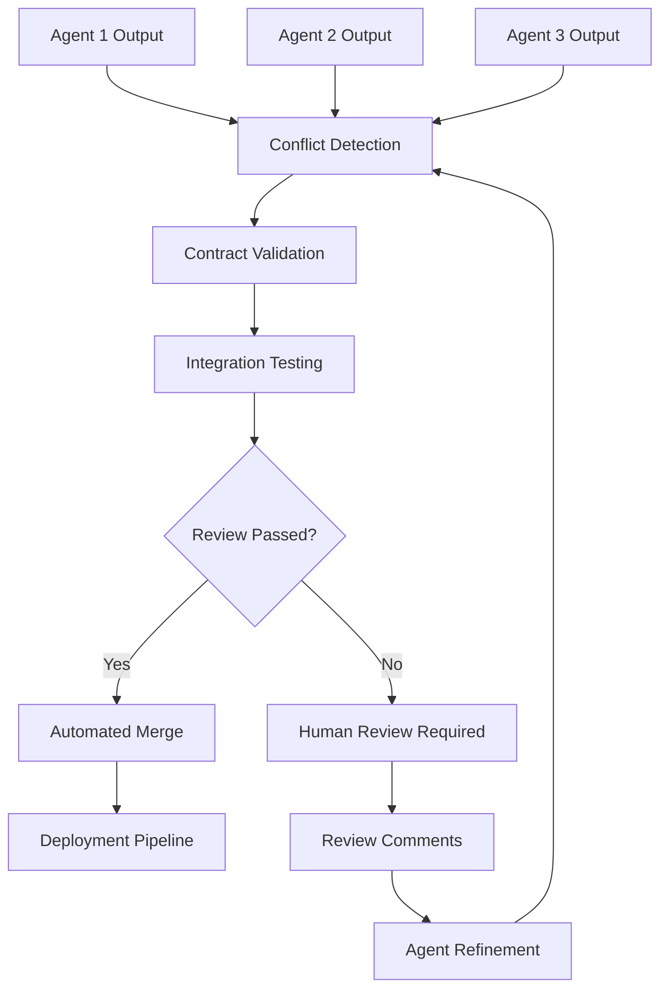

**Automated Conflict Detection**

```python
# ai-review-automation.py
import ast
import json
from pathlib import Path
from typing import Dict, List, Set

class ParallelOutputReviewer:
    def __init__(self, workspace_dir: str):
        self.workspace_path = Path(workspace_dir)
        self.conflicts = []
        self.integration_issues = []
        
    def detect_file_conflicts(self) -> List[Dict]:
        """Detect when multiple agents modified the same files"""
        file_modifications = {}
        
        for agent_dir in self.workspace_path.glob("agent-*"):
            agent_id = agent_dir.name
            
            for modified_file in agent_dir.glob("**/*.py"):
                relative_path = modified_file.relative_to(agent_dir)
                
                if relative_path not in file_modifications:
                    file_modifications[relative_path] = []
                file_modifications[relative_path].append({
                    "agent": agent_id,
                    "file_path": str(modified_file),
                    "content": modified_file.read_text()
                })
        
        # Find files modified by multiple agents
        conflicts = []
        for file_path, modifications in file_modifications.items():
            if len(modifications) > 1:
                conflicts.append({
                    "file": str(file_path),
                    "agents": [mod["agent"] for mod in modifications],
                    "modifications": modifications
                })
        
        return conflicts
    
    def validate_api_contracts(self) -> List[Dict]:
        """Ensure parallel implementations maintain API compatibility"""
        api_definitions = {}
        contract_violations = []
        
        for agent_dir in self.workspace_path.glob("agent-*"):
            agent_id = agent_dir.name
            
            for python_file in agent_dir.glob("**/*.py"):
                try:
                    tree = ast.parse(python_file.read_text())
                    
                    for node in ast.walk(tree):
                        if isinstance(node, ast.FunctionDef):
                            func_signature = {
                                "name": node.name,
                                "args": [arg.arg for arg in node.args.args],
                                "returns": ast.get_source_segment(
                                    python_file.read_text(), node.returns
                                ) if node.returns else None
                            }
                            
                            func_key = f"{python_file.stem}.{node.name}"
                            if func_key not in api_definitions:
                                api_definitions[func_key] = []
                            api_definitions[func_key].append({
                                "agent": agent_id,
                                "signature": func_signature
                            })
                except SyntaxError as e:
                    contract_violations.append({
                        "type": "syntax_error",
                        "agent": agent_id,
                        "file": str(python_file),
                        "error": str(e)
                    })
        
        # Check for signature mismatches
        for func_key, definitions in api_definitions.items():
            if len(definitions) > 1:
                signatures = [d["signature"] for d in definitions]
                if not all(sig == signatures[0] for sig in signatures):
                    contract_violations.append({
                        "type": "signature_mismatch",
                        "function": func_key,
                        "agents": [d["agent"] for d in definitions],
                        "signatures": signatures
                    })
        
        return contract_violations
    
    def generate_integration_tests(self) -> str:
        """Generate tests that validate parallel outputs work together"""
        integration_prompt = f"""
        Generate integration tests for parallel agent outputs in {self.workspace_path}:
        
        1. Test that all agent outputs can be imported without conflicts
        2. Verify API contracts are maintained across implementations
        3. Check that shared dependencies are compatible
        4. Validate that combined functionality works end-to-end
        
        Agents found: {[d.name for d in self.workspace_path.glob("agent-*")]}
        
        Create pytest test cases that:
        - Import all agent outputs
        - Test cross-agent functionality
        - Verify no naming conflicts
        - Check integration points
        """
        
        # In real implementation, this would call AI service
        return self.ai_generate(integration_prompt)
    
    def generate_review_report(self) -> Dict:
        """Generate comprehensive review report for human reviewers"""
        conflicts = self.detect_file_conflicts()
        contract_issues = self.validate_api_contracts()
        
        report = {
            "timestamp": "2024-01-01T12:00:00Z",
            "review_status": "pending" if conflicts or contract_issues else "approved",
            "conflicts": {
                "file_conflicts": len(conflicts),
                "contract_violations": len(contract_issues),
                "details": conflicts + contract_issues
            },
            "recommendations": [],
            "integration_tests": self.generate_integration_tests(),
            "merge_strategy": "human_review" if conflicts else "auto_merge"
        }
        
        # Generate AI recommendations
        if conflicts:
            report["recommendations"].append({
                "type": "conflict_resolution",
                "priority": "high", 
                "description": "Resolve file conflicts before integration",
                "action": "Manual merge required with conflict resolution"
            })
        
        if contract_issues:
            report["recommendations"].append({
                "type": "api_alignment",
                "priority": "high",
                "description": "Align API contracts across agents",
                "action": "Standardize function signatures and return types"
            })
            
        return report

# Usage
reviewer = ParallelOutputReviewer("/workspace")
report = reviewer.generate_review_report()

if report["review_status"] == "approved":
    print("✅ Parallel outputs approved for automatic merge")
else:
    print("⚠️  Manual review required")
    with open("/workspace/review-report.json", "w") as f:
        json.dump(report, f, indent=2)
```

**AI-Powered Conflict Resolution**

```bash
# conflict-resolution.sh
#!/bin/bash
# Automated conflict resolution for parallel agent outputs

resolve_conflicts() {
    local review_report="/workspace/review-report.json"
    
    if [[ ! -f "$review_report" ]]; then
        echo "No review report found"
        return 1
    fi
    
    local conflict_count=$(jq '.conflicts.file_conflicts' "$review_report")
    
    if [[ $conflict_count -gt 0 ]]; then
        echo "Resolving $conflict_count file conflicts..."
        
        # AI-assisted conflict resolution
        ai_resolve "Analyze conflicts in $review_report and suggest resolution:
        
        For each conflicting file:
        1. Determine if changes are complementary or conflicting
        2. If complementary, merge automatically
        3. If conflicting, suggest which version to keep and why
        4. Generate unified version that combines best of both
        
        Prioritize:
        - Security-focused implementations over performance
        - More comprehensive error handling
        - Better test coverage
        - Cleaner, more maintainable code
        
        Output executable merge commands."
        
    else
        echo "No conflicts detected - proceeding with automatic merge"
        auto_merge_outputs
    fi
}

auto_merge_outputs() {
    echo "Automatically merging parallel agent outputs..."
    
    # Create merged directory structure
    mkdir -p /workspace/merged
    
    # Merge non-conflicting files
    for agent_dir in /workspace/agent-*; do
        agent_id=$(basename "$agent_dir")
        
        # Copy unique files from each agent
        rsync -av --ignore-existing "$agent_dir/" /workspace/merged/
        
        echo "Merged outputs from $agent_id"
    done
    
    # Run integration tests on merged output
    cd /workspace/merged
    python -m pytest tests/integration/ -v
    
    if [[ $? -eq 0 ]]; then
        echo "✅ Integration tests passed - merge complete"
        
        # Copy to main source tree
        rsync -av /workspace/merged/ /workspace/src/
        
        # Clean up agent workspaces
        rm -rf /workspace/agent-*
    else
        echo "❌ Integration tests failed - manual review required"
        exit 1
    fi
}

# Execute conflict resolution
resolve_conflicts
```

**Quality Gates for Parallel Outputs**

```yaml
# .ai/review-automation/quality-gates.yml
quality_gates:
  automated_checks:
    - name: "syntax_validation"
      command: "python -m py_compile {file}"
      required: true
      
    - name: "type_checking"
      command: "mypy {file}"
      required: true
      
    - name: "security_scan"
      command: "bandit -r {directory}"
      required: true
      
    - name: "test_coverage"
      command: "pytest --cov={module} --cov-min=80"
      required: true
      
  cross_agent_validation:
    - name: "api_compatibility"
      description: "Verify API contracts match across agents"
      implementation: "contract_validator.py"
      
    - name: "dependency_conflicts"
      description: "Check for conflicting package versions"
      implementation: "dependency_checker.py"
      
    - name: "naming_conflicts"
      description: "Ensure no duplicate class/function names"
      implementation: "namespace_validator.py"
      
  integration_requirements:
    - name: "end_to_end_tests"
      description: "Full workflow tests with all agent outputs"
      timeout: "300s"
      
    - name: "performance_regression"
      description: "Ensure combined output doesn't degrade performance"
      baseline_file: "performance_baseline.json"
      
    - name: "security_integration"
      description: "Verify security across integrated components"
      tools: ["semgrep", "safety", "bandit"]

  approval_criteria:
    automatic_approval:
      - all_automated_checks_pass: true
      - no_file_conflicts: true
      - api_compatibility_maintained: true
      - performance_regression_threshold: "5%"
      
    human_review_required:
      - file_conflicts_detected: true
      - api_breaking_changes: true
      - security_violations_found: true
      - performance_regression: ">5%"
      - test_coverage_below: "80%"
```

**CI/CD Integration**

```yaml
# .github/workflows/parallel-agent-review.yml
name: Parallel Agent Review

on:
  push:
    paths:
      - 'workspace/agent-**'

jobs:
  automated-review:
    runs-on: ubuntu-latest
    steps:
      - uses: actions/checkout@v4
      
      - name: Setup Review Environment
        run: |
          pip install -r requirements-review.txt
          mkdir -p /tmp/review-workspace
          
      - name: Run Parallel Output Review
        run: |
          python ai-review-automation.py \
            --workspace ./workspace \
            --output /tmp/review-workspace/report.json
            
      - name: Check Review Status
        id: review-check
        run: |
          status=$(jq -r '.review_status' /tmp/review-workspace/report.json)
          echo "review_status=$status" >> $GITHUB_OUTPUT
          
      - name: Auto-merge on Approval
        if: steps.review-check.outputs.review_status == 'approved'
        run: |
          ./conflict-resolution.sh
          echo "✅ Parallel outputs automatically merged"
          
      - name: Request Human Review
        if: steps.review-check.outputs.review_status == 'pending'
        run: |
          gh pr comment --body-file /tmp/review-workspace/report.json
          gh pr edit --add-label "needs-human-review"
          echo "⚠️ Human review requested due to conflicts"
          
      - name: Archive Review Artifacts
        uses: actions/upload-artifact@v4
        with:
          name: review-report
          path: /tmp/review-workspace/
```

**Benefits of Review Automation**

1. **Faster Integration**: Automatic conflict detection and resolution
2. **Quality Assurance**: Consistent quality gates across all parallel outputs  
3. **Risk Reduction**: Early detection of integration issues
4. **Team Efficiency**: Reduces manual review overhead for clean merges
5. **Consistency**: Standardized review criteria and processes
6. **Traceability**: Complete audit trail of review decisions

**Anti-pattern: Manual-Only Review**
Relying entirely on human reviewers for parallel agent outputs creates bottlenecks and misses systematic integration issues that automated tools can catch.

**Anti-pattern: Auto-Merge Without Validation**
Automatically merging parallel outputs without proper conflict detection and quality validation can introduce bugs and break system functionality.

---

### Compliance Evidence Automation

**Maturity**: Advanced  
**Description**: Generate audit evidence matrices from logs and configuration changes automatically, creating comprehensive compliance documentation without manual effort.

**Related Patterns**: [Security Scanning Orchestration](#security-scanning-orchestration)

```bash
# Automated compliance evidence collection
aws configservice get-resource-config-history > awsconfig.json
aws cloudtrail lookup-events > iam-changes.json
ai "Generate SOC2 evidence sheet from awsconfig.json and iam-changes.json" > report.csv
```

**Anti-pattern: Manual Evidence Collection**
Hand-crafted spreadsheets miss events or contain outdated entries under audit pressure.

---

### ChatOps Security Integration

**Maturity**: Beginner  
**Description**: Deploy security scanning capabilities through chat commands for immediate feedback, making security assessment as easy as sending a message.

**Related Patterns**: [Security Scanning Orchestration](#security-scanning-orchestration)

```yaml
# bot-config.yml
commands:
  - trigger: /sec scan {{repo}}
    action: "./security-scan.sh && cat pr-comment.txt"
```

**Anti-pattern: Over-Automation**
Allowing auto-fix commands via chat can deploy untested changes.

---

## Deployment Automation Patterns

### Pipeline Synthesis

**Maturity**: Intermediate  
**Description**: Convert plain-English build specifications into CI/CD pipeline configurations, maintaining traceability between human-readable specs and generated pipelines.

**Related Patterns**: [AI Workflow Orchestration](#ai-workflow-orchestration)

```bash
# See actual spec: pipelines/ci_spec.md
# ci.spec
install dependencies -> pip install -r requirements.txt
run tests -> pytest
build image -> docker build -t myapp .
push image -> aws ecr get-login-password | docker push myapp:latest

# Generate CI
ai "Read ci.spec and output GitHub Actions YAML" > .github/workflows/ci.yml
git add ci.spec .github/workflows/ci.yml
git commit -m "chore: generate CI from spec"
```

**Anti-pattern: Over-Generation**
Accepting every AI-suggested stage without pruning adds slow, unused steps to pipelines.

---

### AI-Guided Blue-Green Deployment

**Maturity**: Advanced  
**Description**: Generate blue-green deployment scripts with validation to prevent AI misconceptions, ensuring proper atomic traffic switching rather than gradual rollouts.

**Related Patterns**: [Pipeline Synthesis](#pipeline-synthesis)

```bash
# Blue-green reference documentation
# See actual guide: deployment/blue_green/blue_green_deployment.md
cat > docs/blue-green-guide.md << 'EOF'
# Blue-Green Deployment Pattern

## Key Principles (from Martin Fowler)
1. Maintain two identical production environments: Blue (live) and Green (idle)
2. Deploy new version to the idle environment
3. Test thoroughly in idle environment
4. Switch traffic from Blue to Green atomically
5. Keep Blue as rollback option

## Critical: This is NOT canary deployment
- NO gradual traffic shifting
- NO percentage-based rollout
- Traffic switches 100% at once
EOF

# AI prompt with validation
ai "Using deployment/blue_green/blue_green_deployment.md, create AWS deployment script that:
1. Deploys to IDLE environment only
2. Runs health checks on idle
3. Switches ALL traffic atomically via ALB
4. Keeps previous environment for rollback

DO NOT create canary deployment." > deploy-blue-green.sh

# Validate AI didn't confuse patterns
if grep -q "canary\|gradual\|percentage" deploy-blue-green.sh; then
    echo "ERROR: AI generated canary deployment, not blue-green"
    exit 1
fi
```

**Anti-pattern: Trusting AI Blue-Green Generation**
LLMs frequently confuse blue-green with canary deployments, generating gradual traffic shifting instead of atomic switches.

---

### Drift Detection & Remediation

**Maturity**: Advanced  
**Description**: Detect infrastructure configuration drift and generate corrective patches automatically, maintaining infrastructure as intended without manual intervention.

**Related Patterns**: [Pipeline Synthesis](#pipeline-synthesis)

```bash
# Detect and fix infrastructure drift
terraform plan -out=tf.plan
terraform show -json tf.plan > drift.json
ai "Create Terraform patch from drift.json to restore desired state" > patch.tf
terraform apply patch.tf
```

**Anti-pattern: Automated Overwrite**
Auto-applying AI patches without inspection can break resources you didn't intend to change.

---

### Release Note Synthesis

**Maturity**: Beginner  
**Description**: Automatically generate structured release notes by analyzing git commit history, categorizing changes into meaningful sections for clear communication.

**Related Patterns**: [Pipeline Synthesis](#pipeline-synthesis)

```bash
# Auto-generate structured release notes
git log v1.3.2..HEAD --pretty=format:"%s" > commits.log
ai "Group commits in commits.log under Added, Changed, Fixed" >> CHANGELOG.md
```

**Anti-pattern: Minimal Notes**
Simply pasting commit hashes without context leaves users guessing what changed.

---

## Monitoring & Maintenance Patterns

### Performance Baseline Management

**Maturity**: Advanced  
**Description**: Establish intelligent performance baselines and configure monitoring thresholds automatically, minimizing false positives while catching real performance issues.

**Related Patterns**: [Observable AI Development](#observable-ai-development)

```bash
aws cloudwatch get-metric-statistics --period 86400 > perf.csv
ai "From perf.csv, recommend latency alert thresholds and autoscale policies" > perf-policy.json
deploy-tool apply perf-policy.json
```

**Anti-pattern: One-Off Alerts**
Manual thresholds quickly become stale, causing alert storms or blind spots.

---

### Technical Debt Forecasting

**Maturity**: Intermediate  
**Description**: Proactively identify and prioritize technical debt using AI-powered code analysis, ranking areas most in need of attention with specific remediation strategies.

**Related Patterns**: [AI-Driven Refactoring](#ai-driven-refactoring)

```bash
cloc src > loc.txt
coverage run -m pytest; coverage report > cov.txt
ai "From loc.txt and cov.txt, list top-3 files needing refactor and tests" > debt.txt
```

**Anti-pattern: Reactive Fixes**
Waiting for incidents to spike forces firefighting rather than long-term health management.

---

### Incident Response Automation

**Maturity**: Advanced  
**Description**: Generate actionable incident response playbooks from historical incident data, extracting common patterns and successful resolution strategies for future use.

**Related Patterns**: [Performance Baseline Management](#performance-baseline-management)

```bash
pd incidents:list --limit 10 > incidents.json
ai "Create a step-by-step RDS failover runbook from incidents.json" > runbooks/rds-failover.md
git add runbooks/rds-failover.md
```

**Anti-pattern: Stale Documentation**
Failing to regenerate playbooks after new incidents yields outdated guidance.

---

### Test Suite Health Management

**Maturity**: Intermediate  
**Description**: Analyze build history to identify and remediate flaky tests automatically, improving build reliability by distinguishing between legitimate failures and intermittent issues.

**Related Patterns**: [Comprehensive AI Testing Strategy](#comprehensive-ai-testing-strategy)

```bash
# Identify and fix flaky tests
wget ci-server/logs/last50 > ci.log
ai "Find intermittently failing tests in ci.log and suggest retry decorators" > flaky.txt
# Apply fixes like: @pytest.mark.flaky(reruns=3)
```

**Anti-pattern: Skip Tests**
Marking tests as skipped ignores root causes and shrinks coverage.

---

### Dependency Upgrade Advisor

**Maturity**: Intermediate  
**Description**: Intelligently manage dependency upgrades with compatibility analysis and risk assessment, recommending safe upgrade paths while flagging potentially breaking changes.

**Related Patterns**: [Technical Debt Forecasting](#technical-debt-forecasting)

```bash
# Intelligent dependency management
npm outdated --json > deps.json
ai "From deps.json, suggest npm install commands for lodash and axios without breaking changes" > deps-update.sh
bash deps-update.sh
```

**Anti-pattern: Bulk Updates**
Running `npm update` without understanding breaking changes causes runtime errors.

---

### On-Call Handoff Automation

**Maturity**: Intermediate  
**Description**: Generate comprehensive handoff briefs that summarize system state and active issues, ensuring smooth transitions between on-call engineers with complete context.

**Related Patterns**: [Incident Response Automation](#incident-response-automation)

```bash
# Generate comprehensive handoff briefs
pd incidents:list --status triggered > alerts.json
curl grafana/api/dashboards/home > dash.json
ai "Create an on-call handoff brief from alerts.json and dash.json" > handoff.md
slack-cli post --file handoff.md --channel oncall
```

**Anti-pattern: Fragmented Handoffs**
Relying on chat logs or email threads skips critical context and action items.

---

### Chaos Engineering Scenarios

**Maturity**: Advanced  
**Description**: Generate targeted chaos experiments based on system architecture and dependencies, creating focused scenarios that test resilience without unnecessary disruption.

**Related Patterns**: [Performance Baseline Management](#performance-baseline-management)

```bash
# Generate targeted chaos experiments
ai "From services.json, generate a Gremlin script to kill 1 of 3 instances of service-A every 5m" > chaos.json
gremlin run chaos.json
```

**Anti-pattern: Blind Chaos Testing**
Running random fault injection without understanding system dependencies yields noise rather than insights.

---

# Anti-Patterns Reference

## Common AI Development Anti-Patterns

### Foundation Anti-Patterns
- **Rushing Into AI**: Starting AI adoption without proper assessment
- **Context Drift**: Inconsistent AI rules across team members
- **Unrestricted Access**: Allowing AI tools access to sensitive data
- **Ad-Hoc Development**: Skipping structured development lifecycle

### Development Anti-Patterns
- **Implementation-First AI**: Writing code before defining acceptance criteria
- **Test Generation Without Strategy**: Creating tests without coherent quality goals
- **Big Bang Generation**: Attempting complex features in single AI interaction
- **Uncoordinated Multi-Tool Usage**: Using multiple AI tools without orchestration
- **Black Box Systems**: Insufficient logging for AI debugging
- **Unclear Boundaries**: Ambiguous human-AI handoff points

### Operations Anti-Patterns
- **Fragmented Security**: Isolated security tools without unified framework
- **Alert Fatigue**: Overwhelming developers with low-priority findings
- **Static Deployment**: Fixed scripts without AI adaptation
- **Trusting AI Blue-Green Generation**: Accepting AI output without validation for deployment patterns
- **Reactive Maintenance**: Firefighting instead of proactive AI-assisted management
- **Blind Chaos Testing**: Random fault injection without understanding dependencies

---

# Implementation Guide

## Getting Started

### Phase 1: Foundation (Weeks 1-2)
1. **[AI Readiness Assessment](#ai-readiness-assessment)** - Evaluate team and codebase readiness
2. **[Rules as Code](#rules-as-code)** - Establish consistent AI coding standards
3. **[AI Security Sandbox](#ai-security-sandbox)** - Implement secure AI tool isolation
4. **[AI Developer Lifecycle](#ai-developer-lifecycle)** - Define structured development process
5. **[AI Issue Generation](#ai-issue-generation)** - Generate structured work items from requirements

### Phase 2: Development (Weeks 3-4)
1. **[Specification Driven Development](#specification-driven-development)** - Implement specification-first approach
2. **[Comprehensive AI Testing Strategy](#comprehensive-ai-testing-strategy)** - Establish unified testing framework
3. **[Progressive AI Enhancement](#progressive-ai-enhancement)** - Practice iterative development
4. **[Context Window Optimization](#context-window-optimization)** - Optimize AI tool selection

### Phase 3: Operations (Weeks 5-6)
1. **[AI Security & Compliance](#ai-security--compliance)** - Implement unified security framework
2. **[Deployment Automation](#deployment-automation)** - Establish AI-powered CI/CD
3. **[Monitoring & Maintenance](#monitoring--maintenance)** - Deploy proactive system management

**Note**: For teams practicing continuous delivery, implement security (AI Security Sandbox, AI Security & Compliance) and deployment patterns (Deployment Automation) from week 1 alongside foundation patterns. The phases represent learning dependencies, not deployment sequences.

## Success Metrics

### Foundation Metrics
- Team readiness score improvement
- Consistent AI rule adherence across projects
- Zero credential leaks in AI-generated code
- Reduced onboarding time for new developers

### Development Metrics
- Test coverage maintenance (>90% for AI-generated code)
- Reduced code review cycles
- Faster feature delivery with maintained quality
- Decreased debugging time for AI-generated issues

### Operations Metrics
- Automated policy compliance verification
- Reduced deployment failures
- Faster incident response with AI-generated runbooks
- Proactive technical debt management

## Contributing

Have a pattern that's working well for your team? Open an issue or PR to share your experience. The AI development landscape is evolving rapidly, and we're all learning together.

### Pattern Contribution Guidelines
1. Follow the established pattern template (Maturity, Description, Related Patterns, Examples, Anti-patterns)
2. Include practical, runnable examples
3. Specify clear success criteria and anti-patterns
4. Reference related patterns appropriately
5. Test patterns with multiple AI tools when applicable

## License

MIT License - See LICENSE file for details.

---

*The patterns in this collection represent collective wisdom from teams pioneering AI-assisted development. They're designed to be adapted and evolved as the AI development landscape continues to mature.*