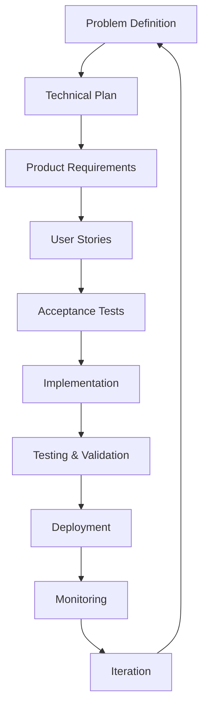

# AI-Powered Development Patterns

A comprehensive collection of proven patterns for building software with AI assistance across CI/CD workflows and general development practices.

## Pattern Overview

This repository contains two complementary pattern collections:

- **[CI/CD AI Patterns](cicdaipatterns/ci-cd-ai-patterns.md)** - AI-enhanced continuous integration and deployment workflows
- **[Coding AI Best Practices](coding-ai-best-practices/coding-ai-my-best-practices.md)** - Foundational patterns for AI-assisted development

## Complete Pattern Reference

| Pattern | Type | Description | Related Patterns |
|---------|------|-------------|------------------|
| **[AI Developer Lifecycle](#ai-developer-lifecycle)** | Foundation | Structured 9-stage process from problem definition through deployment with AI assistance | Rules as Code, Test-Driven AI Development, Observable AI Development |
| **[AI-Powered Pipeline Synthesizer](#ai-powered-pipeline-synthesizer)** | CI/CD | Convert plain-English build specs into CI/CD YAML workflows automatically | Everything as a Tool, AI Prompt Pipeline |
| **[Policy-as-Code Constructor](#policy-as-code-constructor)** | CI/CD | Transform compliance requirements into executable Cedar/OPA policy files | Rules as Code, AI Security Sandbox |
| **[Continuous Security Scanning Orchestrator](#continuous-security-scanning-orchestrator)** | CI/CD | Aggregate SAST/SCA/DAST tools and AI-summarize findings for PR comments | AI Prompt Pipeline, ChatOps Security Assistant |
| **[Test Suite Amplifier](#test-suite-amplifier)** | CI/CD | Generate unit tests for code changes covering edge cases and error paths | Test-Driven AI Development, Test Flakiness Detector |
| **[Drift Detection & Remediation Loop](#drift-detection--remediation-loop)** | CI/CD | Auto-detect infrastructure drift and generate Terraform patches | Observable AI Development, Everything as a Tool |
| **[Intelligent Rollback & Canary Advisor](#intelligent-rollback--canary-advisor)** | CI/CD | Analyze metrics to recommend canary splits and rollback criteria | Performance Baseline Advisor, AI-Guided Blue-Green Deployment |
| **[Compliance Evidence Automator](#compliance-evidence-automator)** | CI/CD | Generate audit evidence matrices from logs and config changes | Observable AI Development, Policy-as-Code Constructor |
| **[ChatOps Security Assistant](#chatops-security-assistant)** | CI/CD | Deploy bots for on-demand security scans via Slack commands | Continuous Security Scanning Orchestrator, Everything as a Tool |
| **[Incident Playbook Generator](#incident-playbook-generator)** | CI/CD | Distill PagerDuty incidents into versioned step-by-step runbooks | AI Knowledge Persistence, On-Call Handoff Brief Generator |
| **[Release Note Synthesizer](#release-note-synthesizer)** | CI/CD | Categorize commits into Added/Changed/Fixed for automated changelogs | AI Commit Protocol, AI Prompt Pipeline |
| **[Dependency Upgrade Advisor](#dependency-upgrade-advisor)** | CI/CD | Suggest non-breaking package upgrades with compatibility analysis | Technical Debt Forecaster, Context Window Optimization |
| **[Technical Debt Forecaster](#technical-debt-forecaster)** | CI/CD | Rank code hotspots needing refactoring based on metrics analysis | Dependency Upgrade Advisor, Observable AI Development |
| **[Test Flakiness Detector](#test-flakiness-detector)** | CI/CD | Identify intermittently failing tests and suggest retry strategies | Test Suite Amplifier, Observable AI Development |
| **[Chaos Scenario Generator](#chaos-scenario-generator)** | CI/CD | Create targeted chaos engineering scripts based on service topology | Performance Baseline Advisor, Everything as a Tool |
| **[Performance Baseline Advisor](#performance-baseline-advisor)** | CI/CD | Recommend alert thresholds and autoscale policies from historical data | Intelligent Rollback & Canary Advisor, Observable AI Development |
| **[On-Call Handoff Brief Generator](#on-call-handoff-brief-generator)** | CI/CD | Summarize alerts and dashboards for seamless on-call transitions | Incident Playbook Generator, Observable AI Development |
| **[AI-Guided Blue-Green Deployment Orchestrator](#ai-guided-blue-green-deployment-orchestrator)** | CI/CD | Generate blue-green deployment scripts with validation to prevent LLM misconceptions | Intelligent Rollback & Canary Advisor, Everything as a Tool |
| **[Rules as Code](#rules-as-code)** | Foundation | Version and maintain AI coding standards as explicit files (.cursorrules, CLAUDE.md) | AI Developer Lifecycle, AI Knowledge Persistence |
| **[Test-Driven AI Development](#test-driven-ai-development)** | Development | Write failing tests first, then use AI to generate implementations that pass specific test criteria | AI Developer Lifecycle, Test-Driven Prompt Engineering |
| **[Progressive AI Enhancement](#progressive-ai-enhancement)** | Development | Build complex features through small, deployable iterations rather than big-bang generation | AI Developer Lifecycle, Constraint-Based AI Development |
| **[AI Security Sandbox](#ai-security-sandbox)** | Security | Run AI tools in isolated environments without access to secrets or sensitive data | Policy-as-Code Constructor, Everything as a Tool |
| **[AI Prompt Pipeline](#ai-prompt-pipeline)** | Development | Chain AI prompts in stages where each validates and improves the previous output | AI-Powered Pipeline Synthesizer, Test-Driven Prompt Engineering |
| **[Context Window Optimization](#context-window-optimization)** | Development | Match AI tool selection to task complexity (Copilot for simple, Claude for architecture) | AI Pair Rotation, Dependency Upgrade Advisor |
| **[Test-Driven Prompt Engineering](#test-driven-prompt-engineering)** | Development | Define expected AI output first, then systematically refine prompts to achieve it | Test-Driven AI Development, AI Prompt Pipeline |
| **[AI Knowledge Persistence](#ai-knowledge-persistence)** | Development | Capture successful patterns and failed attempts as versioned knowledge for future sessions | Rules as Code, Incident Playbook Generator |
| **[AI Commit Protocol](#ai-commit-protocol)** | Development | Structure commits with clear attribution and checkpoints for easy rollback of AI changes | Release Note Synthesizer, AI Security Sandbox |
| **[AI Pair Rotation](#ai-pair-rotation)** | Development | Use different AI tools for different development phases based on their strengths | Context Window Optimization, Parallel AI Workflows |
| **[Constraint-Based AI Development](#constraint-based-ai-development)** | Development | Give AI specific constraints (lines of code, dependencies) to prevent over-engineering | Progressive AI Enhancement, Everything as a Tool |
| **[Observable AI Development](#observable-ai-development)** | Development | Strategic logging and debugging that makes system behavior visible to AI | AI Developer Lifecycle, Performance Baseline Advisor |
| **[Parallel AI Workflows](#parallel-ai-workflows)** | Development | Use multiple AI agents concurrently with shared contracts for different aspects of features | AI Pair Rotation, Everything as a Tool |
| **[Everything as a Tool](#everything-as-a-tool)** | Architecture | Design scripts and services as AI-accessible with structured output and self-documentation | AI Security Sandbox, Parallel AI Workflows |

---

# Foundation Patterns

## AI Developer Lifecycle

**Description**
AI development follows a structured lifecycle from problem definition through deployment, just like traditional software development but with AI-specific considerations at each stage. This lifecycle serves as the foundational framework that integrates all the tactical patterns described in this document - from Rules as Code to Everything as a Tool - ensuring systematic, testable, and maintainable AI-assisted development.

**Related Patterns**: [Rules as Code](#rules-as-code), [Test-Driven AI Development](#test-driven-ai-development), [Observable AI Development](#observable-ai-development)

**The Complete Lifecycle**



**Stage 1: AI-Assisted Problem Definition**
*Patterns: Constraint-Based AI Development, Test-Driven Prompt Engineering*

```markdown
## Problem Statement Template

**Business Problem**: [What business challenge are we solving?]
**Technical Problem**: [What specific technical implementation is needed?]
**Success Criteria**: [How will we measure success?]
**Constraints**: [Time, budget, technology, compliance limitations]
**Assumptions**: [What are we assuming to be true?]

AI Prompt: "Analyze this problem statement for technical feasibility, suggest alternative approaches, and identify potential risks"
```

Apply **Constraint-Based AI Development** by setting specific boundaries upfront. Use **Test-Driven Prompt Engineering** to refine your problem analysis prompts until they consistently produce actionable insights.

**Anti-pattern: Ad-Hoc AI Development**
Jumping straight to coding with AI without proper planning, requirements, or testing strategy, leading to technical debt and unmaintainable systems.

---

## Rules as Code

**Description**
Treat your AI coding standards like infrastructure - version them, evolve them, and make them explicit. Every AI session starts fresh, so without persistent rules, you're teaching AI your preferences from scratch each time.

**Related Patterns**: [AI Developer Lifecycle](#ai-developer-lifecycle), [AI Knowledge Persistence](#ai-knowledge-persistence)

**Examples**
```bash
# Project structure
project/
├── .cursorrules           # Cursor-specific patterns
├── CLAUDE.md             # Claude Code context
├── rules/                # Windsurf modular rules
│   ├── security.md      
│   ├── testing.md       
│   └── refactoring.md   
```

Sample `.cursorrules`:
```markdown
## Code Generation Rules

When generating code:
1. Always use TypeScript with strict mode
2. Prefer composition over inheritance
3. Every public method needs JSDoc
4. Use dependency injection for testability
5. Follow the pattern in src/patterns/

When refactoring:
1. Run tests before any changes
2. One refactoring type per commit
3. Preserve all public APIs
```

**Anti-pattern: Context Drift**
Each developer maintains their own prompts and preferences, leading to inconsistent code across the team.

---

# Development Patterns

## Test-Driven AI Development

**Description**
Write failing tests first, then use AI to generate implementations that pass. Tests provide unambiguous success criteria that prevent AI from hallucinating features you don't need.

**Related Patterns**: [AI Developer Lifecycle](#ai-developer-lifecycle), [Test-Driven Prompt Engineering](#test-driven-prompt-engineering)

**Examples**
```javascript
// Step 1: You write the test (not AI)
describe('PasswordHasher', () => {
  it('should use bcrypt with cost factor 12', async () => {
    const hasher = new PasswordHasher();
    const hash = await hasher.hash('password123');
    
    expect(hash).toMatch(/^\$2[aby]\$12\$/);
    expect(await bcrypt.compare('password123', hash)).toBe(true);
  });
});

// Step 2: Prompt AI with the failing test
"Implement PasswordHasher to make this test pass. Use bcrypt with cost factor 12."
```

**Anti-pattern: Test After**
Letting AI generate both implementation and tests results in tests that mirror the implementation rather than specify behavior.

---

## Progressive AI Enhancement

**Description**
Build complex features through small, deployable iterations. Each AI interaction adds one specific enhancement rather than trying to build everything at once.

**Related Patterns**: [AI Developer Lifecycle](#ai-developer-lifecycle), [Constraint-Based AI Development](#constraint-based-ai-development)

**Examples**
Building authentication progressively:
```bash
# Day 1: Minimal login
"Create POST /login that returns 200 for admin/admin, 401 otherwise"
→ Deploy

# Day 2: Real password check
"Modify login to check passwords against users table. Keep existing API."
→ Deploy

# Day 3: Add security
"Add bcrypt hashing to login. Support both hashed and plain passwords temporarily."
→ Deploy
```

**Anti-pattern: Big Bang Generation**
Asking AI to "create a complete user management system" results in 5000 lines of coupled, untested code.

---

## AI Security Sandbox

**Description**
Run AI tools in isolated environments that can't access secrets, credentials, or sensitive data.

**Related Patterns**: [Policy-as-Code Constructor](#policy-as-code-constructor), [Everything as a Tool](#everything-as-a-tool)

**Examples**
Docker-based isolation:
```yaml
services:
  ai-sandbox:
    image: development:latest
    security_opt:
      - no-new-privileges:true
    cap_drop:
      - ALL
    volumes:
      - ./src:/workspace/src:ro      # Read-only source
      - ./tests:/workspace/tests:rw   # Writable tests
      # No access to .env, .aws, secrets/
```

**Anti-pattern: Unrestricted Access**
Allowing AI tools full system access risks credential leaks and security breaches.

---

## AI Prompt Pipeline

**Description**
Chain AI prompts like a CI/CD pipeline where each stage validates and improves the previous stage's output.

**Related Patterns**: [AI-Powered Pipeline Synthesizer](#ai-powered-pipeline-synthesizer), [Test-Driven Prompt Engineering](#test-driven-prompt-engineering)

**Examples**
```bash
#!/bin/bash
# ai-pipeline.sh

# Stage 1: Generate implementation
ai "Implement UserService.create based on failing test" > stage1.ts

# Stage 2: Security review
ai "Review this code for OWASP Top 10 vulnerabilities: $(cat stage1.ts)" > stage2.ts

# Stage 3: Performance optimization  
ai "Optimize for <50ms response time: $(cat stage2.ts)" > stage3.ts

# Run tests after each stage
npm test || exit 1
```

---

## Context Window Optimization

**Description**
Match AI tool selection to task complexity. Using Claude for every task is like using a sledgehammer to hang a picture.

**Related Patterns**: [AI Pair Rotation](#ai-pair-rotation), [Dependency Upgrade Advisor](#dependency-upgrade-advisor)

**Examples**
Decision matrix:
```
Task: Add null check
Tool: GitHub Copilot (instant, cheap)
Context: <100 tokens

Task: Extract method
Tool: Cursor Cmd+K (fast, focused)  
Context: <1000 tokens

Task: Refactor module
Tool: Windsurf Cascade (handles dependencies)
Context: <10000 tokens

Task: Design architecture
Tool: Claude Code (best reasoning)
Context: Full codebase
```

---

## Test-Driven Prompt Engineering

**Description**
Define expected AI output first, then refine prompts systematically until they produce it - just like TDD for prompts.

**Related Patterns**: [Test-Driven AI Development](#test-driven-ai-development), [AI Prompt Pipeline](#ai-prompt-pipeline)

**Examples**
Goal: Secure password reset endpoint

Expected output:
```typescript
@Post('/password-reset')
@RateLimit({ window: '15m', max: 3 })
async resetPassword(@Body() dto: ResetPasswordDto) {
  const user = await this.users.findByEmail(dto.email);
  if (!user) {
    return { message: 'If email exists, reset link sent' };
  }
  // ... rest of implementation
}
```

Prompt evolution:
```
V1: "Create password reset endpoint"
Result: ❌ Missing rate limiting, reveals emails

V2: "Create secure password reset with rate limiting"  
Result: ❌ Still reveals if email exists

V3: "Create password reset:
- Rate limit 3 per 15 min
- Same response whether email exists or not
- Use Redis for tokens"
Result: ✅ Matches expected output
```

**Anti-pattern: Prompt and Pray**
Vague prompts like "make it better" waste time with multiple iterations.

---

## AI Knowledge Persistence

**Description**
Capture successful AI patterns and failed attempts as versioned knowledge for future sessions.

**Related Patterns**: [Rules as Code](#rules-as-code), [Incident Playbook Generator](#incident-playbook-generator)

**Examples**
`.ai/knowledge/authentication.md`:
```markdown
## Successful Patterns

### JWT Implementation
Prompt that works 95% of the time:
"Implement JWT auth:
- RS256 algorithm (never HS256)
- 15 min access token
- 7 day refresh token in httpOnly cookie
- Include user.id and role in payload"

## Failed Patterns

### ❌ "Make authentication secure"
Too vague - AI adds unnecessary complexity

## Gotchas
- AI defaults to HS256 (insecure)
- Often uses deprecated bcrypt methods
```

---

## AI Commit Protocol

**Description**
Structure commits to maintain clear attribution and enable rollback when working with AI-generated code.

**Related Patterns**: [Release Note Synthesizer](#release-note-synthesizer), [AI Security Sandbox](#ai-security-sandbox)

**Examples**
```bash
# Before AI work
git commit -am "checkpoint: Before implementing auth"

# After AI generates code
git add -p  # Review carefully
git commit -m "feat(auth): Add JWT validation

AI-Assisted: Claude
Safety: Checkpoint at abc123"

# If AI messes up
git reset --hard abc123
```

---

## AI Pair Rotation

**Description**
Use different AI tools for different development phases, like rotating pair programming partners.

**Related Patterns**: [Context Window Optimization](#context-window-optimization), [Parallel AI Workflows](#parallel-ai-workflows)

**Examples**
```bash
# Morning: Architecture design
claude "Design event sourcing for order system"

# Midday: Implementation  
cursor "Implement OrderAggregate from Claude's design"

# Afternoon: Testing
windsurf "Generate comprehensive tests for OrderAggregate"

# Evening: Review
chatgpt "Review this code for best practices"
```

---

## Constraint-Based AI Development

**Description**
Give AI specific constraints to prevent over-engineering and ensure focused solutions.

**Related Patterns**: [Progressive AI Enhancement](#progressive-ai-enhancement), [Everything as a Tool](#everything-as-a-tool)

**Examples**
```
Bad: "Create user service"
Good: "Create user service: <100 lines, 3 methods max, only bcrypt dependency"

Bad: "Add caching"
Good: "Add caching using Map, max 1000 entries, LRU eviction"

Bad: "Improve performance"
Good: "Reduce p99 latency to <50ms without new dependencies"
```

---

## Observable AI Development

**Description**
Make your system's behavior visible to AI through strategic logging and debugging. AI can't fix what it can't see.

**Related Patterns**: [AI Developer Lifecycle](#ai-developer-lifecycle), [Performance Baseline Advisor](#performance-baseline-advisor)

**Examples**
```python
# Good: Observable operations
import logging
logger = logging.getLogger(__name__)

def process_order(order):
    logger.info(f"[ORDER] Processing {order.id} for {order.customer_email}")
    
    try:
        logger.info("[ORDER] Validating...")
        validate_order(order)
        logger.info("[ORDER] ✓ Validation passed")
        
        logger.info(f"[PAYMENT] Charging ${order.total} via {order.payment_method}")
        result = charge_payment(order)
        logger.info(f"[PAYMENT] ✓ Transaction: {result.transaction_id}")
        
    except ValidationError as e:
        logger.error(f"[ORDER] ✗ Validation failed: {e.field} - {e.message}")
        raise
```

**Anti-pattern: Black Box Systems**
Minimal or cryptic logging that leaves AI guessing about system state and failure causes.

---

## Parallel AI Workflows

**Description**
Use multiple AI agents concurrently for different aspects of the same problem, multiplying your effective throughput.

**Related Patterns**: [AI Pair Rotation](#ai-pair-rotation), [Everything as a Tool](#everything-as-a-tool)

**Examples**
Contract-based coordination:
```python
# contracts/checkout_api.py
from typing import TypedDict, List

class CartItem(TypedDict):
    product_id: str
    quantity: int
    price: float

class CheckoutAPI:
    """Shared contract for all agents"""
    
    create_order = {
        "method": "POST",
        "path": "/api/checkout",
        "request": {
            "items": List[CartItem],
            "payment_method": str,
            "shipping_address": str
        },
        "response": {
            "order_id": str,
            "total": float,
            "status": str
        }
    }
```

**Anti-pattern: Uncoordinated Parallel Work**
Multiple AI agents working without shared contracts or clear boundaries.

---

## Everything as a Tool

**Description**
Design every script, service, and system component as an AI-accessible tool with clear interfaces, predictable behavior, and built-in documentation.

**Related Patterns**: [AI Security Sandbox](#ai-security-sandbox), [Parallel AI Workflows](#parallel-ai-workflows)

**Examples**
AI-friendly CLI tool:
```python
#!/usr/bin/env python3
# deploy.py

import click
import json
import sys

@click.command()
@click.argument('environment', type=click.Choice(['dev', 'staging', 'prod']))
@click.option('--dry-run', is_flag=True, help='Show what would happen')
def deploy(environment, dry_run):
    """Deploy application to specified environment."""
    # Structured output for AI
    print(json.dumps({
        "action": "deploy_start",
        "environment": environment,
        "dry_run": dry_run
    }))
    
    try:
        if not dry_run:
            perform_deployment(environment)
            
        print(json.dumps({
            "action": "deploy_success",
            "url": f"https://{environment}.example.com"
        }))
        return 0
        
    except Exception as e:
        print(json.dumps({
            "action": "deploy_error",
            "error": str(e),
            "suggestion": get_error_suggestion(e)
        }))
        return 1
```

**Anti-pattern: Human-Only Interfaces**
Tools that only work interactively or produce unstructured output that AI cannot reliably parse.

---

# CI/CD Patterns

## AI-Powered Pipeline Synthesizer

**Description**
Create human-readable specifications of your build, test, and deploy steps, then use AI to automatically generate pipeline configuration files. Version control both the plain-English spec and the generated pipeline definitions to maintain traceability and enable iterative refinement.

**Related Patterns**: [Everything as a Tool](#everything-as-a-tool), [AI Prompt Pipeline](#ai-prompt-pipeline)

**Examples**

```bash
# ci.spec
install dependencies -> pip install -r requirements.txt
run tests -> pytest
build image -> docker build -t myapp .
push image -> aws ecr get-login-password | docker push myapp:latest
```

```bash
# generate CI
ai "Read ci.spec and output GitHub Actions YAML" > .github/workflows/ci.yml
git add ci.spec .github/workflows/ci.yml
git commit -m "chore: generate CI from spec"
```

**Anti-pattern: Over-generation**
Accepting every AI-suggested stage without pruning adds slow, unused steps to your pipeline.

---

## Policy-as-Code Constructor

**Description**
Transform written compliance requirements into executable policy code by feeding regulatory text into AI and generating policy files in standard formats.

**Related Patterns**: [Rules as Code](#rules-as-code), [AI Security Sandbox](#ai-security-sandbox)

**Examples**

```bash
# policies/req.md
"Data at rest must be AES-256 encrypted in transit and at rest per SOC 2."
```

```bash
# generate policy
ai "Convert policies/req.md into Cedar policy code" > policies/code/encryption.cedar
opa test policies/code/encryption.cedar
```

**Anti-pattern: Opaque policies**
Merging AI output without tests leaves enforcement gaps you can't trace.

---

## Continuous Security Scanning Orchestrator

**Description**
Orchestrate multiple security scanning tools through automation, then use AI to parse and summarize the results into actionable insights for developers.

**Related Patterns**: [AI Prompt Pipeline](#ai-prompt-pipeline), [ChatOps Security Assistant](#chatops-security-assistant)

**Examples**

```bash
#!/bin/bash
snyk test --json > snyk.json
bandit -r src -f json > bandit.json
trivy fs --format json . > trivy.json
ai "Summarize snyk.json, bandit.json, trivy.json; list CRITICAL issues" > pr-comment.txt
gh pr comment --body-file pr-comment.txt
if grep -q '"severity":"CRITICAL"' pr-comment.txt; then exit 1; fi
```

**Anti-pattern: Alert fatigue**
Posting every low-severity finding buries real issues and frustrates devs.

---

## Test Suite Amplifier

**Description**
Analyze code changes and automatically generate comprehensive unit tests that cover edge cases and error conditions.

**Related Patterns**: [Test-Driven AI Development](#test-driven-ai-development), [Test Flakiness Detector](#test-flakiness-detector)

**Examples**

```bash
git diff main...HEAD > change.diff
ai "Generate pytest tests for change.diff covering error paths" > tests/test_new.py
pytest --maxfail=1 --disable-warnings -q
```

**Anti-pattern: Mirror testing**
Auto-generated tests that simply assert "no exception" mirror code and miss real bugs.

---

## Drift Detection & Remediation Loop

**Description**
Detect infrastructure configuration drift and automatically generate corrective patches through AI analysis.

**Related Patterns**: [Observable AI Development](#observable-ai-development), [Everything as a Tool](#everything-as-a-tool)

**Examples**

```bash
terraform plan -out=tf.plan ; terraform show -json tf.plan > drift.json
ai "Create Terraform patch from drift.json to restore desired state" > patch.tf
terraform apply patch.tf
```

**Anti-pattern: Automated overwrite**
Auto-applying AI's patch without inspection can break resources you didn't intend to change.

---

## Intelligent Rollback & Canary Advisor

**Description**
Analyze post-deployment metrics to intelligently recommend canary deployment percentages and automated rollback criteria.

**Related Patterns**: [Performance Baseline Advisor](#performance-baseline-advisor), [AI-Guided Blue-Green Deployment Orchestrator](#ai-guided-blue-green-deployment-orchestrator)

**Examples**

```bash
aws cloudwatch get-metric-statistics --output text > metrics.csv
ai "From metrics.csv, suggest a 5% canary rollout and rollback criteria" > canary.json
deploy-tool update-release --config canary.json
```

**Anti-pattern: Static thresholds**
Hard-coding thresholds ignores shifting traffic patterns and degrades rollback accuracy.

---

## Compliance Evidence Automator

**Description**
Automate compliance evidence collection by extracting system logs and configuration changes, then using AI to compile comprehensive audit reports.

**Related Patterns**: [Observable AI Development](#observable-ai-development), [Policy-as-Code Constructor](#policy-as-code-constructor)

**Examples**

```bash
aws configservice get-resource-config-history > awsconfig.json
aws cloudtrail lookup-events > iam-changes.json
ai "Generate SOC2 evidence sheet from awsconfig.json and iam-changes.json" > report.csv
```

**Anti-pattern: Manual aggregation**
Hand-crafted spreadsheets miss events or outdated entries under audit pressure.

---

## ChatOps Security Assistant

**Description**
Integrate security scanning capabilities directly into team chat platforms through intelligent bots that respond to security-related commands.

**Related Patterns**: [Continuous Security Scanning Orchestrator](#continuous-security-scanning-orchestrator), [Everything as a Tool](#everything-as-a-tool)

**Examples**

```yaml
# bot-config.yml
commands:
  - trigger: /sec scan {{repo}}
    action: "./security-scan.sh && cat pr-comment.txt"
```

```text
User: /sec scan myapp
Bot: "SNYK: 2 CRITICAL, BANDIT: 1 HIGH…"
```

**Anti-pattern: Over-automation**
Allowing auto-fix commands via chat can deploy untested changes.

---

## Incident Playbook Generator

**Description**
Generate actionable incident response playbooks by analyzing historical incident data and extracting common patterns and resolution steps.

**Related Patterns**: [AI Knowledge Persistence](#ai-knowledge-persistence), [On-Call Handoff Brief Generator](#on-call-handoff-brief-generator)

**Examples**

```bash
pd incidents:list --limit 10 > incidents.json
ai "Create a step-by-step RDS failover runbook from incidents.json" > runbooks/rds-failover.md
git add runbooks/rds-failover.md
```

**Anti-pattern: Stale docs**
Failing to regenerate playbooks after new incidents yields outdated guidance.

---

## Release Note Synthesizer

**Description**
Automatically generate structured release notes by analyzing commit messages and categorizing changes into meaningful sections.

**Related Patterns**: [AI Commit Protocol](#ai-commit-protocol), [AI Prompt Pipeline](#ai-prompt-pipeline)

**Examples**

```bash
git log v1.3.2..HEAD --pretty=format:"%s" > commits.log
ai "Group commits in commits.log under Added, Changed, Fixed" >> CHANGELOG.md
```

**Anti-pattern: Minimal notes**
Simply pasting commit hashes without context leaves users guessing what changed.

---

## Dependency Upgrade Advisor

**Description**
Intelligently manage dependency upgrades by analyzing available updates and their potential impact on your codebase.

**Related Patterns**: [Technical Debt Forecaster](#technical-debt-forecaster), [Context Window Optimization](#context-window-optimization)

**Examples**

```bash
npm outdated --json > deps.json
ai "From deps.json, suggest npm install commands for lodash and axios without breaking changes" > deps-update.sh
bash deps-update.sh
```

**Anti-pattern: Bulk updates**
`npm update` without understanding breaking changes causes runtime errors.

---

## Technical Debt Forecaster

**Description**
Proactively identify and prioritize technical debt by analyzing code metrics, test coverage, and complexity indicators through AI-powered assessment.

**Related Patterns**: [Dependency Upgrade Advisor](#dependency-upgrade-advisor), [Observable AI Development](#observable-ai-development)

**Examples**

```bash
cloc src > loc.txt
coverage run -m pytest; coverage report > cov.txt
ai "From loc.txt and cov.txt, list top-3 files needing refactor and tests" > debt.txt
```

**Anti-pattern: Reactive fixes**
Waiting for incidents to spike forces firefighting rather than long-term health.

---

## Test Flakiness Detector

**Description**
Analyze build history to identify unreliable tests that intermittently fail without code changes.

**Related Patterns**: [Test Suite Amplifier](#test-suite-amplifier), [Observable AI Development](#observable-ai-development)

**Examples**

```bash
wget ci-server/logs/last50 > ci.log
ai "Find intermittently failing tests in ci.log and suggest retry decorators" > flaky.txt
# Then edit tests:
# @pytest.mark.flaky(reruns=3)
```

**Anti-pattern: Skip tests**
Marking tests as skipped ignores root causes and shrinks coverage.

---

## Chaos Scenario Generator

**Description**
Generate targeted chaos engineering experiments based on your system architecture and service dependencies.

**Related Patterns**: [Performance Baseline Advisor](#performance-baseline-advisor), [Everything as a Tool](#everything-as-a-tool)

**Examples**

```bash
ai "From services.json, generate a Gremlin script to kill 1 of 3 instances of service-A every 5m" > chaos.json
gremlin run chaos.json
```

**Anti-pattern: Random faulting**
Unguided chaos tests miss critical dependencies and yield noise.

---

## Performance Baseline Advisor

**Description**
Establish intelligent performance baselines by analyzing historical metrics and automatically configuring monitoring thresholds and autoscaling policies.

**Related Patterns**: [Intelligent Rollback & Canary Advisor](#intelligent-rollback--canary-advisor), [Observable AI Development](#observable-ai-development)

**Examples**

```bash
aws cloudwatch get-metric-statistics --period 86400 > perf.csv
ai "From perf.csv, recommend latency alert thresholds and autoscale policies" > perf-policy.json
deploy-tool apply perf-policy.json
```

**Anti-pattern: One-off alerts**
Manual thresholds quickly become stale, causing alert storms or blind spots.

---

## On-Call Handoff Brief Generator

**Description**
Streamline on-call transitions by automatically generating comprehensive handoff briefs that summarize current system state, active alerts, and ongoing issues.

**Related Patterns**: [Incident Playbook Generator](#incident-playbook-generator), [Observable AI Development](#observable-ai-development)

**Examples**

```bash
pd incidents:list --status triggered > alerts.json
curl grafana/api/dashboards/home > dash.json
ai "Create an on-call handoff brief from alerts.json and dash.json" > handoff.md
slack-cli post --file handoff.md --channel oncall
```

**Anti-pattern: Fragmented handoffs**
Relying on chat logs or email threads skips critical context and action items.

---

## AI-Guided Blue-Green Deployment Orchestrator

**Description**
Generate correct blue-green deployment automation by providing AI with explicit reference documentation and validation checks to prevent common misconceptions.

**Related Patterns**: [Intelligent Rollback & Canary Advisor](#intelligent-rollback--canary-advisor), [Everything as a Tool](#everything-as-a-tool)

**Examples**

Blue-green reference documentation (`docs/blue-green-guide.md`):
```markdown
# Blue-Green Deployment Pattern

## Key Principles (from Martin Fowler)
1. Maintain two identical production environments: Blue (live) and Green (idle)
2. Deploy new version to the idle environment
3. Test thoroughly in idle environment
4. Switch traffic from Blue to Green atomically
5. Keep Blue as rollback option

## Critical Steps
1. Identify current live environment
2. Deploy to idle environment
3. Run smoke tests on idle
4. Switch load balancer/DNS
5. Monitor for issues
6. Rollback if needed by switching back

## Anti-patterns to avoid:
- Deploying to both environments
- Gradual traffic shifting (that's canary, not blue-green)
- Not maintaining identical environments
```

AI prompt with explicit guidance:
```bash
ai "Using the blue-green pattern in docs/blue-green-guide.md, create AWS CodeDeploy scripts that:
1. Deploy to the IDLE environment only
2. Run health checks on idle environment  
3. Switch ALL traffic atomically via ALB target groups
4. Keep the previous environment as rollback

Reference: https://web.archive.org/web/20200110052353/https://martinfowler.com/bliki/BlueGreenDeployment.html

DO NOT create canary deployment. DO NOT deploy to both environments." > scripts/blue-green-deploy.sh
```

**Anti-pattern: Trusting AI without validation**
LLMs frequently confuse blue-green with canary deployments or generate scripts that deploy to both environments simultaneously.

---

## Getting Started

1. **Establish AI Developer Lifecycle** - Define your process from problem to production
2. **Start with Rules as Code** - Biggest immediate impact for consistency
3. **Add Security Sandbox** - Prevent credential leaks
4. **Practice Test-Driven AI** - Better quality output
5. **Build Knowledge Base** - Capture what works
6. **Measure and Iterate** - Track what improves

## Contributing

Have a pattern that's working well for your team? Open an issue or PR to share your experience. The AI development landscape is evolving rapidly, and we're all learning together.

## License

MIT License - See LICENSE file for details.