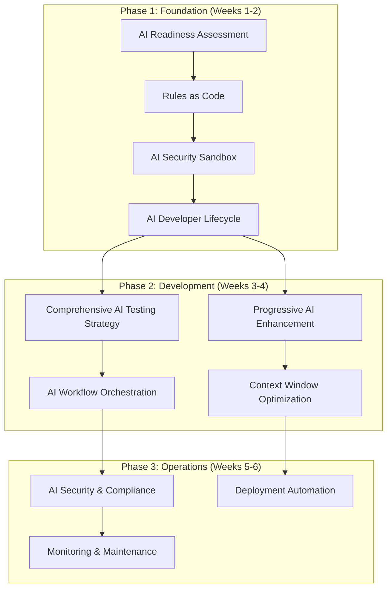
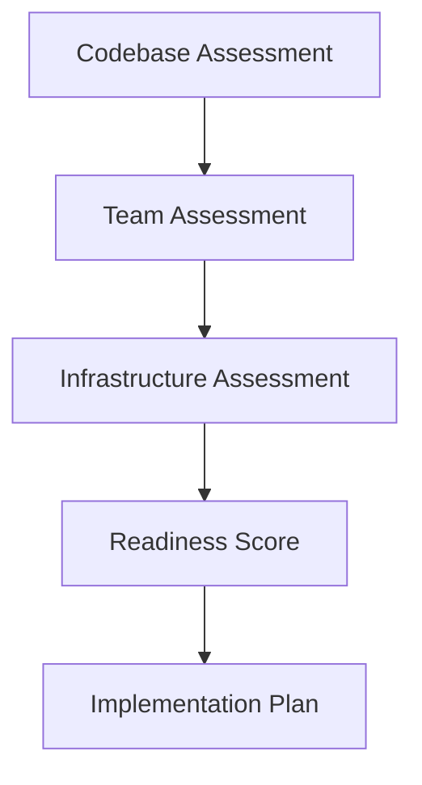
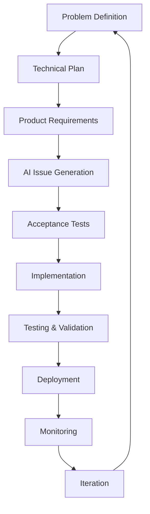
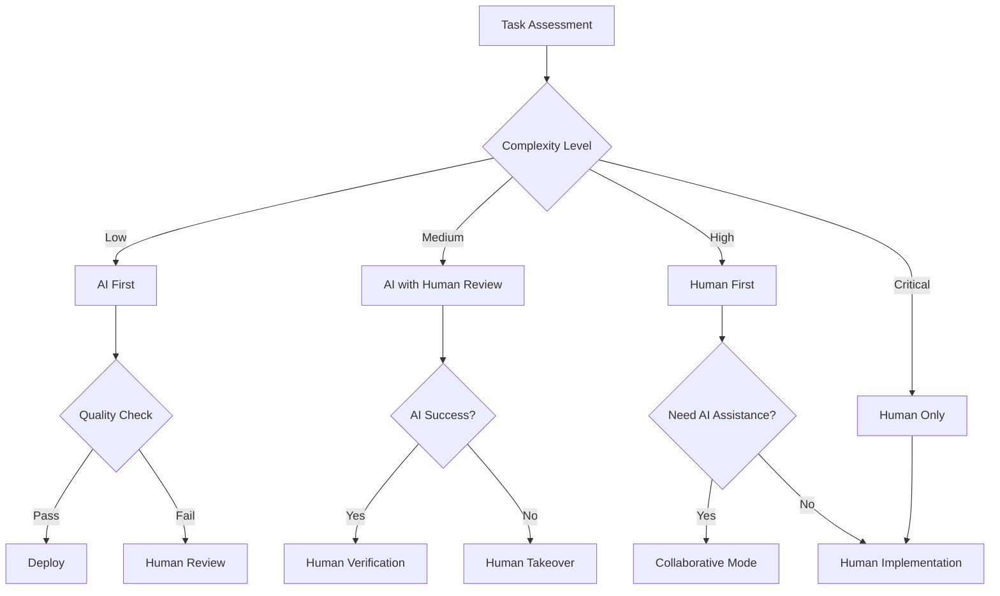
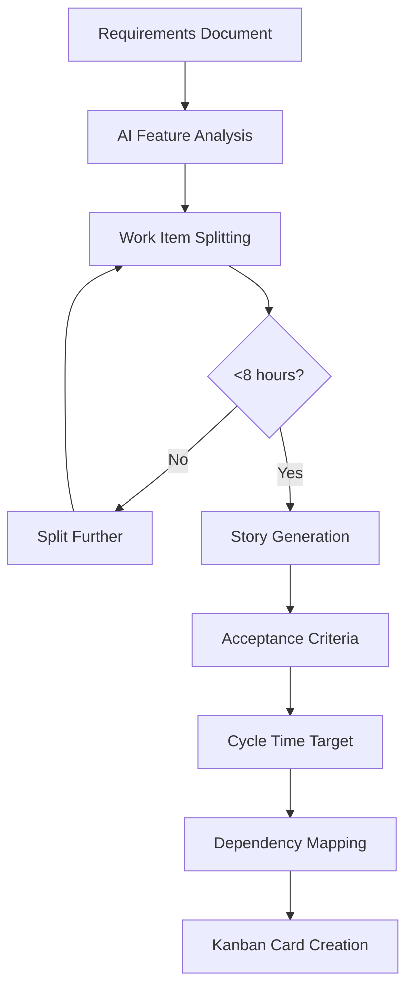
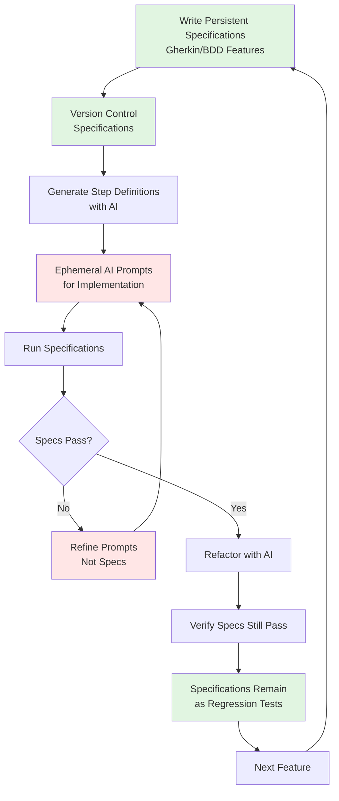
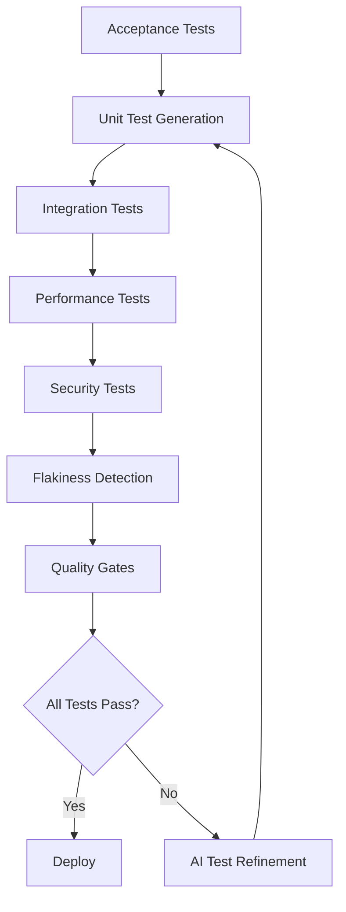
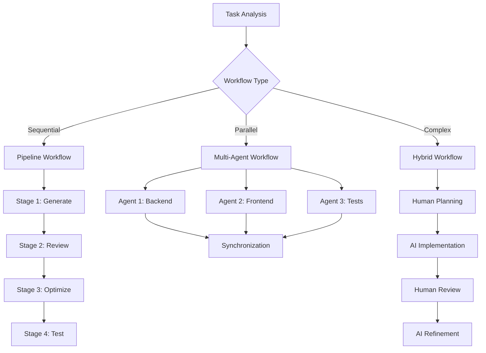
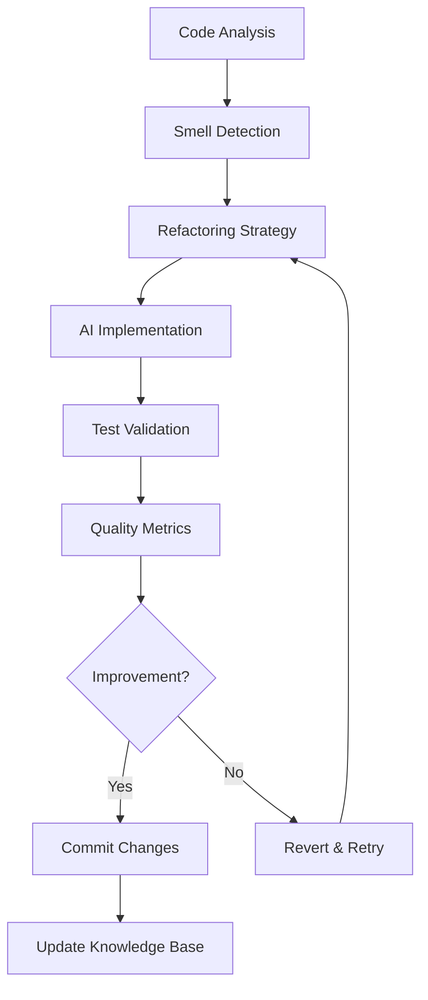

# AI Development Patterns

A comprehensive collection of patterns based on my experience for building software with AI assistance, organized by implementation maturity and development lifecycle phases. These patterns are subject to change as the field evolves.

## Pattern Organization

This repository provides a structured approach to AI-assisted development through three pattern categories:

- **[Foundation Patterns](#foundation-patterns)** - Essential patterns for team readiness and basic AI integration
- **[Development Patterns](#development-patterns)** - Daily practice patterns for AI-assisted coding workflows  
- **[Operations Patterns](#operations-patterns)** - CI/CD, security, and production management with AI

## Pattern Dependencies & Implementation Order

**Important**: These phases represent a **learning progression** for teams new to AI development, not a waterfall approach. Teams with existing DevOps/security expertise should implement patterns continuously across all phases from day one, following a "continuous everything" model.



**Continuous Implementation Note**: Security patterns (AI Security Sandbox, AI Security & Compliance) and deployment patterns should be implemented continuously throughout development, not delayed until specific phases. The dependencies shown represent learning prerequisites, not deployment gates.

## Complete Pattern Reference

| Pattern | Maturity | Type | Description | Dependencies |
|---------|----------|------|-------------|--------------|
| **[AI Readiness Assessment](#ai-readiness-assessment)** | Beginner | Foundation | Systematic evaluation of codebase and team readiness for AI integration | None |
| **[Rules as Code](#rules-as-code)** | Beginner | Foundation | Version and maintain AI coding standards as explicit configuration files | AI Readiness Assessment |
| **[AI Security Sandbox](#ai-security-sandbox)** | Beginner | Foundation | Run AI tools in isolated environments without access to secrets or sensitive data | Rules as Code |
| **[AI Developer Lifecycle](#ai-developer-lifecycle)** | Intermediate | Foundation | Structured 9-stage process from problem definition through deployment with AI assistance | Rules as Code, AI Security Sandbox |
| **[Human-AI Handoff Protocol](#human-ai-handoff-protocol)** | Intermediate | Foundation | Clear boundaries and procedures for transitioning work between human developers and AI | AI Developer Lifecycle |
| **[AI Issue Generation](#ai-issue-generation)** | Beginner | Foundation | Generate Kanban-optimized work items (1-2 day max) from requirements using AI to ensure continuous flow with clear acceptance criteria and dependencies | AI Readiness Assessment |
| **[Specification Driven Development](#specification-driven-development)** | Intermediate | Development | Use executable specifications to guide AI code generation with clear acceptance criteria before implementation | AI Developer Lifecycle |
| **[Comprehensive AI Testing Strategy](#comprehensive-ai-testing-strategy)** | Intermediate | Development | Unified approach to test-first development, automated generation, and quality assurance | Specification Driven Development |
| **[Progressive AI Enhancement](#progressive-ai-enhancement)** | Beginner | Development | Build complex features through small, deployable iterations rather than big-bang generation | AI Developer Lifecycle |
| **[AI Workflow Orchestration](#ai-workflow-orchestration)** | Advanced | Development | Coordinate sequential pipelines, parallel workflows, and hybrid human-AI processes | Comprehensive AI Testing Strategy |
| **[Context Window Optimization](#context-window-optimization)** | Intermediate | Development | Match AI tool selection to task complexity and optimize cost/performance trade-offs | Progressive AI Enhancement |
| **[AI Knowledge Persistence](#ai-knowledge-persistence)** | Intermediate | Development | Capture successful patterns and failed attempts as versioned knowledge for future sessions | Rules as Code |
| **[Constraint-Based AI Development](#constraint-based-ai-development)** | Beginner | Development | Give AI specific constraints to prevent over-engineering and ensure focused solutions | Progressive AI Enhancement |
| **[Observable AI Development](#observable-ai-development)** | Intermediate | Development | Strategic logging and debugging that makes system behavior visible to AI | AI Developer Lifecycle |
| **[AI-Driven Refactoring](#ai-driven-refactoring)** | Intermediate | Development | Systematic code improvement using AI to detect and resolve code smells with measurable quality metrics | Rules as Code |
| **Security & Compliance** | | Operations | *Category containing security and compliance patterns* | |
| **[Policy-as-Code Generation](#policy-as-code-generation)** | Advanced | Operations | Transform compliance requirements into executable Cedar/OPA policy files with AI assistance | AI Security Sandbox |
| **[Security Scanning Orchestration](#security-scanning-orchestration)** | Intermediate | Operations | Aggregate multiple security tools and use AI to summarize findings for actionable insights | Policy-as-Code Generation |
| **[Compliance Evidence Automation](#compliance-evidence-automation)** | Advanced | Operations | Generate audit evidence matrices from logs and configuration changes automatically | Security Scanning Orchestration |
| **[ChatOps Security Integration](#chatops-security-integration)** | Beginner | Operations | Deploy security scanning capabilities through chat commands for immediate feedback | Security Scanning Orchestration |
| **Deployment Automation** | | Operations | *Category containing deployment and pipeline patterns* | |
| **[Pipeline Synthesis](#pipeline-synthesis)** | Intermediate | Operations | Convert plain-English build specifications into CI/CD pipeline configurations | AI Workflow Orchestration |
| **[AI-Guided Blue-Green Deployment](#ai-guided-blue-green-deployment)** | Advanced | Operations | Generate blue-green deployment scripts with validation to prevent AI misconceptions | Pipeline Synthesis |
| **[Drift Detection & Remediation](#drift-detection--remediation)** | Advanced | Operations | Detect infrastructure configuration drift and generate corrective patches automatically | Pipeline Synthesis |
| **[Release Note Synthesis](#release-note-synthesis)** | Beginner | Operations | Automatically generate structured release notes by analyzing git commit history | Pipeline Synthesis |
| **Monitoring & Maintenance** | | Operations | *Category containing monitoring and maintenance patterns* | |
| **[Performance Baseline Management](#performance-baseline-management)** | Advanced | Operations | Establish intelligent performance baselines and configure monitoring thresholds automatically | Observable AI Development |
| **[Technical Debt Forecasting](#technical-debt-forecasting)** | Intermediate | Operations | Proactively identify and prioritize technical debt using AI-powered code analysis | AI-Driven Refactoring |
| **[Incident Response Automation](#incident-response-automation)** | Advanced | Operations | Generate actionable incident response playbooks from historical incident data | Performance Baseline Management |
| **[Test Suite Health Management](#test-suite-health-management)** | Intermediate | Operations | Analyze build history to identify and remediate flaky tests automatically | Comprehensive AI Testing Strategy |
| **[Dependency Upgrade Advisor](#dependency-upgrade-advisor)** | Intermediate | Operations | Intelligently manage dependency upgrades with compatibility analysis and risk assessment | Technical Debt Forecasting |
| **[On-Call Handoff Automation](#on-call-handoff-automation)** | Intermediate | Operations | Generate comprehensive handoff briefs that summarize system state and active issues | Incident Response Automation |
| **[Chaos Engineering Scenarios](#chaos-engineering-scenarios)** | Advanced | Operations | Generate targeted chaos experiments based on system architecture and dependencies | Performance Baseline Management |

---

# Foundation Patterns

Foundation patterns establish the essential infrastructure and team readiness required for successful AI-assisted development. These patterns must be implemented first as they enable all subsequent patterns.

## AI Readiness Assessment

**Maturity**: Beginner  
**Description**: Systematic evaluation of codebase and team readiness for AI-assisted development before implementing AI patterns.

**Related Patterns**: [Rules as Code](#rules-as-code), [AI Issue Generation](#ai-issue-generation)

**Assessment Framework**



**Codebase Readiness Checklist**
```markdown
## Code Quality Prerequisites
□ Consistent code formatting and style guide
□ Comprehensive test coverage (>80% for critical paths)
□ Clear separation of concerns and modular architecture
□ Documented APIs and interfaces
□ Version-controlled configuration and secrets management

## Documentation Standards
□ README with setup and development instructions
□ API documentation (OpenAPI/Swagger)
□ Architecture decision records (ADRs)
□ Coding standards and conventions documented
□ Deployment and operational procedures
```

**Anti-pattern: Rushing Into AI**
Starting AI adoption without proper assessment leads to inconsistent practices, security vulnerabilities, and team frustration.

---

## Rules as Code

**Maturity**: Beginner  
**Description**: Treat AI coding standards like infrastructure - version them, evolve them, and make them explicit. Every AI session starts fresh, so without persistent rules, you're teaching AI your preferences from scratch each time.

**Related Patterns**: [AI Developer Lifecycle](#ai-developer-lifecycle), [AI Knowledge Persistence](#ai-knowledge-persistence)

**Standardized Project Structure**
```bash
project/
├── .ai/                          # AI configuration directory
│   ├── rules/                    # Modular rule sets
│   │   ├── security.md          # Security standards
│   │   ├── testing.md           # Testing requirements
│   │   ├── style.md             # Code style guide
│   │   └── architecture.md      # Architectural patterns
│   ├── prompts/                 # Reusable prompt templates
│   │   ├── implementation.md    # Implementation prompts
│   │   ├── review.md            # Code review prompts
│   │   └── testing.md           # Test generation prompts
│   └── knowledge/               # Captured patterns and gotchas
│       ├── successful.md        # Proven successful patterns
│       └── failures.md          # Known failure patterns
├── .cursorrules                 # Cursor IDE configuration
├── CLAUDE.md                    # Claude Code session context
└── .windsurf/                   # Windsurf configuration
    └── rules.md
```

**Anti-pattern: Context Drift**
Each developer maintains their own prompts and preferences, leading to inconsistent code across the team.

---

## AI Security Sandbox

**Maturity**: Beginner  
**Description**: Run AI tools in isolated environments that can't access secrets, credentials, or sensitive data. Essential for preventing credential leaks and maintaining security compliance.

**Related Patterns**: [AI Security & Compliance](#ai-security--compliance), [Rules as Code](#rules-as-code)

**Default-Deny Network Isolation**
```yaml
# See actual implementation: sandbox/docker-compose.ai-sandbox.yml
# docker-compose.ai-sandbox.yml
version: '3.8'

services:
  ai-development:
    build:
      context: .
      dockerfile: Dockerfile.ai-sandbox
    # Complete network isolation - no egress or ingress
    network_mode: none
    security_opt:
      - no-new-privileges:true
    cap_drop:
      - ALL
    volumes:
      # Read-only source code, read/write tests
      - ./src:/workspace/src:ro
      - ./tests:/workspace/tests:rw
      # DO NOT mount ~/.aws, .env, secrets/, etc.
    environment:
      - NODE_ENV=development
      - AI_SANDBOX=true
    restart: no

# If you need intra-container communication, define an explicit internal network:
# networks:
#   ai-isolated:
#     driver: bridge
#     internal: true
```

**What Default-Deny Accomplishes**

- **`network_mode: none`** cuts off ALL network access - no DNS, no HTTP, no callbacks
- AI gets a fully functional environment for code generation and testing with zero risk of credential exfiltration
- No "phone home" capabilities, no data leaks, no accidental API calls with embedded secrets
- If inter-container communication is needed (e.g., mock services), use an explicit internal-only bridge network
- Pair with Rules-as-Code to enforce these isolation settings in CI/CD pipelines

**Result**: AI assistance lives in a complete network vault. Secrets stay put. Compliance stays intact.

**Anti-pattern: Unrestricted Access**
Allowing AI tools full system access risks credential leaks, data breaches, and security compliance violations.

---

## AI Developer Lifecycle

**Maturity**: Intermediate  
**Description**: AI development follows a structured lifecycle from problem definition through deployment, integrating all tactical patterns for systematic, testable, and maintainable AI-assisted development.

**Related Patterns**: [Rules as Code](#rules-as-code), [Specification Driven Development](#specification-driven-development), [Observable AI Development](#observable-ai-development)

**The Complete Lifecycle**



**Stage 1: AI-Assisted Problem Definition**
*Patterns: [Constraint-Based AI Development](#constraint-based-ai-development)*

Define clear problem statements and success criteria before any implementation work begins.

```bash
ai "Analyze this problem statement for technical feasibility:
- Suggest alternative approaches
- Identify potential risks
- Estimate complexity and effort"
```

**Stage 2: AI-Generated Technical Plan**
*Patterns: [Context Window Optimization](#context-window-optimization), [Rules as Code](#rules-as-code)*

Transform problem definitions into concrete technical architectures with clear implementation paths.

```bash
ai "Create a technical plan for [problem] using [technology stack]:
- Include architecture diagrams
- Detail security considerations
- Break into 3-week development phases
- Identify technical risks and mitigation strategies"
```

**Stage 3: Product Requirements Document (PRD)**
*Patterns: [AI Knowledge Persistence](#ai-knowledge-persistence), [Progressive AI Enhancement](#progressive-ai-enhancement)*

Translate technical plans into detailed product specifications with measurable acceptance criteria.

```bash
ai "Convert this technical plan into detailed product requirements:
- Include API specifications with OpenAPI format
- Define user interaction flows
- Specify error handling patterns
- Add acceptance criteria for each feature"
```

**Stage 4: AI Issue Generation**
*Patterns: [AI Issue Generation](#ai-issue-generation), [Progressive AI Enhancement](#progressive-ai-enhancement)*

Transform product requirements into structured, actionable work items using AI to break down features into properly sized tasks with clear acceptance criteria and dependencies.

```bash
# Generate development tasks from PRD
ai "Break down these product requirements into Kanban-ready GitHub issues:
- Clear titles and acceptance criteria  
- Cycle time targets (4-8 hours max per task)
- If any task would take >8 hours, split it further
- Frontend/backend/testing labels
- Dependency mapping between tasks
- Each task independently deployable

Format as JSON for automated issue creation."
```

Apply [**AI Issue Generation**](#ai-issue-generation) to create comprehensive task breakdown. Use [**Progressive AI Enhancement**](#progressive-ai-enhancement) to ensure tasks are properly sized for iterative delivery.

**Stage 5: Specification Driven Development**
*Patterns: [Specification Driven Development](#specification-driven-development), [Observable AI Development](#observable-ai-development)*

Write executable acceptance tests before implementation to guide AI code generation.

```bash
ai "Generate acceptance tests for user story:
- Use Gherkin format for clarity
- Cover happy path and edge cases
- Include performance criteria
- Make tests executable with minimal setup"
```

**Stage 6: AI-Driven Implementation**
*Patterns: [AI Security Sandbox](#ai-security-sandbox), [Rules as Code](#rules-as-code), [Progressive AI Enhancement](#progressive-ai-enhancement)*

Use AI to implement features that satisfy the acceptance tests while maintaining code quality.

```bash
# Implementation workflow
ai-checkpoint "Before implementing user authentication"
ai-implement "Create JWT-based authentication following our security patterns"
ai-test "Run tests and fix any failures"
ai-review "Review code for security vulnerabilities"
ai-commit "Add authentication with security review"
```

**Stage 7: Comprehensive Testing Strategy**
*Patterns: [Comprehensive AI Testing Strategy](#comprehensive-ai-testing-strategy), [AI Workflow Orchestration](#ai-workflow-orchestration), [Context Window Optimization](#context-window-optimization)*

Execute multi-layered testing approach with AI assistance for thorough quality assurance.

```bash
ai "Generate comprehensive test suite:
- Unit tests with edge cases
- Integration tests for API endpoints
- End-to-end user journey tests
- Security vulnerability scans
- Performance benchmarks"
```

**Stage 8: Deployment Pipeline**
*Patterns: [Deployment Automation](#deployment-automation), [AI Security Sandbox](#ai-security-sandbox)*

Automate deployment with AI validation at each stage to ensure production readiness.

```bash
ai "Review deployment checklist:
- Validate all tests passing
- Check security compliance
- Verify performance metrics
- Generate deployment notes
- Create rollback plan"
```

**Stage 9: AI-Monitored Production**
*Patterns: [Observable AI Development](#observable-ai-development), [AI Knowledge Persistence](#ai-knowledge-persistence), [Monitoring & Maintenance](#monitoring--maintenance)*

Continuous monitoring with AI-powered analysis for proactive issue detection and resolution.

```bash
ai "Analyze production metrics:
- Identify performance anomalies
- Detect error rate increases
- Suggest optimization opportunities
- Generate incident reports"
```

**Anti-pattern: Ad-Hoc AI Development**
Jumping straight to coding with AI without proper planning, requirements, or testing strategy.

**Note**: Some patterns referenced in the lifecycle stages are advanced patterns documented in separate resources. The patterns linked above provide the foundation for the AI Developer Lifecycle.

---


## Human-AI Handoff Protocol

**Maturity**: Intermediate  
**Description**: Clear boundaries and procedures for transitioning work between human developers and AI tools based on complexity, security requirements, and creative problem-solving needs.

**Related Patterns**: [AI Developer Lifecycle](#ai-developer-lifecycle), [Observable AI Development](#observable-ai-development)

**Handoff Decision Framework**



**Anti-pattern: Unclear Boundaries**
Allowing AI and humans to work on the same task simultaneously without clear handoff points leads to conflicts, duplicated effort, and inconsistent quality.

---

## AI Issue Generation

**Maturity**: Beginner  
**Description**: Generate structured work items optimized for Kanban flow using AI to break down features into small, rapidly completable tasks (1-2 days max) with clear acceptance criteria and dependencies. Focus on continuous flow rather than batch estimation.

**Related Patterns**: [AI Readiness Assessment](#ai-readiness-assessment), [Specification Driven Development](#specification-driven-development)

**Issue Generation Framework**



**Examples**

**Input: High-level requirement**
```markdown
## Feature Request
"Users need to be able to reset their passwords via email"
```

**AI Prompt for Kanban-Ready Task Generation**
```bash
ai "Break down this feature into small Kanban tasks:

Feature: Password reset via email

Create GitHub issues following Kanban principles:
- Ensure each task can be completed in less than a day
- Clear titles and descriptions
- Specific acceptance criteria
- Labels (frontend, backend, testing)
- Dependencies between tasks
- If any task takes >2 days, split it further

Format as JSON for GitHub API import."
```

**Generated Kanban-Ready Issues**
```json
[
  {
    "title": "Backend: Implement password reset token generation",
    "body": "## Description\nCreate secure token generation for password reset requests\n\n## Acceptance Criteria\n- [ ] Generate cryptographically secure reset tokens\n- [ ] Set token expiration (15 minutes)\n- [ ] Store token-user mapping in Redis\n- [ ] Validate email exists before token creation\n\n## Technical Notes\n- Use crypto.randomBytes(32)\n- TTL of 900 seconds in Redis\n- Rate limit: 3 requests per hour per email\n\n## Cycle Time Target\n8-12 hours (deployable independently)",
    "labels": ["backend", "security", "kanban-ready"],
    "milestone": "Password Reset MVP"
  },
  {
    "title": "Backend: Email service integration for reset links", 
    "body": "## Description\nSend password reset emails with secure links\n\n## Acceptance Criteria\n- [ ] Template-based email generation\n- [ ] Secure reset link with token\n- [ ] Email delivery confirmation\n- [ ] Handle email service failures gracefully\n\n## Dependencies\n- Requires: Password reset token generation\n\n## Cycle Time Target\n6-8 hours (deploy once token generation is complete)",
    "labels": ["backend", "email", "kanban-ready"],
    "milestone": "Password Reset MVP"
  },
  {
    "title": "Frontend: Password reset request form",
    "body": "## Description\nUI for users to request password reset\n\n## Acceptance Criteria\n- [ ] Email input field with validation\n- [ ] Submit button with loading state\n- [ ] Success/error message display\n- [ ] Rate limiting feedback\n\n## Design\n- Use existing form components\n- Match current auth page styling\n\n## Cycle Time Target\n4-6 hours (can work in parallel with backend tasks)",
    "labels": ["frontend", "ui", "kanban-ready"],
    "milestone": "Password Reset MVP"
  }
]
```

**Kanban Epic Breakdown**
```bash
ai "Break down this epic for optimal Kanban flow:

Epic: User Dashboard with Analytics

Kanban task requirements:
- Maximum 4-8 hours per task (1 day)
- If a task would take longer, split it
- Each task independently deployable
- Focus on flow over estimates

Break down into:
- Database migrations (each table/index separately)
- Individual API endpoints (one endpoint per task)
- UI components (one component per task)
- Test suites (by feature area)
- Security checks (per component)
- Performance optimizations (targeted improvements)

Goal: Continuous flow with rapid feedback cycles."
```

**Integration with Project Management**
```bash
# GitHub Issues
gh issue create --title "$(echo "$issue" | jq -r '.title')" \
                --body "$(echo "$issue" | jq -r '.body')" \
                --label "$(echo "$issue" | jq -r '.labels[]')"

# JIRA Integration
curl -X POST "$JIRA_API/issue" \
  -H "Content-Type: application/json" \
  -d "$jira_issue_json"

# Azure DevOps
az boards work-item create --title "$title" \
                          --type "User Story" \
                          --description "$description"
```

**Kanban Work Item Splitting**
```bash
ai "Apply Kanban principles to split these work items:

Kanban splitting rules:
- Maximum cycle time: 4-8 hours (1 day)
- If >8 hours, must split into smaller items
- Each item independently deployable
- Measure actual cycle time, not estimates

Historical cycle times for reference:
- Authentication token generation: 8 hours
- Email template setup: 4 hours
- Password reset form: 4 hours  
- API endpoint creation: 6 hours
- Database migration: 3 hours per table

For each task:
1. Can it be completed in <8 hours?
2. If no, how to split it?
3. What's the smallest valuable increment?

Remember: Flow over estimates, rapid feedback over perfect planning."
```

> "If a task takes more than one day, split it."  
> – Kanban Guide, Lean Kanban University

> "Small, frequent deliveries expose issues early and keep teams aligned."  
> – Agile Alliance, Kanban Glossary

**Anti-pattern: Vague Issue Generation**
Creating generic tasks without specific acceptance criteria, proper sizing, or clear dependencies leads to scope creep and estimation errors.

**Anti-pattern Examples:**
```markdown
❌ "Fix the login page"
❌ "Make the dashboard better" 
❌ "Add some tests"

✅ "Add OAuth 2.0 token validation endpoint (8 hours)"
✅ "Implement dashboard metric WebSocket connection (6 hours)"
✅ "Write unit tests for user service login method (4 hours)"
```

---

# Development Patterns

Development patterns provide tactical approaches for day-to-day AI-assisted coding workflows, focusing on quality, maintainability, and team collaboration.

## Specification Driven Development

**Maturity**: Intermediate  
**Description**: Use executable specifications to guide AI code generation by writing clear acceptance criteria first, then prompting AI to create minimal implementations that satisfy those specifications. This approach ensures AI-generated code meets exact requirements before implementation begins.

**Key Principle: Specifications Persist, Prompts are Ephemeral**

Unlike prompts that vanish after each AI session, executable specifications become permanent project artifacts that:
- Define system behavior independently of any AI tool
- Serve as living documentation that evolves with the codebase
- Provide regression testing throughout the project lifecycle
- Act as the source of truth for what the system should do

While you may refine prompts repeatedly to get the right implementation, the specifications remain constant, ensuring consistency across different AI tools and sessions.

**Related Patterns**: [AI Developer Lifecycle](#ai-developer-lifecycle), [Comprehensive AI Testing Strategy](#comprehensive-ai-testing-strategy), [Observable AI Development](#observable-ai-development)

**The Specification-Driven AI Workflow**



**Examples**

**Step 1: Write Persistent Specifications (These Live Forever)**
```gherkin
# See actual implementation: specs/user_authentication.feature
# features/user_authentication.feature
# This specification will persist throughout the project lifecycle
# It defines WHAT the system does, not HOW it's implemented

Feature: User Authentication
  As a user
  I want to log into the system
  So that I can access my personal dashboard

  Scenario: Successful login with valid credentials
    Given a user exists with email "user@example.com" and password "securepass123"
    When I submit login credentials "user@example.com" and "securepass123"
    Then I should be redirected to the dashboard
    And I should see a welcome message "Welcome back!"

  Scenario: Failed login with invalid credentials
    Given a user exists with email "user@example.com" and password "securepass123"
    When I submit login credentials "user@example.com" and "wrongpassword"
    Then I should see an error message "Invalid credentials"
    And I should remain on the login page
```

**Step 2: Generate Implementation with Ephemeral Prompts**
```python
# features/steps/auth_steps.py
# These prompts are temporary - used once and discarded
# The specifications above remain the source of truth

# Ephemeral Prompt 1: "Generate pytest-bdd step definitions for the user authentication feature"
# Ephemeral Prompt 2: "Use bcrypt for password hashing"
# Ephemeral Prompt 3: "Add rate limiting to prevent brute force"

from pytest_bdd import given, when, then, scenarios
from selenium import webdriver
import pytest

scenarios('../user_authentication.feature')

@given('a user exists with email "<email>" and password "<password>"')
def user_exists(email, password):
    # AI generates user creation logic
    user_service.create_user(email=email, password=password)

@when('I submit login credentials "<email>" and "<password>"')
def submit_login(browser, email, password):
    # AI generates form interaction
    browser.find_element_by_id("email").send_keys(email)
    browser.find_element_by_id("password").send_keys(password)
    browser.find_element_by_id("login-button").click()

@then('I should be redirected to the dashboard')
def verify_dashboard_redirect(browser):
    # AI generates assertion logic
    assert "/dashboard" in browser.current_url
```

**Why Specifications Persist While Prompts Don't**

1. **Specifications are contracts**: They define what your system promises to do, regardless of implementation
2. **Prompts are conversations**: They're tactical instructions that change based on AI capabilities and context
3. **Specifications enable refactoring**: You can completely rewrite implementations while specifications ensure behavior remains correct
4. **Prompts are tool-specific**: Different AI tools need different prompts, but they all must satisfy the same specifications

**Benefits of Specification Persistence**
- **AI Tool Independence**: Switch between Copilot, Cursor, Claude without losing your behavioral requirements
- **Team Alignment**: New developers understand system behavior from specs, not from scattered prompts
- **Regression Safety**: Specifications catch breaking changes regardless of how code was generated
- **Living Documentation**: Specifications document actual system behavior, not intended behavior

**Anti-pattern: Implementation-First AI**
Writing code with AI first, then trying to retrofit tests, resulting in tests that mirror implementation rather than specify behavior.

**Anti-pattern: Prompt Hoarding**
Saving collections of prompts as if they were specifications. Prompts are implementation details; specifications are behavioral contracts.

---

## Comprehensive AI Testing Strategy

**Maturity**: Intermediate  
**Description**: Unified approach combining test-first development, automated test generation, and quality assurance patterns to ensure AI-generated code meets quality and behavioral specifications.

**Related Patterns**: [Specification Driven Development](#specification-driven-development), [Observable AI Development](#observable-ai-development)

**Integrated Testing Framework**



**Anti-pattern: Test Generation Without Strategy**
Generating tests with AI without a coherent strategy leads to poor coverage, flaky tests, and false confidence in code quality.

---

## Progressive AI Enhancement

**Maturity**: Beginner  
**Description**: Build complex features through small, deployable iterations. Each AI interaction adds one specific enhancement rather than trying to build everything at once.

**Related Patterns**: [AI Developer Lifecycle](#ai-developer-lifecycle), [Constraint-Based AI Development](#constraint-based-ai-development)

**Examples**
Building authentication progressively:
```bash
# Day 1: Minimal login
"Create POST /login that returns 200 for admin/admin, 401 otherwise"
→ Deploy

# Day 2: Real password check
"Modify login to check passwords against users table. Keep existing API."
→ Deploy

# Day 3: Add security
"Add bcrypt hashing to login. Support both hashed and plain passwords temporarily."
→ Deploy

# Day 4: Modern tokens
"Replace session with JWT. Keep session endpoint for backward compatibility."
→ Deploy
```

**Anti-pattern: Big Bang Generation**
Asking AI to "create a complete user management system" results in 5000 lines of coupled, untested code that takes days to review and debug.

---

## AI Workflow Orchestration

**Maturity**: Advanced  
**Description**: Coordinate sequential pipelines, parallel workflows, and hybrid human-AI processes for complex development tasks requiring multiple AI tools and human oversight.

**Related Patterns**: [Human-AI Handoff Protocol](#human-ai-handoff-protocol), [Comprehensive AI Testing Strategy](#comprehensive-ai-testing-strategy)

**Workflow Types & Selection**



**Anti-pattern: Uncoordinated Multi-Tool Usage**
Using multiple AI tools without proper orchestration leads to inconsistent code, integration conflicts, and wasted effort from competing implementations.

---

## Context Window Optimization

**Maturity**: Intermediate  
**Description**: Match AI tool selection to task complexity and optimize cost/performance trade-offs. Using Claude for every task is like using a sledgehammer to hang a picture.

**Related Patterns**: [Progressive AI Enhancement](#progressive-ai-enhancement), [AI Workflow Orchestration](#ai-workflow-orchestration)

**Decision Matrix**
```
Task: Add null check
Tool: GitHub Copilot (instant, cheap)
Context: <100 tokens

Task: Extract method
Tool: Cursor Cmd+K (fast, focused)  
Context: <1000 tokens

Task: Refactor module
Tool: Windsurf Cascade (handles dependencies)
Context: <10000 tokens

Task: Design architecture
Tool: Claude Code (best reasoning)
Context: Full codebase
```

---

## AI Knowledge Persistence

**Maturity**: Intermediate  
**Description**: Capture successful patterns and failed attempts as versioned knowledge for future sessions.

**Related Patterns**: [Rules as Code](#rules-as-code)

**Examples**
`.ai/knowledge/authentication.md`:
```markdown
## Successful Patterns

### JWT Implementation
Prompt that works 95% of the time:
"Implement JWT auth:
- RS256 algorithm (never HS256)
- 15 min access token
- 7 day refresh token in httpOnly cookie
- Include user.id and role in payload"

## Failed Patterns

### ❌ "Make authentication secure"
Too vague - AI adds unnecessary complexity

## Gotchas
- AI defaults to HS256 (insecure)
- Often uses deprecated bcrypt methods
```

---

## Constraint-Based AI Development

**Maturity**: Beginner  
**Description**: Give AI specific constraints to prevent over-engineering and ensure focused solutions.

**Related Patterns**: [Progressive AI Enhancement](#progressive-ai-enhancement), [Human-AI Handoff Protocol](#human-ai-handoff-protocol)

**Examples**
```
Bad: "Create user service"
Good: "Create user service: <100 lines, 3 methods max, only bcrypt dependency"

Bad: "Add caching"
Good: "Add caching using Map, max 1000 entries, LRU eviction"

Bad: "Improve performance"
Good: "Reduce p99 latency to <50ms without new dependencies"
```

---

## Observable AI Development

**Maturity**: Intermediate  
**Description**: Make your system's behavior visible to AI through strategic logging and debugging. AI can't fix what it can't see.

**Related Patterns**: [AI Developer Lifecycle](#ai-developer-lifecycle), [Comprehensive AI Testing Strategy](#comprehensive-ai-testing-strategy)

**Examples**
```python
# Good: Observable operations
import logging
logger = logging.getLogger(__name__)

def process_order(order):
    logger.info(f"[ORDER] Processing {order.id} for {order.customer_email}")
    
    try:
        logger.info("[ORDER] Validating...")
        validate_order(order)
        logger.info("[ORDER] ✓ Validation passed")
        
        logger.info(f"[PAYMENT] Charging ${order.total} via {order.payment_method}")
        result = charge_payment(order)
        logger.info(f"[PAYMENT] ✓ Transaction: {result.transaction_id}")
        
    except ValidationError as e:
        logger.error(f"[ORDER] ✗ Validation failed: {e.field} - {e.message}")
        raise
```

**Anti-pattern: Black Box Systems**
Minimal or cryptic logging that leaves AI guessing about system state and failure causes.

---

## AI-Driven Refactoring

**Maturity**: Intermediate  
**Description**: Systematic code improvement using AI to detect and resolve code smells with measurable quality metrics, following established refactoring rules and maintaining test coverage throughout the process.

**Related Patterns**: [Rules as Code](#rules-as-code), [Comprehensive AI Testing Strategy](#comprehensive-ai-testing-strategy)

**Code Smell Detection Framework**



**Automated Code Smell Detection**

```bash
# .ai/rules/refactoring.md - Define measurable thresholds
cat > .ai/rules/refactoring.md << 'EOF'
# Refactoring Rules

## Long Method Smell
- Max lines: 20 (excluding docstrings)
- Max cyclomatic complexity: 10
- Detection: flake8 C901, pylint R0915

## Large Class Smell  
- Max class lines: 250
- Max methods: 20
- Max instance variables: 10
- Detection: pylint R0902, R0904

## Primitive Obsession Smell
- String validation patterns in multiple places
- Dictionaries as pseudo-objects
- Lists of primitives that always travel together

## Refactoring Strategies
- Extract Method for long methods
- Extract Class for large classes
- Replace Primitive with Object for primitive obsession
EOF

# AI smell detection
ai "Analyze this codebase using .ai/rules/refactoring.md:
1. Run static analysis tools (flake8, pylint, radon)
2. Identify code smells per defined thresholds
3. Prioritize by impact and complexity
4. Suggest specific refactoring strategy for each smell"
```

**Long Method Refactoring Example**

```bash
# AI refactoring prompt for long methods
ai "Refactor process_user_data() method:
- 35 lines (exceeds 20 line threshold)
- Multiple responsibilities: validation, database, notifications
- Apply Extract Method pattern
- Maintain test coverage and API contract"
```

**Large Class Refactoring Example**

```bash
# AI refactoring prompt for large classes
ai "Extract cohesive classes from UserManager:
- 320 lines, 25 methods, 12 variables (all exceed thresholds)
- Apply Extract Class pattern
- Maintain API compatibility"
```

**Primitive Obsession Refactoring**

```bash
# AI refactoring prompt for primitive obsession
ai "Replace primitive strings/dicts with value objects:
- Create Email, Phone, Address classes
- Encapsulate validation logic
- Replace primitive parameters with objects"
```

**Refactoring Workflow Integration**

```bash
# Automated refactoring pipeline
#!/bin/bash
# refactor-pipeline.sh

echo "Running code smell detection..."
flake8 --select=C901 src/  # Complexity
pylint src/ --disable=all --enable=R0915,R0902,R0904  # Method/class size
radon cc src/ --min=C  # Cyclomatic complexity

echo "AI refactoring analysis..."
ai "Analyze static analysis output and .ai/rules/refactoring.md:
1. List code smells by priority (impact × frequency)
2. Suggest refactoring strategy for top 3 smells  
3. Estimate effort and risk for each refactoring
4. Generate implementation plan"

echo "Running tests before refactoring..."
pytest --cov=src tests/

echo "AI refactoring implementation..."
ai "Implement highest priority refactoring:
- Maintain test coverage >90%
- Preserve existing API contracts  
- Create atomic commits for each smell
- Document refactoring decisions"

echo "Validate refactoring..."
pytest --cov=src tests/
flake8 src/
pylint src/

echo "Update knowledge base..."
ai "Document refactoring outcome in .ai/knowledge/refactoring.md:
- What was refactored and why
- Metrics before/after
- Lessons learned
- Patterns to reuse"
```

**Quality Metrics Tracking**

```bash
# Before/after metrics comparison
ai "Generate refactoring impact report:

Before refactoring:
- Cyclomatic complexity: 12
- Method length: 35 lines
- Test coverage: 85%
- Code duplication: 15%

After refactoring:
- Cyclomatic complexity: 4 (main) + 2 (extracted methods)
- Method length: 8 lines (main) + 4 extracted methods <10 lines each
- Test coverage: 92% 
- Code duplication: 8%

Calculate:
- Maintainability improvement score
- Technical debt reduction
- Risk assessment for future changes"
```

**When to Apply Refactoring**

- **During Development**: Red-Green-Refactor cycle with AI assistance
- **Feature Work**: Refactor smelly code before adding features
- **Bug Fixes**: Clean up code while fixing issues
- **Code Reviews**: Automated PR quality checks
- **Scheduled**: Weekly code health assessments

**Integration with Development Workflow**

- **Pre-commit hooks**: Check staged files for code smells
- **IDE integration**: Real-time refactoring suggestions
- **CI pipeline**: Automated quality gates and technical debt tracking

**Risk Assessment for Refactoring Timing**

- **Low Risk**: Extract Method, rename, constants, type hints
- **Medium Risk**: Extract Class, replace conditionals, parameter objects  
- **High Risk**: Large decomposition, inheritance changes, schema refactoring

**Anti-pattern: Shotgun Surgery**
Making widespread changes without systematic analysis leads to introduced bugs and degraded code quality.

**Anti-pattern: Speculative Refactoring**
Refactoring code "just in case" without measurable quality issues or clear improvement goals wastes time and introduces risk.

**Anti-pattern: Refactoring Without Tests**
Attempting refactoring without comprehensive automated tests makes it impossible to verify behavior preservation.

---

# Operations Patterns

Operations patterns focus on CI/CD, security, compliance, and production management with AI assistance, building on the foundation and development patterns.

## Security & Compliance Patterns

### Policy-as-Code Generation

**Maturity**: Advanced  
**Description**: Transform compliance requirements into executable Cedar/OPA policy files with AI assistance, ensuring regulatory requirements become testable code.

**Related Patterns**: [AI Security Sandbox](#ai-security-sandbox), [Rules as Code](#rules-as-code)

```bash
# policies/req.md
"Data at rest must be AES-256 encrypted in transit and at rest per SOC 2."

# Generate policy
# See actual policies: policies/iam_permissions.cedar
ai "Convert policies/req.md into Cedar policy code" > policies/code/encryption.cedar
opa test policies/code/encryption.cedar
```

**Anti-pattern: Manual Policy Translation**
Hand-coding policies from written requirements introduces inconsistencies and interpretation errors.

---

### Security Scanning Orchestration

**Maturity**: Intermediate  
**Description**: Aggregate multiple security tools and use AI to summarize findings for actionable insights, reducing alert fatigue while maintaining security rigor.

**Related Patterns**: [Policy-as-Code Generation](#policy-as-code-generation)

```bash
#!/bin/bash
snyk test --json > snyk.json
bandit -r src -f json > bandit.json
trivy fs --format json . > trivy.json
ai "Summarize snyk.json, bandit.json, trivy.json; list CRITICAL issues" > pr-comment.txt
gh pr comment --body-file pr-comment.txt
if grep -q '"severity":"CRITICAL"' pr-comment.txt; then exit 1; fi
```

**Anti-pattern: Alert Fatigue**
Posting every low-severity finding buries real issues and frustrates developers.

---

### Compliance Evidence Automation

**Maturity**: Advanced  
**Description**: Generate audit evidence matrices from logs and configuration changes automatically, creating comprehensive compliance documentation without manual effort.

**Related Patterns**: [Security Scanning Orchestration](#security-scanning-orchestration)

```bash
# Automated compliance evidence collection
aws configservice get-resource-config-history > awsconfig.json
aws cloudtrail lookup-events > iam-changes.json
ai "Generate SOC2 evidence sheet from awsconfig.json and iam-changes.json" > report.csv
```

**Anti-pattern: Manual Evidence Collection**
Hand-crafted spreadsheets miss events or contain outdated entries under audit pressure.

---

### ChatOps Security Integration

**Maturity**: Beginner  
**Description**: Deploy security scanning capabilities through chat commands for immediate feedback, making security assessment as easy as sending a message.

**Related Patterns**: [Security Scanning Orchestration](#security-scanning-orchestration)

```yaml
# bot-config.yml
commands:
  - trigger: /sec scan {{repo}}
    action: "./security-scan.sh && cat pr-comment.txt"
```

**Anti-pattern: Over-Automation**
Allowing auto-fix commands via chat can deploy untested changes.

---

## Deployment Automation Patterns

### Pipeline Synthesis

**Maturity**: Intermediate  
**Description**: Convert plain-English build specifications into CI/CD pipeline configurations, maintaining traceability between human-readable specs and generated pipelines.

**Related Patterns**: [AI Workflow Orchestration](#ai-workflow-orchestration)

```bash
# See actual spec: pipelines/ci_spec.md
# ci.spec
install dependencies -> pip install -r requirements.txt
run tests -> pytest
build image -> docker build -t myapp .
push image -> aws ecr get-login-password | docker push myapp:latest

# Generate CI
ai "Read ci.spec and output GitHub Actions YAML" > .github/workflows/ci.yml
git add ci.spec .github/workflows/ci.yml
git commit -m "chore: generate CI from spec"
```

**Anti-pattern: Over-Generation**
Accepting every AI-suggested stage without pruning adds slow, unused steps to pipelines.

---

### AI-Guided Blue-Green Deployment

**Maturity**: Advanced  
**Description**: Generate blue-green deployment scripts with validation to prevent AI misconceptions, ensuring proper atomic traffic switching rather than gradual rollouts.

**Related Patterns**: [Pipeline Synthesis](#pipeline-synthesis)

```bash
# Blue-green reference documentation
# See actual guide: deployment/blue_green/blue_green_deployment.md
cat > docs/blue-green-guide.md << 'EOF'
# Blue-Green Deployment Pattern

## Key Principles (from Martin Fowler)
1. Maintain two identical production environments: Blue (live) and Green (idle)
2. Deploy new version to the idle environment
3. Test thoroughly in idle environment
4. Switch traffic from Blue to Green atomically
5. Keep Blue as rollback option

## Critical: This is NOT canary deployment
- NO gradual traffic shifting
- NO percentage-based rollout
- Traffic switches 100% at once
EOF

# AI prompt with validation
ai "Using deployment/blue_green/blue_green_deployment.md, create AWS deployment script that:
1. Deploys to IDLE environment only
2. Runs health checks on idle
3. Switches ALL traffic atomically via ALB
4. Keeps previous environment for rollback

DO NOT create canary deployment." > deploy-blue-green.sh

# Validate AI didn't confuse patterns
if grep -q "canary\|gradual\|percentage" deploy-blue-green.sh; then
    echo "ERROR: AI generated canary deployment, not blue-green"
    exit 1
fi
```

**Anti-pattern: Trusting AI Blue-Green Generation**
LLMs frequently confuse blue-green with canary deployments, generating gradual traffic shifting instead of atomic switches.

---

### Drift Detection & Remediation

**Maturity**: Advanced  
**Description**: Detect infrastructure configuration drift and generate corrective patches automatically, maintaining infrastructure as intended without manual intervention.

**Related Patterns**: [Pipeline Synthesis](#pipeline-synthesis)

```bash
# Detect and fix infrastructure drift
terraform plan -out=tf.plan
terraform show -json tf.plan > drift.json
ai "Create Terraform patch from drift.json to restore desired state" > patch.tf
terraform apply patch.tf
```

**Anti-pattern: Automated Overwrite**
Auto-applying AI patches without inspection can break resources you didn't intend to change.

---

### Release Note Synthesis

**Maturity**: Beginner  
**Description**: Automatically generate structured release notes by analyzing git commit history, categorizing changes into meaningful sections for clear communication.

**Related Patterns**: [Pipeline Synthesis](#pipeline-synthesis)

```bash
# Auto-generate structured release notes
git log v1.3.2..HEAD --pretty=format:"%s" > commits.log
ai "Group commits in commits.log under Added, Changed, Fixed" >> CHANGELOG.md
```

**Anti-pattern: Minimal Notes**
Simply pasting commit hashes without context leaves users guessing what changed.

---

## Monitoring & Maintenance Patterns

### Performance Baseline Management

**Maturity**: Advanced  
**Description**: Establish intelligent performance baselines and configure monitoring thresholds automatically, minimizing false positives while catching real performance issues.

**Related Patterns**: [Observable AI Development](#observable-ai-development)

```bash
aws cloudwatch get-metric-statistics --period 86400 > perf.csv
ai "From perf.csv, recommend latency alert thresholds and autoscale policies" > perf-policy.json
deploy-tool apply perf-policy.json
```

**Anti-pattern: One-Off Alerts**
Manual thresholds quickly become stale, causing alert storms or blind spots.

---

### Technical Debt Forecasting

**Maturity**: Intermediate  
**Description**: Proactively identify and prioritize technical debt using AI-powered code analysis, ranking areas most in need of attention with specific remediation strategies.

**Related Patterns**: [AI-Driven Refactoring](#ai-driven-refactoring)

```bash
cloc src > loc.txt
coverage run -m pytest; coverage report > cov.txt
ai "From loc.txt and cov.txt, list top-3 files needing refactor and tests" > debt.txt
```

**Anti-pattern: Reactive Fixes**
Waiting for incidents to spike forces firefighting rather than long-term health management.

---

### Incident Response Automation

**Maturity**: Advanced  
**Description**: Generate actionable incident response playbooks from historical incident data, extracting common patterns and successful resolution strategies for future use.

**Related Patterns**: [Performance Baseline Management](#performance-baseline-management)

```bash
pd incidents:list --limit 10 > incidents.json
ai "Create a step-by-step RDS failover runbook from incidents.json" > runbooks/rds-failover.md
git add runbooks/rds-failover.md
```

**Anti-pattern: Stale Documentation**
Failing to regenerate playbooks after new incidents yields outdated guidance.

---

### Test Suite Health Management

**Maturity**: Intermediate  
**Description**: Analyze build history to identify and remediate flaky tests automatically, improving build reliability by distinguishing between legitimate failures and intermittent issues.

**Related Patterns**: [Comprehensive AI Testing Strategy](#comprehensive-ai-testing-strategy)

```bash
# Identify and fix flaky tests
wget ci-server/logs/last50 > ci.log
ai "Find intermittently failing tests in ci.log and suggest retry decorators" > flaky.txt
# Apply fixes like: @pytest.mark.flaky(reruns=3)
```

**Anti-pattern: Skip Tests**
Marking tests as skipped ignores root causes and shrinks coverage.

---

### Dependency Upgrade Advisor

**Maturity**: Intermediate  
**Description**: Intelligently manage dependency upgrades with compatibility analysis and risk assessment, recommending safe upgrade paths while flagging potentially breaking changes.

**Related Patterns**: [Technical Debt Forecasting](#technical-debt-forecasting)

```bash
# Intelligent dependency management
npm outdated --json > deps.json
ai "From deps.json, suggest npm install commands for lodash and axios without breaking changes" > deps-update.sh
bash deps-update.sh
```

**Anti-pattern: Bulk Updates**
Running `npm update` without understanding breaking changes causes runtime errors.

---

### On-Call Handoff Automation

**Maturity**: Intermediate  
**Description**: Generate comprehensive handoff briefs that summarize system state and active issues, ensuring smooth transitions between on-call engineers with complete context.

**Related Patterns**: [Incident Response Automation](#incident-response-automation)

```bash
# Generate comprehensive handoff briefs
pd incidents:list --status triggered > alerts.json
curl grafana/api/dashboards/home > dash.json
ai "Create an on-call handoff brief from alerts.json and dash.json" > handoff.md
slack-cli post --file handoff.md --channel oncall
```

**Anti-pattern: Fragmented Handoffs**
Relying on chat logs or email threads skips critical context and action items.

---

### Chaos Engineering Scenarios

**Maturity**: Advanced  
**Description**: Generate targeted chaos experiments based on system architecture and dependencies, creating focused scenarios that test resilience without unnecessary disruption.

**Related Patterns**: [Performance Baseline Management](#performance-baseline-management)

```bash
# Generate targeted chaos experiments
ai "From services.json, generate a Gremlin script to kill 1 of 3 instances of service-A every 5m" > chaos.json
gremlin run chaos.json
```

**Anti-pattern: Blind Chaos Testing**
Running random fault injection without understanding system dependencies yields noise rather than insights.

---

# Anti-Patterns Reference

## Common AI Development Anti-Patterns

### Foundation Anti-Patterns
- **Rushing Into AI**: Starting AI adoption without proper assessment
- **Context Drift**: Inconsistent AI rules across team members
- **Unrestricted Access**: Allowing AI tools access to sensitive data
- **Ad-Hoc Development**: Skipping structured development lifecycle

### Development Anti-Patterns
- **Implementation-First AI**: Writing code before defining acceptance criteria
- **Test Generation Without Strategy**: Creating tests without coherent quality goals
- **Big Bang Generation**: Attempting complex features in single AI interaction
- **Uncoordinated Multi-Tool Usage**: Using multiple AI tools without orchestration
- **Black Box Systems**: Insufficient logging for AI debugging
- **Unclear Boundaries**: Ambiguous human-AI handoff points

### Operations Anti-Patterns
- **Fragmented Security**: Isolated security tools without unified framework
- **Alert Fatigue**: Overwhelming developers with low-priority findings
- **Static Deployment**: Fixed scripts without AI adaptation
- **Trusting AI Blue-Green Generation**: Accepting AI output without validation for deployment patterns
- **Reactive Maintenance**: Firefighting instead of proactive AI-assisted management
- **Blind Chaos Testing**: Random fault injection without understanding dependencies

---

# Implementation Guide

## Getting Started

### Phase 1: Foundation (Weeks 1-2)
1. **[AI Readiness Assessment](#ai-readiness-assessment)** - Evaluate team and codebase readiness
2. **[Rules as Code](#rules-as-code)** - Establish consistent AI coding standards
3. **[AI Security Sandbox](#ai-security-sandbox)** - Implement secure AI tool isolation
4. **[AI Developer Lifecycle](#ai-developer-lifecycle)** - Define structured development process
5. **[AI Issue Generation](#ai-issue-generation)** - Generate structured work items from requirements

### Phase 2: Development (Weeks 3-4)
1. **[Specification Driven Development](#specification-driven-development)** - Implement specification-first approach
2. **[Comprehensive AI Testing Strategy](#comprehensive-ai-testing-strategy)** - Establish unified testing framework
3. **[Progressive AI Enhancement](#progressive-ai-enhancement)** - Practice iterative development
4. **[Context Window Optimization](#context-window-optimization)** - Optimize AI tool selection

### Phase 3: Operations (Weeks 5-6)
1. **[AI Security & Compliance](#ai-security--compliance)** - Implement unified security framework
2. **[Deployment Automation](#deployment-automation)** - Establish AI-powered CI/CD
3. **[Monitoring & Maintenance](#monitoring--maintenance)** - Deploy proactive system management

**Note**: For teams practicing continuous delivery, implement security (AI Security Sandbox, AI Security & Compliance) and deployment patterns (Deployment Automation) from week 1 alongside foundation patterns. The phases represent learning dependencies, not deployment sequences.

## Success Metrics

### Foundation Metrics
- Team readiness score improvement
- Consistent AI rule adherence across projects
- Zero credential leaks in AI-generated code
- Reduced onboarding time for new developers

### Development Metrics
- Test coverage maintenance (>90% for AI-generated code)
- Reduced code review cycles
- Faster feature delivery with maintained quality
- Decreased debugging time for AI-generated issues

### Operations Metrics
- Automated policy compliance verification
- Reduced deployment failures
- Faster incident response with AI-generated runbooks
- Proactive technical debt management

## Contributing

Have a pattern that's working well for your team? Open an issue or PR to share your experience. The AI development landscape is evolving rapidly, and we're all learning together.

### Pattern Contribution Guidelines
1. Follow the established pattern template (Maturity, Description, Related Patterns, Examples, Anti-patterns)
2. Include practical, runnable examples
3. Specify clear success criteria and anti-patterns
4. Reference related patterns appropriately
5. Test patterns with multiple AI tools when applicable

## License

MIT License - See LICENSE file for details.

---

*The patterns in this collection represent collective wisdom from teams pioneering AI-assisted development. They're designed to be adapted and evolved as the AI development landscape continues to mature.*