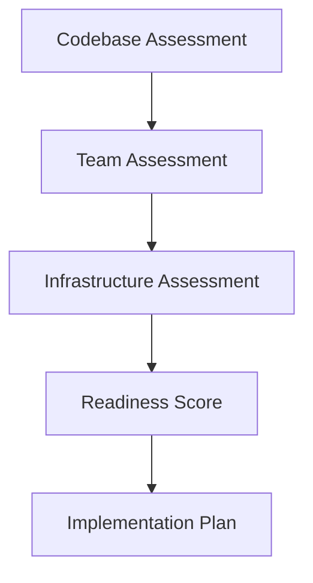
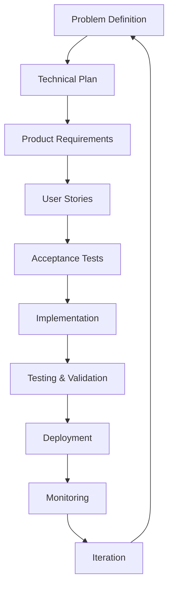
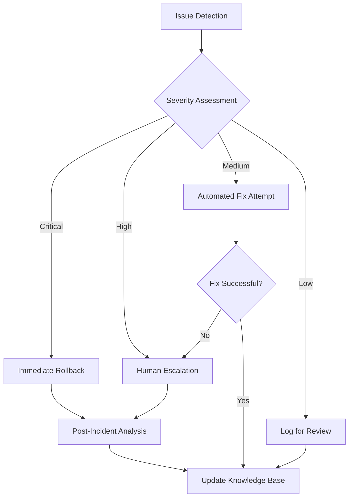
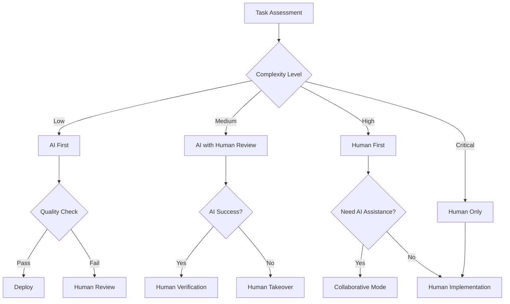
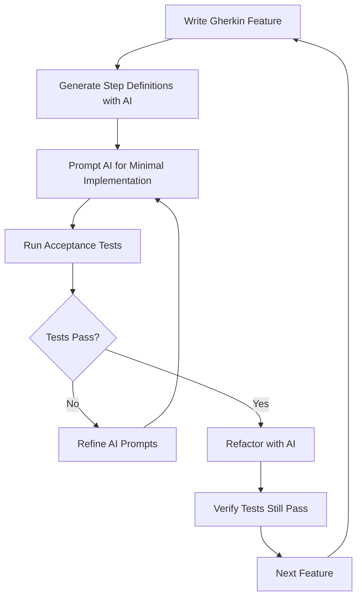
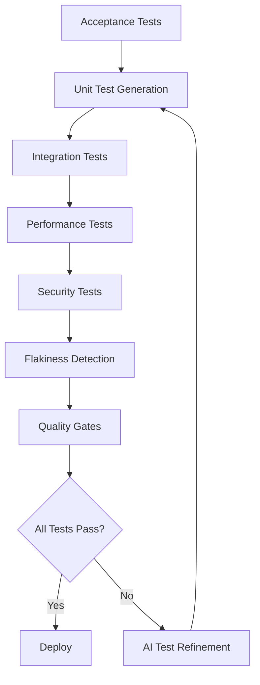
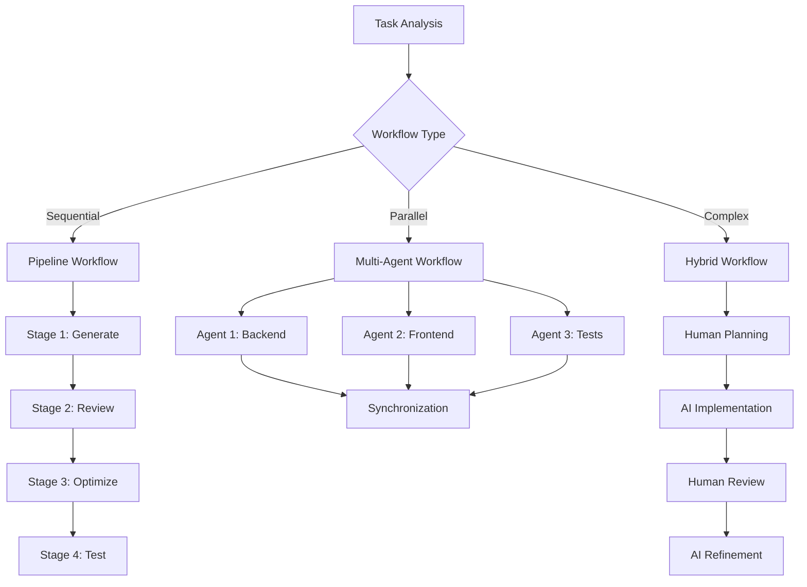

# Patterns for Coding with AI

## The Evolution of AI-Assisted Development

I've been writing code for decades, and I can tell you that AI-assisted coding represents the biggest shift I've ever experienced in software development. When I first started using ChatGPT in 2023 for a personal finance project, I approached it like any new tool - with healthy skepticism and rigorous experimentation. What I discovered changed how I think about software development.

Tools like Cursor, Windsurf, and Claude Code aren't just fancy autocomplete. They're fundamentally reshaping how we deliver software continuously. But here's what the "vibe coding" hype gets wrong: having deep software engineering expertise doesn't become less important - it becomes *more* important. You need to know what good looks like to guide these tools effectively.

While we're still in the early days of AI-assisted development, I've identified patterns that consistently work across different projects and teams. These aren't universal truths - they're observations from the trenches that have helped me ship better software faster. I'd love to hear your experiences and patterns too. What's working for you? What patterns have you discovered? Let's learn from each other as we figure out this new world together.

# Foundation Patterns

Foundation patterns establish the essential infrastructure and team readiness required for successful AI-assisted development. These patterns must be implemented first as they enable all subsequent patterns.

## AI Readiness Assessment

**Maturity**: Beginner  
**Description**: Systematic evaluation of codebase and team readiness for AI-assisted development before implementing AI patterns.

**Related Patterns**: [Rules as Code](#rules-as-code), [AI Security Sandbox](#ai-security-sandbox)

**Assessment Framework**



**Codebase Readiness Checklist**
```markdown
## Code Quality Prerequisites
□ Consistent code formatting and style guide
□ Comprehensive test coverage (>80% for critical paths)
□ Clear separation of concerns and modular architecture
□ Documented APIs and interfaces
□ Version-controlled configuration and secrets management

## Documentation Standards
□ README with setup and development instructions
□ API documentation (OpenAPI/Swagger)
□ Architecture decision records (ADRs)
□ Coding standards and conventions documented
□ Deployment and operational procedures
```

**Anti-pattern: Rushing Into AI**
Starting AI adoption without proper assessment leads to inconsistent practices, security vulnerabilities, and team frustration.

---

## AI Developer Lifecycle

**Maturity**: Intermediate  
**Description**: AI development follows a structured lifecycle from problem definition through deployment, integrating all tactical patterns for systematic, testable, and maintainable AI-assisted development.

**Related Patterns**: [Rules as Code](#rules-as-code), [ATDD-Driven AI Development](#atdd-driven-ai-development), [Observable AI Development](#observable-ai-development)

**The Complete Lifecycle**



**Stage 1: AI-Assisted Problem Definition**
*Patterns: Constraint-Based AI Development, Test-Driven Prompt Engineering*

```markdown
## Problem Statement Template

**Business Problem**: [What business challenge are we solving?]
**Technical Problem**: [What specific technical implementation is needed?]
**Success Criteria**: [How will we measure success?]
**Constraints**: [Time, budget, technology, compliance limitations]
**Assumptions**: [What are we assuming to be true?]

AI Prompt: "Analyze this problem statement for technical feasibility, suggest alternative approaches, and identify potential risks"
```

Apply **Constraint-Based AI Development** by setting specific boundaries upfront. Use **Test-Driven Prompt Engineering** to refine your problem analysis prompts until they consistently produce actionable insights.

**Stage 2: AI-Generated Technical Plan**
*Patterns: Context Window Optimization, AI Pair Rotation, Rules as Code*

```markdown
## Technical Plan Template

**Architecture Overview**: [High-level system design]
**Technology Stack**: [Languages, frameworks, databases, cloud services]
**Integration Points**: [APIs, services, data sources]
**Security Considerations**: [Auth, data protection, compliance]
**Performance Requirements**: [SLA targets, scalability needs]
**Development Phases**: [Breakdown into deliverable milestones]

AI Prompt: "Create a technical plan for [problem] using [technology stack]. Include architecture diagrams, security considerations, and 3-week development phases."
```

Use **Context Window Optimization** - choose Claude for complex architectural reasoning. Apply **AI Pair Rotation** by having different AI tools review the plan. Ensure consistency with your **Rules as Code** for architecture standards.

**Stage 3: Product Requirements Document (PRD)**
*Patterns: AI Knowledge Persistence, Progressive AI Enhancement*

```markdown
## PRD Template

**Functional Requirements**:
- Feature 1: [Detailed behavior description]
- Feature 2: [User interactions and system responses]

**Non-Functional Requirements**:
- Performance: [Response times, throughput]
- Security: [Authentication, authorization, data protection]
- Usability: [User experience standards]

**API Specifications**:
- Endpoint definitions
- Request/response schemas
- Error handling

AI Prompt: "Convert this technical plan into detailed product requirements with API specifications and user interaction flows."
```

Leverage **AI Knowledge Persistence** by referencing successful patterns from previous PRDs. Plan for **Progressive AI Enhancement** by breaking requirements into deployable iterations.

**Stage 4: User Stories with AI Context**
*Patterns: AI Knowledge Persistence, Constraint-Based AI Development*

```markdown
## User Story Template

**As a** [user type]
**I want** [functionality]
**So that** [business value]

**Acceptance Criteria**:
- Given [initial state]
- When [action]
- Then [expected outcome]

**AI Implementation Notes**:
- Relevant patterns from knowledge base
- Security considerations
- Performance requirements

AI Prompt: "Generate user stories from these requirements. Include acceptance criteria and implementation guidance for each story."
```

Include **AI Knowledge Persistence** references in implementation notes. Apply **Constraint-Based AI Development** to scope each story appropriately.

**Stage 5: Acceptance Test-Driven Development (ATDD)**
*Patterns: Test-Driven AI Development, Observable AI Development*

```javascript
// Example: Authentication feature
describe('User Authentication', () => {
  describe('Login Process', () => {
    it('should authenticate valid users', async () => {
      // Given a registered user
      const user = await createTestUser({
        email: 'test@example.com',
        password: 'SecurePass123!'
      });
      
      // When they submit valid credentials
      const response = await request(app)
        .post('/api/auth/login')
        .send({
          email: 'test@example.com',
          password: 'SecurePass123!'
        });
      
      // Then they receive an access token
      expect(response.status).toBe(200);
      expect(response.body.token).toBeDefined();
      expect(response.body.token).toMatch(/^[A-Za-z0-9-_]+\.[A-Za-z0-9-_]+\.[A-Za-z0-9-_]+$/);
    });
    
    it('should reject invalid credentials', async () => {
      // Given invalid credentials
      // When they attempt login
      const response = await request(app)
        .post('/api/auth/login')
        .send({
          email: 'test@example.com',
          password: 'WrongPassword'
        });
      
      // Then access is denied
      expect(response.status).toBe(401);
      expect(response.body.error).toBe('Invalid credentials');
    });
  });
});

// AI Prompt: "Implement authentication service to make these tests pass"
```

This is **Test-Driven AI Development** in action - write tests first, then use AI to implement. Include **Observable AI Development** patterns in your test setup to make system behavior visible to AI during implementation.

**Stage 6: AI-Driven Implementation**
*Patterns: AI Commit Protocol, AI Security Sandbox, Rules as Code, Progressive AI Enhancement*

```bash
# Implementation workflow
1. ai-checkpoint "Before implementing user authentication"
2. ai-implement "Create JWT-based authentication following our security patterns"
3. ai-test "Run tests and fix any failures"
4. ai-review "Review code for security vulnerabilities"
5. ai-commit "Add authentication with security review"
```

Follow **AI Commit Protocol** for safe rollbacks. Work within an **AI Security Sandbox** to protect secrets. Apply **Rules as Code** for consistent implementation. Use **Progressive AI Enhancement** for incremental delivery.

**Stage 7: Comprehensive Testing Strategy**
*Patterns: AI Prompt Pipeline, Parallel AI Workflows, Context Window Optimization*

```markdown
## Testing Phases

**Unit Tests**: AI-generated tests for individual functions
**Integration Tests**: API endpoint testing with real dependencies
**End-to-End Tests**: Complete user journey validation
**Security Tests**: Penetration testing and vulnerability scanning
**Performance Tests**: Load testing and stress testing

AI Prompts for each phase:
- "Generate unit tests for [component] with edge cases"
- "Create integration tests for [API] endpoints"
- "Build end-to-end tests for [user journey]"
- "Review for OWASP Top 10 vulnerabilities"
- "Generate performance tests for [endpoints]"
```

Use **AI Prompt Pipeline** to chain testing phases. Deploy **Parallel AI Workflows** to run different test types concurrently. Apply **Context Window Optimization** - use Copilot for simple tests, Claude for complex test scenarios.

**Stage 8: Deployment Pipeline**
*Patterns: Everything as a Tool, AI Prompt Pipeline, AI Security Sandbox*

```yaml
# .github/workflows/ai-assisted-deploy.yml
name: AI-Assisted Deployment

on:
  push:
    branches: [main]

jobs:
  ai-validation:
    runs-on: ubuntu-latest
    steps:
      - name: AI Code Review
        run: |
          ai-reviewer "Review changes for production readiness"
          
      - name: AI Security Scan
        run: |
          ai-security "Scan for vulnerabilities and secrets"
          
      - name: AI Performance Check
        run: |
          ai-performance "Validate performance requirements"

  deploy:
    needs: ai-validation
    runs-on: ubuntu-latest
    steps:
      - name: AI-Assisted Deploy
        run: |
          ai-deploy "Deploy to production with zero-downtime strategy"
```

Implement **Everything as a Tool** for AI-accessible deployment scripts. Use **AI Prompt Pipeline** for sequential validation stages. Maintain **AI Security Sandbox** isolation during deployment.

**Stage 9: AI-Monitored Production**
*Patterns: Observable AI Development, AI Knowledge Persistence, Everything as a Tool*

```python
# monitoring/ai_alerts.py
class AIMonitoring:
    def __init__(self):
        self.ai_agent = AIAgent()
        
    async def analyze_metrics(self, metrics):
        """AI analyzes production metrics and suggests actions"""
        analysis = await self.ai_agent.analyze(
            prompt=f"""
            Analyze these production metrics:
            {metrics}
            
            Identify:
            1. Performance degradations
            2. Error rate increases
            3. Resource utilization issues
            4. Recommended actions
            """,
            context=load_historical_patterns()
        )
        
        return analysis
        
    async def auto_remediate(self, issue):
        """AI suggests and executes safe remediation"""
        if issue.severity == "high" and issue.confidence > 0.9:
            remediation = await self.ai_agent.suggest_fix(issue)
            if remediation.safe_to_auto_execute:
                return await self.execute_remediation(remediation)
```

Apply **Observable AI Development** to make system behavior visible to AI monitoring. Use **AI Knowledge Persistence** to load historical patterns for analysis. Design monitoring as **Everything as a Tool** for AI accessibility.

**Real-World Example: E-commerce Cart Feature**

```markdown
# Week 1: Planning Phase
Day 1: AI problem analysis → "Add shopping cart to increase conversion"
Day 2: AI technical plan → "Session-based cart with Redis, upgrade to persistent"
Day 3: AI PRD generation → "Cart operations, persistence, checkout integration"

# Week 2: Development Phase  
Day 4: AI user stories → "Add item, remove item, persist cart, checkout"
Day 5: AI test generation → "Comprehensive test suite for all cart operations"
Day 6-8: AI implementation → "Progressive enhancement: session → persistent → optimized"

# Week 3: Testing & Deployment
Day 9-10: AI testing → "Security, performance, integration testing"
Day 11: AI deployment → "Blue-green deployment with monitoring"
Day 12: AI monitoring → "Performance analysis and optimization suggestions"
```

**Lifecycle Tools Integration**
*Integrating All Patterns: Rules as Code, AI Knowledge Persistence, Everything as a Tool*

```bash
# Project structure for AI lifecycle
project/
├── lifecycle/
│   ├── 01-problem-definition.md
│   ├── 02-technical-plan.md
│   ├── 03-prd.md
│   ├── 04-user-stories.md
│   └── 05-acceptance-tests.js
├── .ai/
│   ├── prompts/           # Stage-specific prompts (Test-Driven Prompt Engineering)
│   ├── patterns/          # Successful implementation patterns (AI Knowledge Persistence)  
│   └── knowledge/         # Domain-specific AI knowledge (AI Knowledge Persistence)
├── .cursorrules           # Rules as Code for consistent AI behavior
├── CLAUDE.md             # Rules as Code for Claude Code sessions
├── tests/
│   ├── unit/
│   ├── integration/
│   └── e2e/
└── monitoring/
    ├── metrics/
    └── ai-analysis/
```

This structure supports all patterns: **Rules as Code** through .cursorrules and CLAUDE.md, **AI Knowledge Persistence** in the .ai/ directory, and **Everything as a Tool** with structured, discoverable organization.

**Anti-pattern: Ad-Hoc AI Development**
Jumping straight to coding with AI without proper planning, requirements, or testing strategy.

---

## AI Failure Recovery Protocol

**Maturity**: Intermediate  
**Description**: Systematic approach to detecting and recovering from AI-generated issues with automated rollback triggers and learning capture mechanisms.

**Related Patterns**: [AI Knowledge Persistence](#ai-knowledge-persistence), [AI Commit Protocol](#ai-commit-protocol)

**Detection & Recovery Framework**



**Anti-pattern: Ignore and Hope**
Ignoring AI-generated issues or assuming they'll resolve themselves leads to accumulated technical debt and system instability.

---

## Human-AI Handoff Protocol

**Maturity**: Intermediate  
**Description**: Clear boundaries and procedures for transitioning work between human developers and AI tools based on complexity, security requirements, and creative problem-solving needs.

**Related Patterns**: [Constraint-Based AI Development](#constraint-based-ai-development), [AI Developer Lifecycle](#ai-developer-lifecycle)

**Handoff Decision Framework**



**Anti-pattern: Unclear Boundaries**
Allowing AI and humans to work on the same task simultaneously without clear handoff points leads to conflicts, duplicated effort, and inconsistent quality.

---

# Development Patterns

Development patterns provide tactical approaches for day-to-day AI-assisted coding workflows, focusing on quality, maintainability, and team collaboration.

**Pattern Integration Summary**
The AI Developer Lifecycle serves as the orchestrating framework that weaves together all tactical patterns described in this document. Each stage strategically applies specific patterns - from **Constraint-Based AI Development** in problem definition to **Observable AI Development** in production monitoring. This systematic approach ensures that AI assistance enhances rather than replaces software engineering discipline, creating a sustainable and scalable development process.

## Rapid Iteration Cycles

**This is NOT waterfall** - the lifecycle operates on multiple time scales with frequent iteration. Here's how developers actually use it:

**Micro-cycles (30 minutes - 2 hours): Individual Feature Iterations**
```bash
# 9:00 AM - Quick problem definition
"Add email validation to user registration form"

# 9:05 AM - Minimal technical plan  
"Use validator.js library, add to existing registration endpoint"

# 9:10 AM - Acceptance test (ATDD)
it('should reject invalid email formats', async () => { ... })

# 9:25 AM - AI implementation
"Implement email validation to make this test pass"

# 9:40 AM - Deploy to staging
# 10:00 AM - Monitoring shows success → Done

# Total: 1 hour, full lifecycle
```

**Daily cycles (2-8 hours): User Story Completion**
```bash
# Morning: Complete user story
- Define: "As a user, I want password reset via email"
- Plan: "Use Redis for tokens, SendGrid for email" 
- Implement with AI over 3-4 micro-cycles
- Deploy + monitor

# Afternoon: Next user story
- Define: "As an admin, I want to see user activity"  
- Plan: "Add logging, create dashboard endpoint"
- Implement, deploy, monitor

# 2 complete stories per day, each through full lifecycle
```

**Sprint cycles (1-2 weeks): Feature Completion**
```bash
# Week 1: Authentication System
Day 1-2: Basic login/logout (multiple user stories)
Day 3-4: Password reset, email verification  
Day 5: Admin features, security hardening

# Each day = multiple complete lifecycle iterations
# Each story = 1-3 micro-cycles
# Total: ~20-30 complete lifecycle iterations per feature
```

**Iteration Frequency by Stage**

| Stage | Time Investment | Frequency |
|-------|----------------|-----------|
| **Problem Definition** | 2-5 minutes | Every story/bug |
| **Technical Plan** | 5-15 minutes | Every story/major bug |  
| **PRD** | 15-30 minutes | Weekly (batch of stories) |
| **User Stories** | 10-20 minutes | Weekly (5-10 stories) |
| **Acceptance Tests** | 10-30 minutes | Every story |
| **Implementation** | 30-120 minutes | Every story |
| **Testing** | 10-30 minutes | Every story |
| **Deployment** | 5-15 minutes | Multiple times daily |
| **Monitoring** | Continuous | Always running |

**Real-World Iteration Examples**

```bash
# Example 1: Bug Fix (20 minutes total)
10:30 AM - Problem: "Users can't upload large files"
10:32 AM - Plan: "Increase nginx upload limit, add progress bar"  
10:35 AM - Test: "Should handle 10MB file uploads"
10:45 AM - Implement with AI assistance
10:50 AM - Deploy, monitor → Fixed

# Example 2: API Enhancement (45 minutes total)  
2:00 PM - Problem: "API needs pagination for user list"
2:05 PM - Plan: "Add limit/offset params, cursor-based pagination"
2:10 PM - Test: "Should return paginated results with next/prev links"
2:25 PM - Implement pagination logic
2:35 PM - Add additional test coverage  
2:45 PM - Deploy, verify monitoring → Complete

# Example 3: New Feature (2 hours total)
9:00 AM - Problem: "Need two-factor authentication"
9:10 AM - Plan: "TOTP with QR codes, backup codes, Redis storage"
9:20 AM - Stories: Setup, enable, verify, recovery flows
9:30 AM - Tests: Complete 2FA user journey
10:00 AM - Implement setup flow (30 min micro-cycle)
10:30 AM - Implement verification (30 min micro-cycle)  
11:00 AM - Deploy + monitor → MVP ready
11:00 AM - Next iteration: backup codes, admin features
```

**Anti-pattern: Stage Perfectionism**
Spending hours perfecting any single stage. The power comes from rapid iteration, not perfect documentation.

**Key Principles for Rapid Iteration**
- **Good enough** documentation that enables the next stage
- **Timeboxed** stages - set 15-minute timers
- **Parallel workflows** - implement while writing next tests  
- **Continuous deployment** - multiple deploys per day
- **Fast feedback** - monitor immediately after each deploy

## Rules as Code

**Maturity**: Beginner

**Description**: Treat AI coding standards like infrastructure - version them, evolve them, and make them explicit. Every AI session starts fresh, so without persistent rules, you're teaching AI your preferences from scratch each time.

**Related Patterns**: [AI Developer Lifecycle](#ai-developer-lifecycle), [AI Knowledge Persistence](#ai-knowledge-persistence)

**Examples**
```bash
# Project structure
project/
├── .cursorrules           # Cursor-specific patterns
├── CLAUDE.md             # Claude Code context
├── rules/                # Windsurf modular rules
│   ├── security.md      
│   ├── testing.md       
│   └── refactoring.md   
```

Sample `.cursorrules`:
```markdown
## Code Generation Rules

When generating code:
1. Always use TypeScript with strict mode
2. Prefer composition over inheritance
3. Every public method needs JSDoc
4. Use dependency injection for testability
5. Follow the pattern in src/patterns/

When refactoring:
1. Run tests before any changes
2. One refactoring type per commit
3. Preserve all public APIs
```

Real-world prompt using rules:
```
"Implement user authentication following our security rules in rules/security.md"
```

**Anti-pattern: Context Drift**
Each developer maintains their own prompts and preferences, leading to inconsistent code across the team. One developer's AI generates REST APIs, another's generates GraphQL, both solving the same problem differently.

## ATDD-Driven AI Development

**Maturity**: Intermediate  
**Description**: Use Acceptance Test-Driven Development (ATDD) to guide AI code generation by writing executable specifications first, then prompting AI to create minimal implementations that satisfy the acceptance criteria.

**Related Patterns**: [AI Developer Lifecycle](#ai-developer-lifecycle), [Comprehensive AI Testing Strategy](#comprehensive-ai-testing-strategy), [Observable AI Development](#observable-ai-development)

**The ATDD-AI Workflow**



**Step 1: Write Executable Specifications First**
```gherkin
# features/user_authentication.feature
Feature: User Authentication
  As a user
  I want to log into the system
  So that I can access my personal dashboard

  Scenario: Successful login with valid credentials
    Given a user exists with email "user@example.com" and password "securepass123"
    When I submit login credentials "user@example.com" and "securepass123"
    Then I should be redirected to the dashboard
    And I should see a welcome message "Welcome back!"

  Scenario: Failed login with invalid credentials
    Given a user exists with email "user@example.com" and password "securepass123"
    When I submit login credentials "user@example.com" and "wrongpassword"
    Then I should see an error message "Invalid credentials"
    And I should remain on the login page
```

**Step 2: AI-Generated Step Definitions**
```python
# features/steps/auth_steps.py
# Prompt: "Generate pytest-bdd step definitions for the user authentication feature"

from pytest_bdd import given, when, then, scenarios
from selenium import webdriver
import pytest

scenarios('../user_authentication.feature')

@given('a user exists with email "<email>" and password "<password>"')
def user_exists(email, password):
    # AI generates user creation logic
    user_service.create_user(email=email, password=password)

@when('I submit login credentials "<email>" and "<password>"')
def submit_login(browser, email, password):
    # AI generates form interaction
    browser.find_element_by_id("email").send_keys(email)
    browser.find_element_by_id("password").send_keys(password)
    browser.find_element_by_id("login-button").click()

@then('I should be redirected to the dashboard')
def verify_dashboard_redirect(browser):
    # AI generates assertion logic
    assert "/dashboard" in browser.current_url
```

**Anti-pattern: Implementation-First AI**
Writing code with AI first, then trying to retrofit tests, resulting in tests that mirror implementation rather than specify behavior.

---

## Comprehensive AI Testing Strategy

**Maturity**: Intermediate  
**Description**: Unified approach combining test-first development, automated test generation, and quality assurance patterns to ensure AI-generated code meets quality and behavioral specifications.

**Related Patterns**: [ATDD-Driven AI Development](#atdd-driven-ai-development), [Observable AI Development](#observable-ai-development)

**Integrated Testing Framework**



**Anti-pattern: Test Generation Without Strategy**
Generating tests with AI without a coherent strategy leads to poor coverage, flaky tests, and false confidence in code quality.

---

## Test-Driven AI Development

**Maturity**: Intermediate  
**Description**: Write failing tests first, then use AI to generate implementations that pass. Tests provide unambiguous success criteria that prevent AI from hallucinating features you don't need.

**Related Patterns**: [ATDD-Driven AI Development](#atdd-driven-ai-development), [Comprehensive AI Testing Strategy](#comprehensive-ai-testing-strategy)

**Examples**
```javascript
// Step 1: You write the test (not AI)
describe('PasswordHasher', () => {
  it('should use bcrypt with cost factor 12', async () => {
    const hasher = new PasswordHasher();
    const hash = await hasher.hash('password123');
    
    expect(hash).toMatch(/^\$2[aby]\$12\$/);
    expect(await bcrypt.compare('password123', hash)).toBe(true);
  });
});

// Step 2: Prompt AI with the failing test
"Implement PasswordHasher to make this test pass. Use bcrypt with cost factor 12."

// AI generates focused implementation that passes your specific test
```

More complex example:
```javascript
// Your test defines retry behavior precisely
test('should retry with exponential backoff', async () => {
  const api = new ResilientAPI();
  mockFailTwiceThenSucceed(api.client);
  
  const result = await api.get('/endpoint');
  
  expect(result.data).toBe('success');
  expect(api.client.get).toHaveBeenCalledTimes(3);
  
  // Verify exponential delays
  const delays = getDelaysFromMock(api.client.get);
  expect(delays[0]).toBeCloseTo(100, -2);
  expect(delays[1]).toBeCloseTo(200, -2);
});

// Prompt: "Implement ResilientAPI.get() to pass this test"
```

**Anti-pattern: Test After**
Letting AI generate both implementation and tests results in tests that mirror the implementation rather than specify behavior. The tests pass but don't catch real bugs.

## Progressive AI Enhancement

**Maturity**: Beginner

**Description**: Build complex features through small, deployable iterations. Each AI interaction adds one specific enhancement rather than trying to build everything at once.

**Related Patterns**: [AI Developer Lifecycle](#ai-developer-lifecycle), [Constraint-Based AI Development](#constraint-based-ai-development)

**Examples**
Building authentication progressively:
```bash
# Day 1: Minimal login
"Create POST /login that returns 200 for admin/admin, 401 otherwise"
→ Deploy

# Day 2: Real password check
"Modify login to check passwords against users table. Keep existing API."
→ Deploy

# Day 3: Add security
"Add bcrypt hashing to login. Support both hashed and plain passwords temporarily."
→ Deploy

# Day 4: Modern tokens
"Replace session with JWT. Keep session endpoint for backward compatibility."
→ Deploy
```

Real order system evolution:
```typescript
// Iteration 1
"Create order endpoint that saves items and calculates total"

// Iteration 2  
"Add inventory check before order creation. Throw if insufficient stock."

// Iteration 3
"Add payment capture after order creation using PaymentService."

// Iteration 4
"Send confirmation email after successful payment."

// Each deployed independently
```

**Anti-pattern: Big Bang Generation**
Asking AI to "create a complete user management system" results in 5000 lines of coupled, untested code that takes days to review and debug.

## AI Security Sandbox

**Maturity**: Beginner

**Description**: Run AI tools in isolated environments that can't access secrets, credentials, or sensitive data. Essential for preventing credential leaks and maintaining security compliance.

**Related Patterns**: [Rules as Code](#rules-as-code), [AI Security & Compliance](#ai-security--compliance)

**Examples**
Docker-based isolation:
```yaml
services:
  ai-sandbox:
    image: development:latest
    security_opt:
      - no-new-privileges:true
    cap_drop:
      - ALL
    volumes:
      - ./src:/workspace/src:ro      # Read-only source
      - ./tests:/workspace/tests:rw   # Writable tests
      # No access to .env, .aws, secrets/
    environment:
      - NODE_ENV=development
      # No sensitive environment variables
```

`.claudeignore` for additional protection:
```bash
# Secrets
.env*
*.pem
*.key
**/secrets/
.aws/
.ssh/

# Sensitive data
**/customer_data/
**/analytics/
```

Prompting for security:
```
"Generate AWS deployment using OIDC federation. Never use long-lived credentials."
```

## AI Workflow Orchestration

**Maturity**: Advanced  
**Description**: Coordinate sequential pipelines, parallel workflows, and hybrid human-AI processes for complex development tasks requiring multiple AI tools and human oversight.

**Related Patterns**: [Human-AI Handoff Protocol](#human-ai-handoff-protocol), [Comprehensive AI Testing Strategy](#comprehensive-ai-testing-strategy)

**Workflow Types & Selection**



**Anti-pattern: Uncoordinated Multi-Tool Usage**
Using multiple AI tools without proper orchestration leads to inconsistent code, integration conflicts, and wasted effort from competing implementations.

---

## AI Prompt Pipeline

**Maturity**: Intermediate  
**Description**: Chain AI prompts like a CI/CD pipeline where each stage validates and improves the previous stage's output.

**Related Patterns**: [AI Workflow Orchestration](#ai-workflow-orchestration), [Test-Driven Prompt Engineering](#test-driven-prompt-engineering)

**Examples**
```bash
#!/bin/bash
# ai-pipeline.sh

# Stage 1: Generate implementation
ai "Implement UserService.create based on failing test" > stage1.ts

# Stage 2: Security review
ai "Review this code for OWASP Top 10 vulnerabilities: $(cat stage1.ts)" > stage2.ts

# Stage 3: Performance optimization  
ai "Optimize for <50ms response time: $(cat stage2.ts)" > stage3.ts

# Stage 4: Documentation
ai "Add comprehensive JSDoc: $(cat stage3.ts)" > final.ts

# Run tests after each stage
npm test || exit 1
```

Progressive refinement example:
```
Stage 1: Basic implementation
→ UserService with simple insert

Stage 2: Security hardened
→ Added input validation, SQL injection prevention

Stage 3: Performance optimized
→ Parallel validation, selective field returns

Stage 4: Documented
→ Complete JSDoc with examples
```

## Context Window Optimization

**Maturity**: Intermediate

**Description**: Match AI tool selection to task complexity and optimize cost/performance trade-offs. Using Claude for every task is like using a sledgehammer to hang a picture.

**Related Patterns**: [Progressive AI Enhancement](#progressive-ai-enhancement), [AI Workflow Orchestration](#ai-workflow-orchestration)

**Examples**
Decision matrix:
```
Task: Add null check
Tool: GitHub Copilot (instant, cheap)
Context: <100 tokens

Task: Extract method
Tool: Cursor Cmd+K (fast, focused)  
Context: <1000 tokens

Task: Refactor module
Tool: Windsurf Cascade (handles dependencies)
Context: <10000 tokens

Task: Design architecture
Tool: Claude Code (best reasoning)
Context: Full codebase
```

Cost optimization in practice:
```bash
# Simple completion - Copilot
user.email?.toLowerCase()

# Single file refactor - Cursor
"Extract validation logic to separate method"

# Multi-file refactor - Windsurf
"Split UserService into command and query services"

# Complex reasoning - Claude
"Design event sourcing for our order system with replay capabilities"
```

## Test-Driven Prompt Engineering

**Maturity**: Intermediate

**Description**: Define expected AI output first, then refine prompts systematically until they produce it - just like TDD for prompts.

**Related Patterns**: [ATDD-Driven AI Development](#atdd-driven-ai-development), [AI Knowledge Persistence](#ai-knowledge-persistence)

**Examples**
Goal: Secure password reset endpoint

Expected output:
```typescript
@Post('/password-reset')
@RateLimit({ window: '15m', max: 3 })
async resetPassword(@Body() dto: ResetPasswordDto) {
  const user = await this.users.findByEmail(dto.email);
  if (!user) {
    return { message: 'If email exists, reset link sent' };
  }
  // ... rest of implementation
}
```

Prompt evolution:
```
V1: "Create password reset endpoint"
Result: ❌ Missing rate limiting, reveals emails

V2: "Create secure password reset with rate limiting"  
Result: ❌ Still reveals if email exists

V3: "Create password reset:
- Rate limit 3 per 15 min
- Same response whether email exists or not
- Use Redis for tokens"
Result: ✅ Matches expected output
```

**Anti-pattern: Prompt and Pray**
Vague prompts like "make it better" or "add proper error handling" waste time with multiple iterations.

## AI Knowledge Persistence

**Maturity**: Intermediate

**Description**: Capture successful patterns and failed attempts as versioned knowledge for future sessions.

**Related Patterns**: [Rules as Code](#rules-as-code), [AI Failure Recovery Protocol](#ai-failure-recovery-protocol)

**Examples**
`.ai/knowledge/authentication.md`:
```markdown
## Successful Patterns

### JWT Implementation
Prompt that works 95% of the time:
"Implement JWT auth:
- RS256 algorithm (never HS256)
- 15 min access token
- 7 day refresh token in httpOnly cookie
- Include user.id and role in payload"

### Password Hashing  
Always specify:
"Use bcrypt cost factor 12 (4 in tests)"

## Failed Patterns

### ❌ "Make authentication secure"
Too vague - AI adds unnecessary complexity

### ❌ "Add auth with rate limiting and logging"  
Multiple concerns confuse AI

## Gotchas
- AI defaults to HS256 (insecure)
- Often uses deprecated bcrypt methods
- Forgets timing-safe comparison
```

Loading context for new sessions:
```bash
cat .ai/knowledge/authentication.md > context.txt
echo "Following our auth patterns above, implement login endpoint" >> context.txt
```

## AI Commit Protocol

**Maturity**: Beginner

**Description**: Structure commits to maintain clear attribution and enable rollback when working with AI-generated code.

**Related Patterns**: [AI Failure Recovery Protocol](#ai-failure-recovery-protocol), [AI Knowledge Persistence](#ai-knowledge-persistence)

**Examples**
```bash
# Before AI work
git commit -am "checkpoint: Before implementing auth"

# After AI generates code
git add -p  # Review carefully
git commit -m "feat(auth): Add JWT validation

AI-Assisted: Claude
Safety: Checkpoint at abc123"

# If AI messes up
git reset --hard abc123
```

Real commit history:
```
e4f5a67 feat(auth): Add JWT token validation
        AI-Assisted: Cursor
        Safety: Checkpoint at d3e2f1a

d3e2f1a checkpoint: Before JWT validation

c2d3e4f refactor(auth): Extract password hashing
        AI-Assisted: Claude Code
        Safety: Checkpoint at b1c2d3e

b1c2d3e checkpoint: Before refactoring
```

## AI Pair Rotation

**Maturity**: Intermediate

**Description**: Use different AI tools for different development phases, like rotating pair programming partners.

**Related Patterns**: [Context Window Optimization](#context-window-optimization), [AI Workflow Orchestration](#ai-workflow-orchestration)

**Examples**
```bash
# Morning: Architecture design
claude "Design event sourcing for order system"

# Midday: Implementation  
cursor "Implement OrderAggregate from Claude's design"

# Afternoon: Testing
windsurf "Generate comprehensive tests for OrderAggregate"

# Evening: Review
chatgpt "Review this code for best practices"
```

Each tool's strength:
- Claude: Complex reasoning, architecture
- Cursor: IDE integration, refactoring
- Windsurf: Multi-file changes
- Copilot: Quick completions

## Constraint-Based AI Development

**Maturity**: Beginner

**Description**: Give AI specific constraints to prevent over-engineering and ensure focused solutions.

**Related Patterns**: [Progressive AI Enhancement](#progressive-ai-enhancement), [Human-AI Handoff Protocol](#human-ai-handoff-protocol)

**Examples**
```
Bad: "Create user service"
Good: "Create user service: <100 lines, 3 methods max, only bcrypt dependency"

Bad: "Add caching"
Good: "Add caching using Map, max 1000 entries, LRU eviction"

Bad: "Improve performance"
Good: "Reduce p99 latency to <50ms without new dependencies"
```

Real constraint examples:
```
"Implement rate limiter:
- Use only Redis
- <50 lines of code
- Support multiple endpoints
- Reset windows at minute boundaries"

"Add validation:
- No external libraries
- Return all errors at once
- Match our ErrorResponse type"
```

## Observable AI Development

**Maturity**: Intermediate

**Description**: Make your system's behavior visible to AI through strategic logging and debugging. AI can't fix what it can't see.

**Related Patterns**: [AI Developer Lifecycle](#ai-developer-lifecycle), [Comprehensive AI Testing Strategy](#comprehensive-ai-testing-strategy)

**Examples**
```python
# Bad: Silent failures
def process_order(order):
    try:
        validate_order(order)
        charge_payment(order)
        send_confirmation(order)
    except Exception:
        pass  # AI has no visibility

# Good: Observable operations
import logging
logger = logging.getLogger(__name__)

def process_order(order):
    logger.info(f"[ORDER] Processing {order.id} for {order.customer_email}")
    
    try:
        logger.info("[ORDER] Validating...")
        validate_order(order)
        logger.info("[ORDER] ✓ Validation passed")
        
        logger.info(f"[PAYMENT] Charging ${order.total} via {order.payment_method}")
        result = charge_payment(order)
        logger.info(f"[PAYMENT] ✓ Transaction: {result.transaction_id}")
        
        logger.info(f"[EMAIL] Sending confirmation to {order.customer_email}")
        send_confirmation(order)
        logger.info(f"[EMAIL] ✓ Sent successfully")
        
    except ValidationError as e:
        logger.error(f"[ORDER] ✗ Validation failed: {e.field} - {e.message}")
        raise
    except PaymentError as e:
        logger.error(f"[PAYMENT] ✗ Payment failed: {e.reason}")
        raise
```

Debug mode for AI sessions:
```python
# settings.py
import os
import logging

if os.getenv("AI_DEBUG"):
    logging.basicConfig(
        level=logging.DEBUG,
        format='%(asctime)s [%(levelname)s] %(name)s - %(message)s'
    )
    # Also enable SQL query logging
    logging.getLogger('sqlalchemy.engine').setLevel(logging.INFO)
```

Real-world usage:
```bash
# Run in debug mode for AI
AI_DEBUG=1 python app.py

# AI can now see:
# 2024-01-15 10:30:15 [INFO] app - [ORDER] Processing order-123
# 2024-01-15 10:30:16 [ERROR] app - [PAYMENT] ✗ Payment failed: Gateway timeout
```

**Anti-pattern: Black Box Systems**
Minimal or cryptic logging that leaves AI guessing about system state and failure causes.

```python
# Anti-pattern
try:
    do_something()
except:
    logger.error("Error")  # What error? Where? Why?

# Anti-pattern
print("Processing...")  # Processing what?
print("Done")          # What's done?
```

## Parallel AI Workflows

**Maturity**: Advanced

**Description**: Use multiple AI agents concurrently for different aspects of the same problem, multiplying your effective throughput while maintaining isolation and coordination through shared contracts.

**Related Patterns**: [AI Workflow Orchestration](#ai-workflow-orchestration), [Human-AI Handoff Protocol](#human-ai-handoff-protocol)

**Examples**
Contract-based coordination:
```python
# contracts/checkout_api.py
from typing import TypedDict, List

class CartItem(TypedDict):
    product_id: str
    quantity: int
    price: float

class CheckoutAPI:
    """Shared contract for all agents"""
    
    create_order = {
        "method": "POST",
        "path": "/api/checkout",
        "request": {
            "items": List[CartItem],
            "payment_method": str,
            "shipping_address": str
        },
        "response": {
            "order_id": str,
            "total": float,
            "status": str
        }
    }
```

Docker isolation setup:
```yaml
# docker-compose.yml
version: '3.8'
services:
  ai-backend:
    image: python:3.11
    volumes:
      - ./backend:/workspace
      - ./contracts:/contracts:ro
    environment:
      - AI_AGENT=backend
      
  ai-frontend:
    image: node:18
    volumes:
      - ./frontend:/workspace
      - ./contracts:/contracts:ro
    environment:
      - AI_AGENT=frontend
      
  ai-tests:
    image: python:3.11
    volumes:
      - ./tests:/workspace
      - ./contracts:/contracts:ro
      - ./backend:/backend:ro
      - ./frontend:/frontend:ro
```

Launching parallel work:
```bash
#!/bin/bash
# parallel-dev.sh

# Start containers
docker-compose up -d

# Launch agents in tmux
tmux new-session -d -s ai-dev

# Backend window
tmux new-window -t ai-dev:1 -n backend
tmux send-keys -t ai-dev:1 "docker exec -it ai-backend bash" C-m
tmux send-keys -t ai-dev:1 "claude 'Implement checkout API from /contracts/checkout_api.py'" C-m

# Frontend window
tmux new-window -t ai-dev:2 -n frontend  
tmux send-keys -t ai-dev:2 "docker exec -it ai-frontend bash" C-m
tmux send-keys -t ai-dev:2 "cursor 'Build checkout UI from /contracts/checkout_api.py'" C-m

# Tests window
tmux new-window -t ai-dev:3 -n tests
tmux send-keys -t ai-dev:3 "docker exec -it ai-tests bash" C-m
tmux send-keys -t ai-dev:3 "windsurf 'Test checkout flow from /contracts/checkout_api.py'" C-m

tmux attach -t ai-dev
```

Real-world feature division:
```
Feature: User Dashboard

Agent 1 - Data Layer (Claude):
  - Database queries
  - Aggregation logic
  - API endpoints

Agent 2 - UI Components (Cursor):
  - Dashboard layout
  - Charts and widgets
  - Real-time updates

Agent 3 - Performance (Windsurf):
  - Caching layer
  - Query optimization
  - Load testing

Agent 4 - Mobile (ChatGPT):
  - Responsive design
  - Touch interactions
  - Offline support

All working from contracts/dashboard_api.py
```

**Anti-pattern: Uncoordinated Parallel Work**
Multiple AI agents working without shared contracts or clear boundaries, resulting in incompatible implementations.

```python
# Anti-pattern: No contract
# Agent 1 creates: {"user_id": 123, "full_name": "John Doe"}
# Agent 2 expects: {"userId": 123, "fullName": "John Doe"}
# Agent 3 tests:   {"id": 123, "name": "John Doe"}
# Nothing works together
```

## Everything as a Tool

**Maturity**: Intermediate

**Description**: Design every script, service, and system component as an AI-accessible tool with clear interfaces, predictable behavior, and built-in documentation. Think API-first, but for AI agents.

**Related Patterns**: [Observable AI Development](#observable-ai-development), [AI Workflow Orchestration](#ai-workflow-orchestration)

**Examples**
AI-friendly CLI tool:
```python
#!/usr/bin/env python3
# deploy.py

import click
import json
import sys

@click.command()
@click.argument('environment', type=click.Choice(['dev', 'staging', 'prod']))
@click.option('--dry-run', is_flag=True, help='Show what would happen')
@click.option('--version', help='Specific version to deploy')
def deploy(environment, dry_run, version):
    """Deploy application to specified environment."""
    # Structured output for AI
    print(json.dumps({
        "action": "deploy_start",
        "environment": environment,
        "dry_run": dry_run,
        "version": version or "latest"
    }))
    
    try:
        # Deployment logic
        if not dry_run:
            perform_deployment(environment, version)
            
        print(json.dumps({
            "action": "deploy_success",
            "url": f"https://{environment}.example.com",
            "version": version or get_latest_version()
        }))
        return 0
        
    except Exception as e:
        print(json.dumps({
            "action": "deploy_error",
            "error": str(e),
            "suggestion": get_error_suggestion(e)
        }))
        return 1

if __name__ == '__main__':
    sys.exit(deploy())
```

Self-documenting service:
```python
from fastapi import FastAPI, HTTPException
from pydantic import BaseModel

app = FastAPI()

@app.get("/health")
async def health_check():
    """AI-readable health status."""
    checks = await run_health_checks()
    
    return {
        "healthy": all(c["ok"] for c in checks),
        "checks": checks,
        "timestamp": datetime.utcnow().isoformat(),
        "suggested_actions": get_suggested_actions(checks)
    }

@app.get("/admin/capabilities")
async def list_capabilities():
    """Discover available admin actions."""
    return {
        "endpoints": [
            {
                "method": "POST",
                "path": "/admin/cache/clear",
                "description": "Clear all caches",
                "confirmation_required": True
            },
            {
                "method": "GET",
                "path": "/admin/logs",
                "description": "Retrieve logs",
                "parameters": ["lines", "level", "service"]
            }
        ]
    }

class ClearCacheRequest(BaseModel):
    confirm: str

@app.post("/admin/cache/clear")
async def clear_cache(request: ClearCacheRequest):
    """Clear cache with confirmation."""
    if request.confirm != "clear-cache":
        raise HTTPException(400, detail={
            "error": "Confirmation required",
            "hint": 'POST {"confirm": "clear-cache"}'
        })
    
    await cache.clear()
    return {
        "status": "success",
        "next_steps": ["Check /health", "Monitor performance"]
    }
```

Migration tool example:
```python
#!/usr/bin/env python3
# migrate.py

import click
import json

@click.group()
def cli():
    """Database migration tool."""
    pass

@cli.command()
def status():
    """Show migration status in AI-readable format."""
    pending = get_pending_migrations()
    applied = get_applied_migrations()
    
    print(json.dumps({
        "pending": pending,
        "applied": applied,
        "can_migrate": len(pending) > 0,
        "next_migration": pending[0] if pending else None
    }, indent=2))

@cli.command()
def capabilities():
    """Show what this tool can do."""
    print(json.dumps({
        "commands": ["status", "up", "down", "create"],
        "examples": [
            "migrate.py status",
            "migrate.py up --one",
            "migrate.py down",
            "migrate.py create add_user_table"
        ]
    }, indent=2))
```

Real-world AI usage:
```
"Check if we need to run migrations and apply them"
# AI runs: ./migrate.py status
# Sees pending migrations
# AI runs: ./migrate.py up
# Parses structured output, knows it succeeded
```

**Anti-pattern: Human-Only Interfaces**
Tools that only work interactively or produce unstructured output that AI cannot reliably parse.

```python
# Anti-pattern: Interactive prompts
name = input("Enter your name: ")  # AI can't respond
if input("Are you sure? (y/n) ") != 'y':  # Blocks AI

# Anti-pattern: Unstructured output  
print("Something happened")  # What happened?
print("It might have worked")  # Did it work or not?

# Anti-pattern: No discovery
# secret-tool.py with no --help, no docs, no way to know what it does
```

## Pattern Summary

| Pattern | Description |
|---------|-------------|
| **AI Developer Lifecycle** | Structured 9-stage process from problem definition through deployment with AI assistance at each phase |
| **Rules as Code** | Version and maintain AI coding standards as explicit files (.cursorrules, CLAUDE.md) to ensure consistency across sessions |
| **Test-Driven AI Development** | Write failing tests first, then use AI to generate implementations that pass specific test criteria |
| **Progressive AI Enhancement** | Build complex features through small, deployable iterations rather than big-bang generation |
| **AI Security Sandbox** | Run AI tools in isolated environments without access to secrets or sensitive data |
| **AI Prompt Pipeline** | Chain AI prompts in stages where each validates and improves the previous output |
| **Context Window Optimization** | Match AI tool selection to task complexity (Copilot for simple, Claude for architecture) |
| **Test-Driven Prompt Engineering** | Define expected AI output first, then systematically refine prompts to achieve it |
| **AI Knowledge Persistence** | Capture successful patterns and failed attempts as versioned knowledge for future sessions |
| **AI Commit Protocol** | Structure commits with clear attribution and checkpoints for easy rollback of AI changes |
| **AI Pair Rotation** | Use different AI tools for different development phases based on their strengths |
| **Constraint-Based AI Development** | Give AI specific constraints (lines of code, dependencies) to prevent over-engineering |
| **Observable AI Development** | Strategic logging and debugging that makes system behavior visible to AI |
| **Parallel AI Workflows** | Use multiple AI agents concurrently with shared contracts for different aspects of features |
| **Everything as a Tool** | Design scripts and services as AI-accessible with structured output and self-documentation |

## Implementation Guide

### Phase 1: Foundation (Weeks 1-2)
1. **[AI Readiness Assessment](#ai-readiness-assessment)** - Evaluate team and codebase readiness
2. **[Rules as Code](#rules-as-code)** - Establish consistent AI coding standards
3. **[AI Security Sandbox](#ai-security-sandbox)** - Implement secure AI tool isolation
4. **[AI Developer Lifecycle](#ai-developer-lifecycle)** - Define structured development process

### Phase 2: Development (Weeks 3-4)
1. **[ATDD-Driven AI Development](#atdd-driven-ai-development)** - Implement acceptance test-first approach
2. **[Comprehensive AI Testing Strategy](#comprehensive-ai-testing-strategy)** - Establish unified testing framework
3. **[Progressive AI Enhancement](#progressive-ai-enhancement)** - Practice iterative development
4. **[Context Window Optimization](#context-window-optimization)** - Optimize AI tool selection

### Additional Tactical Patterns
- **[AI Workflow Orchestration](#ai-workflow-orchestration)** - For complex multi-tool coordination
- **[AI Knowledge Persistence](#ai-knowledge-persistence)** - Capture what works for future sessions
- **[Human-AI Handoff Protocol](#human-ai-handoff-protocol)** - Clear boundaries for collaboration
- **[Everything as a Tool](#everything-as-a-tool)** - Make systems AI-accessible

**Note**: For teams practicing continuous delivery, implement security and deployment patterns from week 1 alongside foundation patterns. The phases represent learning dependencies, not deployment sequences.

Remember: AI is a powerful tool, but it's still just a tool. The patterns you apply determine whether it helps or hinders your continuous delivery practice.

---

*"The secret to effective AI-assisted development isn't better prompts - it's better patterns. Treat AI like any other tool in your CD pipeline: automate it, constrain it, measure it, and continuously improve it."*