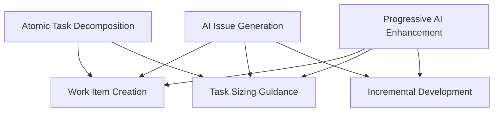

# AI Development Patterns: Consistency Review Report

**Date**: 2024-12-19  
**Reviewer**: AI Analysis  
**Scope**: Comprehensive end-to-end pattern analysis  
**Files Analyzed**: README.md, docs/specs.md, docs/examples/*

## Executive Summary

The AI Development Patterns repository contains valuable and innovative patterns for AI-assisted development. However, our analysis reveals significant structural inconsistencies, contradictory guidance, and missing connections that impact usability and comprehension. This report identifies 23 specific issues across 5 categories and provides actionable recommendations for resolution.

## Critical Issues Identified

### 🚨 **Critical: Missing Pattern in Reference Table**
**Issue**: AI Choice Generation pattern is fully implemented but completely absent from the Complete Pattern Reference table (lines 43-78)  
**Impact**: Breaks pattern discoverability and dependency understanding  
**Location**: README.md lines 43-78 vs. implementation at line 822  
**Recommendation**: Add AI Choice Generation to table with appropriate dependencies

### 🚨 **Critical: Contradictory Task Sizing Guidance**
**Issue**: Three core patterns provide conflicting task sizing recommendations:
- AI Issue Generation: "1-2 day max" tasks (line 410)
- Atomic Task Decomposition: "<2 hours" tasks (line 992) 
- Progressive AI Enhancement: Daily iterations (line 792)

**Impact**: Teams receive contradictory guidance on fundamental work breakdown  
**Recommendation**: Establish clear task sizing hierarchy and differentiate use cases

## Detailed Analysis by Category

## 1. Inconsistencies

### 1.1 Pattern Reference Table Gaps
| **Pattern Name** | **Status** | **Location** | **Issue** |
|------------------|------------|--------------|-----------|
| AI Choice Generation | ❌ Missing | Line 822 implemented, not in table | Not discoverable via reference |
| AI Security & Compliance | 🔄 Name mismatch | Table line 61 vs. "Security & Compliance Patterns" line 2302 | Inconsistent naming |
| Deployment Automation | 🔄 Category vs. Pattern | Listed as pattern but functions as category | Structural confusion |

### 1.2 Maturity Level Misalignments
| **Pattern** | **Listed Maturity** | **Actual Complexity** | **Recommendation** |
|-------------|---------------------|------------------------|-------------------|
| AI Issue Generation | Beginner | Requires Kanban expertise, complex JSON generation | → Intermediate |
| AI Choice Generation | Beginner | Requires trade-off analysis, prototype validation | → Intermediate |
| Context Window Optimization | Intermediate | Deep AI tool understanding required | → Advanced |

### 1.3 Naming Convention Issues
- **Inconsistent prefixes**: Some patterns use "AI-" prefix, others don't
- **Category ambiguity**: Patterns listed as both individual items and category headers
- **Reference mismatches**: Table names don't match actual pattern section headers

## 2. Contradictions

### 2.1 Task Sizing Conflict Analysis
```
AI Issue Generation (Beginner): 
  └─ "1-2 day max" tasks for Kanban flow
  └─ "4-8 hours max per task" 
  
Atomic Task Decomposition (Intermediate):
  └─ "<2 hours" for parallel agent execution
  └─ "Rapid feedback cycle"

Progressive AI Enhancement (Beginner):
  └─ Daily deployment iterations
  └─ "Each AI interaction adds one enhancement"
```
**Resolution Required**: Define task sizing contexts and use cases

### 2.2 Security Pattern Dependencies
**Circular dependency detected**:
- Policy-as-Code Generation → depends on → AI Security Sandbox
- Security Scanning Orchestration → depends on → Policy-as-Code Generation
- AI Security Sandbox → enhanced with → parallel agent safety

**Issue**: Creates implementation order confusion  
**Recommendation**: Establish clear security pattern hierarchy

### 2.3 Testing Strategy Overlaps
**Redundant coverage across**:
- Comprehensive AI Testing Strategy (general testing)
- Observable AI Development (debugging/logging for tests)
- Specification Driven Development (test-first approach)
- AI-Driven Traceability (test coverage tracking)

**Recommendation**: Differentiate testing pattern boundaries and responsibilities

## 3. Overlaps and Redundancy

### 3.1 Task Decomposition Redundancy Map

**Impact**: Users encounter similar concepts in multiple patterns without clear differentiation

### 3.2 Security Pattern Overlap
- **AI Security Sandbox**: Network isolation, container security
- **Parallel Agent Isolation**: Extended sandbox with agent coordination
- **Policy-as-Code Generation**: Compliance automation

**Recommendation**: Consolidate into layered security model

## 4. Missing Connections

### 4.1 Bidirectional Reference Gaps
| **Pattern A** | **References** | **Pattern B** | **B References A?** | **Issue** |
|---------------|----------------|---------------|-------------------|-----------|
| AI Choice Generation | Progressive AI Enhancement | ✅ | ❌ | Unidirectional |
| Observable AI Development | AI-Driven Traceability | ❌ | ❌ | No connection |
| Human-AI Handoff Protocol | AI Workflow Orchestration | ❌ | ✅ | Reverse only |

### 4.2 Logical Flow Gaps
**Missing conceptual connections**:
- **AI Knowledge Persistence** ↔ **AI-Driven Traceability**: Both capture development artifacts
- **Constraint-Based AI Development** ↔ **AI Choice Generation**: Both guide AI decision-making
- **Technical Debt Forecasting** ↔ **AI-Driven Refactoring**: Sequential workflow relationship

### 4.3 Incomplete Specification References
**Missing example files referenced in specs.md**:
```
Referenced but missing:
├── docs/examples/au4d.md ❌
├── docs/examples/pm7b.md ❌  
├── docs/examples/pm7c.md ❌
├── docs/examples/pm7d.md ❌
├── docs/examples/pm8b.md ❌
├── docs/examples/pm8c.md ❌
├── docs/examples/pm9a.md ❌
├── docs/examples/pm9b.md ❌
└── docs/examples/pm9c.md ❌

Existing:
├── docs/examples/au1a.md ✅
├── docs/examples/au2b.md ✅
├── docs/examples/au3c.md ✅
├── docs/examples/au3f.md ✅
├── docs/examples/au5f.md ✅
├── docs/examples/pm7a.md ✅
└── docs/examples/pm8a.md ✅

Coverage: 7/16 (44% complete)
```

## 5. Structural Issues

### 5.1 Pattern Template Inconsistency
| **Section** | **Consistent Across Patterns?** | **Issue** |
|-------------|--------------------------------|-----------|
| Maturity | ✅ Yes | - |
| Description | ✅ Yes | - |
| Related Patterns | 🔄 Partial | Some missing bidirectional refs |
| Examples | ❌ No | Varying depth and format |
| Anti-patterns | ❌ No | Not all patterns include them |
| Mermaid diagrams | ❌ No | Inconsistent usage |

### 5.2 Dependency Graph Inconsistencies
**Phase dependencies in mermaid diagram (lines 17-37) don't match**:
- Individual pattern "Related Patterns" sections
- Complete Pattern Reference table dependencies
- Actual implementation order requirements

### 5.3 Maturity Classification Issues
**No clear criteria defined for**:
- What constitutes "Beginner" vs "Intermediate" vs "Advanced"
- Whether maturity refers to pattern complexity or user prerequisite knowledge
- How to handle patterns that are simple to understand but require advanced context

## Recommendations for Resolution

## Phase 1: Critical Fixes (Immediate)

### 1. Complete Pattern Reference Table
```markdown
| **[AI Choice Generation](#ai-choice-generation)** | Beginner → Intermediate | Development | Generate multiple implementation options for exploration | Progressive AI Enhancement |
```

### 2. Resolve Task Sizing Contradictions
**Proposed hierarchy**:
- **AI Issue Generation**: 4-8 hours for Kanban work items
- **Atomic Task Decomposition**: 1-2 hours for parallel agent tasks
- **Progressive AI Enhancement**: Daily deployment cycles (can contain multiple atomic tasks)

### 3. Create Missing Specification Examples
Generate the 9 missing example files referenced in specs.md

## Phase 2: Structural Improvements (Short-term)

### 1. Define Maturity Criteria
```yaml
maturity_levels:
  beginner:
    description: "Basic AI tool usage, minimal setup required"
    prerequisites: ["Basic programming", "AI tool access"]
    complexity: "Single tool, straightforward prompts"
    
  intermediate: 
    description: "Multi-tool coordination, process integration"
    prerequisites: ["Development workflow experience", "Team coordination"]
    complexity: "Multiple tools, orchestration patterns"
    
  advanced:
    description: "Complex systems, enterprise concerns"
    prerequisites: ["Architecture experience", "Security/compliance knowledge"]
    complexity: "Multi-agent systems, advanced safety considerations"
```

### 2. Standardize Pattern Structure
**Required sections for all patterns**:
- Maturity + clear rationale
- Description with scope boundaries
- Related Patterns (bidirectional verification)
- Examples (minimum viable example + advanced example)
- Anti-patterns (what not to do)
- When to Use (clear decision criteria)

### 3. Consolidate Overlapping Patterns
**Proposed consolidation**:
- **Task Decomposition Suite**: Merge AI Issue Generation + Atomic Task Decomposition with clear use case differentiation
- **Testing Strategy Suite**: Unify testing-related patterns with clear boundaries
- **Security Pattern Hierarchy**: Layer security patterns from basic isolation to enterprise compliance

## Phase 3: Content Enhancement (Medium-term)

### 1. Complete Missing Connections
Add bidirectional references between all logically related patterns

### 2. Clarify Pattern Boundaries
Define clear scope and responsibility boundaries for each pattern

### 3. Enhance Decision Framework
Create decision trees or flowcharts to help users select appropriate patterns

## Implementation Priority

### 🔴 **Critical (This Week)**
1. Fix AI Choice Generation missing from reference table
2. Resolve task sizing contradictions with clear guidance
3. Create missing specification example files

### 🟡 **Important (Next 2 Weeks)**  
1. Define and apply consistent maturity criteria
2. Standardize pattern structure across all patterns
3. Complete bidirectional pattern references

### 🟢 **Enhancement (Next Month)**
1. Consolidate overlapping patterns
2. Create pattern selection decision framework
3. Add comprehensive cross-references

## Metrics for Success

- **Consistency Score**: All patterns follow same structure template
- **Reference Completeness**: 100% bidirectional pattern references
- **Example Coverage**: All referenced specification examples exist
- **User Experience**: Clear decision criteria for pattern selection
- **Dependency Clarity**: Unambiguous implementation order guidance

## Conclusion

The AI Development Patterns repository provides innovative and valuable guidance for AI-assisted development. Addressing these consistency issues will significantly improve usability, reduce confusion, and establish this as the definitive resource for AI development patterns. The identified issues are structural rather than conceptual, making them straightforward to resolve with focused effort.

**Immediate action recommended**: Address the critical inconsistencies identified in Phase 1 to prevent continued pattern adoption with conflicting guidance.